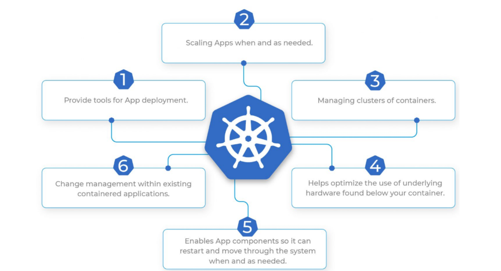
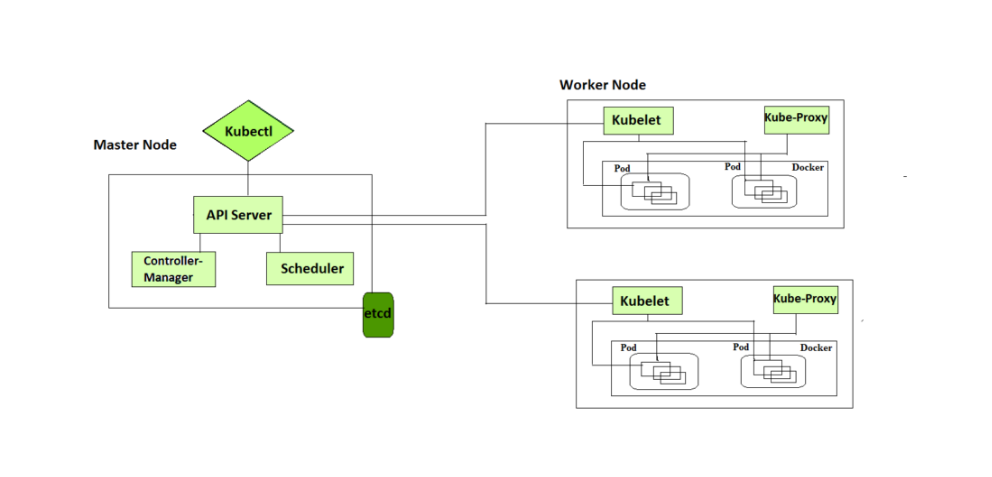

Kubernetes practise:
-------------------
# Kubernetes (K8s)(devops 23april2023 morning class and evening class refer)
* Need for K8s
* High Availability (HA):
   * When we run our applications in docker container and if the container fails, we need to manually start the container
   *  If the node i.e. the machine fails all the containers running on the machine should be re-created on other machine
   * K8s can do both of the above
* Autoscaling
   * Containers don’t scale on their own.
   * Scaling is of two types
        * Vertical Scaling
        * Horizontal Scaling
   * K8s can do both horizontal and vertical scaling of containers
* Zero-Down time Deployments
    * K8s can handle deployments with near    zero-down time deployments
    * K8s can handle rollout (new version) and roll back (undo new version => previous version)
* K8s is described as Production grade Container management 

Kubernetes
----------
* Kubernetes also known as K8s, is an open-source system for automating deployment, scaling, and management of containerized applications.

* K8s described as Production grade container management

History
-------

* Google had a history of running everything on containers.
* To manage these containers, Google has developed container management tools (inhouse)
      * Borg
      * Omega
* With Docker publicizing containers, With the experience in running and managing containers, Google has started a project Kubernetes (developed in Go) and then handed it over to Cloud Native Container Foundation (CNCF)
* Competetiors
     * Apache Mesos
     * Hashicorp Nomad
     * Docker Swarm
     * But K8s is clear winner
Terms
-----
* Distributed System
* Node
* Cluster
* State
* Stateful Applications
* Stateless Applications
* Monolith
* Microservices
* Desired State
* Declarative vs Imperative
* Pet Vs Cattle

# What Kubernetes can do?

Kubernetes Architecture
-------------------------

Kubernetes Components
----------------------
[ReferHere](https://directdevops.blog/2019/10/10/kubernetes-master-and-node-components/)

# Control plane components (Master Node Components)
      kube-api server
      etcd (*)
      kube-scheduler
      controller manager
      cloud controller manager

API Server (Application Programeble Interface)
------------
The API Server is the entry point of K8S Services.
The Kubernetes API server receives the REST commands which are sent by the user.
After receiving them, it validates the REST requests, processes them, and then executes them. After the execution of REST commands, the resulting state of a cluster is saved in 'etcd' as a distributed key-value store.
This API server is meant to scale automatically as per load.

ETCD
----
etcd is a consistent and highly-available key value store used as Kubernetes’ backing store for all cluster data. If your Kubernetes cluster uses etcd as its backing store, make sure you have a back up plan for those data. You can find in-depth information about etcd in the official documentation.

Controller Manager
------------------
The Kubernetes Controller Manager (also called kube-controller-manager) is a daemon that acts as a continuous control loop in a Kubernetes cluster.
The controller monitors the current state of the cluster via calls made to the API Server and changes the current state to match the desired state described in the cluster’s declarative configuration.

Scheduler
----------
The scheduler in a master node schedules the tasks for the worker nodes.
And, for every worker node, it is used to store the resource usage information.      

# Node Components
      kubelet
      kube-proxy
      Container run time (*)

Pod
----
A group of one or more containers.The smallest unit of k8s.The container has no ip address Pod has an IP address.
If the pod fails, then that pod will not be created again, another new pod will be created and its IP will be different.

kubelet
--------
Kublet is a small, lightweight Kubernetes node agent that runs on each node in a Kubernetes cluster.
It's responsible for managing the nodes and communicating with the Kubernetes master.
It's also responsible for making sure that the containers running on the nodes are healthy and running correctly.

Kube-proxy
----------
Kube-proxy is a network proxy service for Kubernetes that is responsible for routing traffic to different services within the cluster.
It is responsible for forwarding traffic from one service to another, allowing for communication between different components of the Kubernetes cluster.

Container Runtime
-----------------
Container technology to be used in k8s cluster
in our case it is docker.

Service
-------
In Kubernetes, a service is an object that abstracts the underlying infrastructure and provides a unified access point for the applications that are running on the cluster.
Services allow the applications to communicate with each other and are used to provide load balancing and service discovery.

cluster
-------
In Kubernetes, a cluster is a set of nodes (physical or virtual machines) that are connected and managed by the Kubernetes software.

Container Engine(Docker, Rocket, ContainerD)
-----------------
A container engine is a software system that enables applications and services to be packaged and run in an isolated environment.
Docker, Rocket, and Container are all examples of container engines that are used to run applications in containers.

# What is kubectl stand for?
Kubectl stands for Kubernetes Command-line interface. It is a command-line tool for the Kubernetes platform to perform API calls.
Kubectl is the main interface that allows users to create (and manage) individual objects or groups of objects inside a Kubernetes cluster.
Kubernetes resources are defined by a manifest file written in YAML. When the manifest is deployed, an object is created that aims to reach the desired state within the cluster. From that point, the appropriate controller watches the object and updates the cluster’s existing state to match the desired state.
## Kubernetes Questions
# distributed system kubernetes:
Kubernetes provides you with a framework to run distributed systems resiliently. It takes care of scaling and failover for your application, provides deployment patterns, and more. For example: Kubernetes can easily manage a canary deployment for your system.
# node:
A Kubernetes node is a machine that runs containerized workloads as part of a Kubernetes cluster. A node can be a physical machine or a virtual machine, and can be hosted on-premises or in the cloud. A Kubernetes cluster can have a large number of nodes—recent versions support up to 5,000 nodes.
# Cluster Kubernetes:
What is a Kubernetes cluster? A Kubernetes cluster is a set of nodes that run containerized applications. Containerizing applications packages an app with its dependences and some necessary services. They are more lightweight and flexible than virtual machines.
# What are the states in Kubernetes?
There are three possible container states: Waiting , Running , and Terminated . To check the state of a Pod's containers, you can use kubectl describe pod <name-of-pod> .
# What is stateful and stateless application in Kubernetes?
Stored Data: If the webserver stores data in a backend manner and uses it to identify the user as an always-connected client, the service is Stateful. While in Stateless, the server does store data, but in a database to verify user/client whenever it needs to connect.
# What does monolithic mean in Kubernetes?
Similarly, a monolithic architecture suggests a single-tiered application where all different components from a single platform can be combined and used for a single program.
# why we use odd number nodes in kubernetes?
In order to facilitate availability of master services, they should be deployed with odd numbers (e.g. 3,5,7,9 etc.) so quorum (master node majority) can be maintained should one or more masters fail.
* In k8s everthing stores in etcd controllers
# scaling up and down
# scaling in and out

## Please ensure that, all the Classroom K8S Concepts covered so far, have to be practiced well both Technically and Theoretically as well for Interviews perspective like:

* Pods / Containers
* containers:Containers are small, fast and portable because unlike a virtual machine, containers do not need to include a guest OS in every instance and can instead simply leverage the features and resources of the host OS.[referhere](https://www.ibm.com/topics/containers)
  * Benefits of containers
      *  Lightweight
      *  Portable and platform-independent
      *  Supports modern development and architecture
      *  Improves utilization

* Jobs / CronJobs

* ReplicaSets

* Deployment

* Service / Headless Service

* Volumes / Persistent Volumes / Persistent Volume Claims

* Stateful Sets and

* Namespaces etc.  