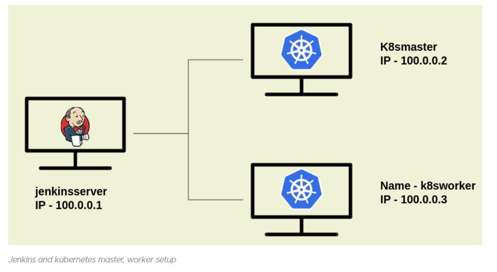

# k8s CICD with jenkins
* For documentation [Referhere](https://jhooq.com/ci-cd-jenkins-kubernetes/)

Pre-Requisites
--------------
1. Alright so before we start setting up our CI/CD pipeline I have setup my kuernetes cluster already.
* As you can see in the sketch we will have three servers(virtual machine)

  1. Jenkins Server
  2. Kubernetes Master
  3. Kubernetes Worker
* In that preview On left we can see Jenkins server where we have only installed Jenkins and we should keep in mind that we are not running Jenkins inside kubernetes cluster. (It is not recommended to run Jenkins inside kubernetes cluster.)

* On the right hand side you will see two servers one is k8smaster for kubernetes master node and k8sworker for kubernetes worker.

* Jenkins server will connect to k8smaster and k8sworker for doing the continuous deployment.
* Next we create this instances by using terrform``vi main.tf``
```h
resource "aws_instance" "jenkinsserver" {
  ami           = "ami-008bcc0a51a849165"
  instance_type = "t2.micro"
  subnet_type   = "private"
  aws_security_group = "port_all"
  
  cpu_options {
    core_count       = 2
    threads_per_core = 2
  }
  
  tags = {
    Name = "jenkins"
  }
}
resource "aws_instance" "k8smaster" {
  ami           = "ami-008bcc0a51a849165"
  instance_type = "t2.medium"
  subnet_type   = "private"
  aws_security_group = "port_all"
  
  cpu_options {
    core_count       = 2
    threads_per_core = 2
  }
  
  tags = {
    Name = "master"
  }
} 
resource "aws_instance" "k8sworker" {
  ami           = "ami-008bcc0a51a849165"
  instance_type = "t2.medium"
  subnet_type   = "private"
  aws_security_group = "port_all"
  
  cpu_options {
    core_count       = 2
    threads_per_core = 2
  }
  
  tags = {
    Name = "worker"
  }
}   
resource "aws_vpc" "my_vpc" {
  cidr_block = "192.168.0.0/16"

  tags = {
    Name = "vpc"
  }
}

resource "aws_security_group" "port_all" {
  name        = "port_all"
  description = "Allow TLS inbound traffic"
  vpc_id      = aws_vpc.main.id

  ingress {
    description      = "TLS from VPC"
    from_port        = 0
    to_port          = 65535
    protocol         = "tcp"
    cidr_blocks      = [aws_vpc.main.cidr_block]
    ipv6_cidr_blocks = [aws_vpc.main.ipv6_cidr_block]
  }

  egress {
    from_port        = 0
    to_port          = 0
    protocol         = "-1"
    cidr_blocks      = ["0.0.0.0/0"]
    ipv6_cidr_blocks = ["::/0"]
  }

  tags = {
    Name = "port_all"
  }
}

resource "aws_subnet" "my_subnet" {
  vpc_id            = aws_vpc.my_vpc.id
  cidr_block        = "192.168.10.0/24"
  availability_zone = "eu-west-3a"

  tags = {
    Name = "private_sb"
  }
}
```
* provider.tf
```h
terraform {
  required_providers {
    aws = {
      source = "hashicorp/aws"
      version = "4.61.0"
    }
  }
}

provider "aws" {
  region = "eu-west-3"
}
```

1. Where does Github and Docker Hub fits in the CI/CD
We will use Git Hub as version control to push our application code. In this lab session we will be using Springpetclinic.

* Secondly we will use DockerHub for uploading/pushing the Docker image. Here is the overview of our GitHub and DockerHub flow 

Step 1 - Checkin/Push your code to GitHub

Step 2 - Pull your code from GitHub into your Jenkins server

Step 3 - Use Gradle/Maven build tool for building the artifacts

Step 4 - Create Docker image

Step 5 - Push your latest Docker image to DockerHub

Step 6 - Pull the latest image from DockerHub into jenkins.

Step 7 - Then use k8s-spc-deployment.yml to deploy your application inside your kubernetes cluster.

3. Install Jenkins on jenkinsserver

* In jenkins node install jenkins with use of below commands
* Install Java: we also need Java as pre-requisite for installing jenkins, so lets first install java
```
sudo apt-get update
sudo apt install openjdk-11-jdk(any java version 8,11,17)
java --version
wget -q -O - https://pkg.jenkins.io/debian-stable/jenkins.io.key | sudo apt-key add -
sudo sh -c 'echo deb https://pkg.jenkins.io/debian-stable binary/ > \
    /etc/apt/sources.list.d/jenkins.list'
sudo apt-get update
sudo apt-get install jenkins
```
4. Verify Jenkins installation:
* After installing Jenkins we can verify the jenkins installation by accessing the initial login page of the jenkins.

* Since we have installed Jenkins on virtual machine with IP:8080
* Find Default jenkins password:
 As we can see we need to provide Default jenkins(initialAdminPassword) administrator password.on this path ``cat /var/lib/jenkins/secrets/initialAdminPassword``
* After enter the password customize jenkins page opened in that click on install suggested plugin.
* Select install suggested plugin and then it should install all the default plugins which is required for running Jenkins.
* After successful login setup username and password
* After we have installed all the suggested default plugins, it will prompt you for setting up username and password
* After that jenkins is ready to use click on start using jenkins
5. Jenkins - Install "SSH Pipeline Steps" plugin and "Gradle":
* SSH Pipeline Steps:
* we need to install one more plugin SSH Pipeline Steps which we are going to use for SSH into k8smaster and k8sworker server.

* For installing plugin please goto - Manage Jenkins -> Manage Plugin -> Available then in the search box type SSH Pipeline Steps.

* NSelect the plugin and install it without restart.

* Setup Gradle:
For this lab session we are going to use Spring pet clinic Application, so for that we need Gradle as our build tool.

* To setup Gradle Goto - Manage Jenkins -> Global Tool Configuration -> Gradle

* Click on Add Grdle and then enter name default.

* After that click on the checkbox - Install Automatically and from the drop down Install from Gradle.org select latest version.
* Now We are not installing any plugins for jenkins,we have completed the jenkins and jenkins plugin setup.
6. Install Docker on jenkinsserver:
* Now we need to install Docker on jenkinsserver since we need to push our docker image to DockerHub.
* Install Docker:
Use the following command to install the Docker
```
curl -fsSL https://get.docker.com -o get-docker.sh
sh get-docker.sh
sudo usermod -aG docker jenkins 
exit and relogin
docker info
``` 
7. Take spc application 
* Now its time for you to look at our application which we are going to deploy inside kubernetes cluster using Jenkins Pipeline.
* you can clone the code repo from - Source Code

* The source code also include the Dockerfile for building the dockerimage

8. Write the Pipeline script:
* CI/CD Jenkins Pipeline script into steps
8.1 Create Jenkins Pipeline
* The first step for you would be to create a pipeline.

Goto : Jenkins -> New Items

=>Enter an item name : spc

=>Select Pipeline

=>Click Ok
8.2 Clone the Git Repo
* The first principle of the CI/CD pipeline is to clone/checkout the source code, using the same principle we are going to clone the GIT Repo inside Jenkins

8.3 Jenkins store git credentials
* As you know we cannot store plain text password inside jenkins scripts, so we need to store it somewhere securely.

* Jenkins Manage Credential provides very elegant way to store GitHub Username and Password.

* Goto : Jenkins -> Manage Jenkins -> Manage Credentials
* Keep the ID somewhere store so that you remember - GIT_HUB_CREDENTIALS
8.4 Build the Spring Pet Clinic
* Next step would be to build the Spc Using Gradle

8.5 Build Docker image and tag it
* After successful Gradle Build we are going to build Docker Image and after that I am going to tag it with the name myspcimage-latest

8.6 Jenkins store DockerHub credentials
* For storing DockerHub Credentials you need to GOTO: Jenkins -> Manage Jenkins -> Manage Credentials -> Stored scoped to jenkins -> global -> Add Credentials

* From the Kind dropdown please select Secret text
   1. Secret - Type in the DockerHub Password
   2. ID - DOCKER_HUB_PASSWORD
   3. Description - Docker Hub password

8.7 Docker Login via CLI
* Since I am working inside Jenkins so every step I perform I need to write pipeline script. Now after building and tagging the Docker Image we need to push it to the DockerHub. But before you push to DockerHub you need to authenticate yourself via CLI(command line interface) using docker login.
* $DOCKER_HUB_PASSWORD - Since I cann't disclose my DockerHub password, so I stored my DockerHub Password into Jenkins Manage Jenkins and assigned the ID $DOCKER_HUB_PASSWORD

8.8 Push Docker Image into DockerHub
* After successful Docker login now we need to push the image to DockerHub

8.9 SSH Into k8smaster server
* In the previous steps we have installed SSH Pipeline Steps in step no - 5, now we are going to use that plugin to SSH into k8smaster server

8.10 Copy k8s-spc-deployment.yml to k8smaster server
* After successful login copy k8s-spc-deployment.yml into k8smaster server

8.11 Create kubernetes deployment and service
* Apply the k8s-spc-deployment.yml which will eventually -
   1. Create deployment with name - spc
   2. Expose service on NodePort

* So here is the final complete pipeline script for my CI/CD Jenkins kubernetes pipeline
```js
node {

    stage("Git Clone"){

        git credentialsId: 'GIT_CREDENTIALS', url: 'https://github.com/rahulwagh/spring-boot-docker.git'
    }

     stage('Gradle Build') {

       sh './gradlew build'

    }

    stage("Docker build"){
        sh 'docker version'
        sh 'docker build -t jhooq-docker-demo .'
        sh 'docker image list'
        sh 'docker tag jhooq-docker-demo rahulwagh17/jhooq-docker-demo:jhooq-docker-demo'
    }

    withCredentials([string(credentialsId: 'DOCKER_HUB_PASSWORD', variable: 'PASSWORD')]) {
        sh 'docker login -u rahulwagh17 -p $PASSWORD'
    }

    stage("Push Image to Docker Hub"){
        sh 'docker push  rahulwagh17/jhooq-docker-demo:jhooq-docker-demo'
    }

    stage("SSH Into k8s Server") {
        def remote = [:]
        remote.name = 'K8S master'
        remote.host = '100.0.0.2'
        remote.user = 'vagrant'
        remote.password = 'vagrant'
        remote.allowAnyHosts = true

        stage('Put k8s-spring-boot-deployment.yml onto k8smaster') {
            sshPut remote: remote, from: 'k8s-spring-boot-deployment.yml', into: '.'
        }

        stage('Deploy spring boot') {
          sshCommand remote: remote, command: "kubectl apply -f k8s-spring-boot-deployment.yml"
        }
    }

}
```
Conclusion:
-------------
1. First thing which I did is - setup the kubernetes cluster
2. Install Jenkins on another server
3. Install plugin 'SSH Pipeline Step' for jenkins
4. Install Docker along with Jenkins
5. Setup user group for CurrentUser and Jenkins
6. I created Jenkins Pipeline script for continuous Deployment.

