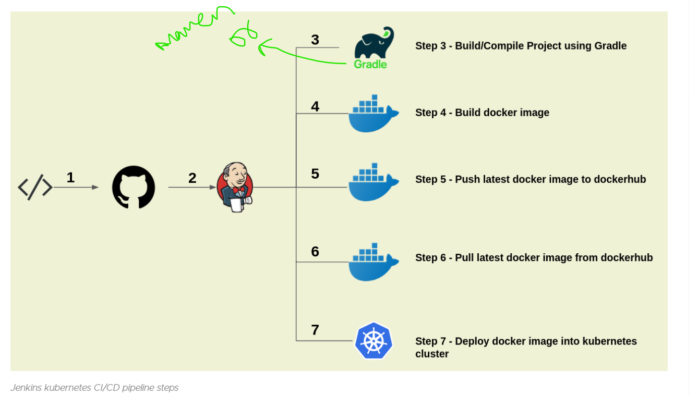

# k8s CICD with jenkins
* For documentation [Referhere](https://jhooq.com/ci-cd-jenkins-kubernetes/)

Pre-Requisites
--------------

2. Where does Github and Docker Hub fits in the CI/CD
We will use Git Hub as version control to push our application code. In this lab session we will be using Springpetclinic.

* Secondly we will use DockerHub for uploading/pushing the Docker image. Here is the overview of our GitHub and DockerHub flow 

Step 1 - Checkin/Push your code to GitHub

Step 2 - Pull your code from GitHub into your Jenkins server

Step 3 - Use Gradle/Maven build tool for building the artifacts

Step 4 - Create Docker image

Step 5 - Push your latest Docker image to DockerHub

Step 6 - Pull the latest image from DockerHub into jenkins.

Step 7 - Then use k8s-spc-deployment.yml to deploy your application inside your kubernetes cluster.