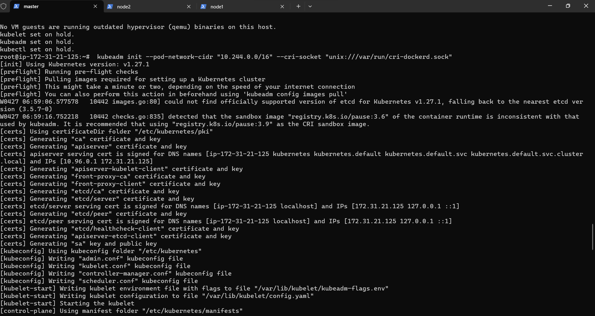
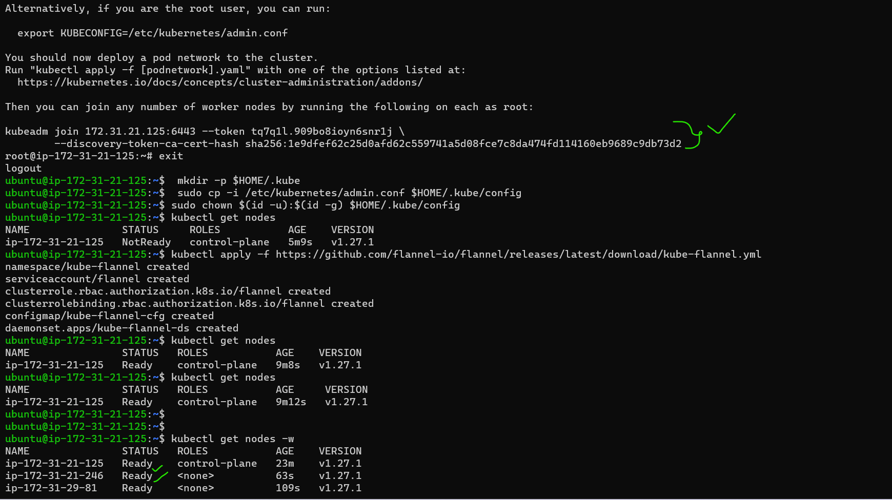

k8s install commands:

* First we can create 3 instances with t2 medium
* Next that 3 nodes 1 is master and another nodes are node1,node2.
* In all 3 nodes install docker with docker commands
```
curl -fsSL https://get.docker.com -o get-docker.sh
sh get-docker.sh
sudo usermod -aG docker ubuntu
docker info
exit and relogin
```
* After install docker in all 3 nodes exit and relogin because we can give usermod permissions.
* After successful installation re-login into your machine
* After re-login try to get docker info $ docker info
* Run the below commands as root user in all 3 nodes
# Run these commands as root

```
sudo -i
wget https://storage.googleapis.com/golang/getgo/installer_linux
chmod +x ./installer_linux
./installer_linux
source ~/.bash_profile
git clone https://github.com/Mirantis/cri-dockerd.git
cd cri-dockerd
mkdir bin
go build -o bin/cri-dockerd
mkdir -p /usr/local/bin
install -o root -g root -m 0755 bin/cri-dockerd /usr/local/bin/cri-dockerd
cp -a packaging/systemd/* /etc/systemd/system
sed -i -e 's,/usr/bin/cri-dockerd,/usr/local/bin/cri-dockerd,' /etc/systemd/system/cri-docker.service
systemctl daemon-reload
systemctl enable cri-docker.service
systemctl enable --now cri-docker.socket
cd ~
sudo apt-get update
sudo apt-get install -y apt-transport-https ca-certificates curl
sudo curl -fsSLo /etc/apt/keyrings/kubernetes-archive-keyring.gpg https://packages.cloud.google.com/apt/doc/apt-key.gpg
echo "deb [signed-by=/etc/apt/keyrings/kubernetes-archive-keyring.gpg] https://apt.kubernetes.io/ kubernetes-xenial main" | sudo tee /etc/apt/sources.list.d/kubernetes.list
sudo apt-get update
sudo apt-get install -y kubelet kubeadm kubectl
sudo apt-mark hold kubelet kubeadm kubectl
```
-------------------till here in 3 nodes only-----------

* This command run in master node only
* Now create a cluster from a master node, use this command ``kubeadm init --pod-network-cidr "10.244.0.0/16" --cri-socket "unix:///var/run/cri-dockerd.sock"``

 

* After this command execution in the output the following commands are came 
```
kubeadm join 172.31.47.212:6443 --token o3w92f.36k6full7pu2ygi0 \
        --discovery-token-ca-cert-hash sha256:bac5374430a738a01b6914e68058ac1f95c5682b2f113462779c908bf4411ebe
```       
* To start using your cluster, you need to run the following as a regular user(ubuntu user)
* below commands execute only in master node 
  ```
  exit
  mkdir -p $HOME/.kube
  sudo cp -i /etc/kubernetes/admin.conf $HOME/.kube/config
  sudo chown $(id -u):$(id -g) $HOME/.kube/config
  kubectl apply -f https://github.com/flannel-io/flannel/releases/latest/download/kube-flannel.yml

  ```
 
* Now you need to run the following command in nodes, it will shows on master node.
* Add nodes to the masternode use this command as a root user(it is in masternode and in that add cri socket)
* This below command execute in another two nodes(means worker nodes) don't execute in master node.
* Because it is use for connecting worker nodes to the master node.
* In the kubeadm join(it is in the output of kubeadm init....sock command) command we can add this ``--cri-socket "unix:///var/run/cri-dockerd.sock"`` like see below command
```
kubeadm join 172.31.21.125:6443 --token tq7q1l.909bo8ioyn6snr1j \
        --cri-socket "unix:///var/run/cri-dockerd.sock" \
        --discovery-token-ca-cert-hash sha256:1e9dfef62c25d0afd62c559741a5d08fce7c8da474fd114160eb9689c9db73d2
```		
* Check in master node ``kubectl get nodes``
* and ``kubectl get nodes -w``

* For check the resources ``kubectl api-resources``

* After that create a manifest file with reference of kubernetes 
[referhere](https://kubernetes.io/docs/reference/generated/kubernetes-api/v1.27/)
* Then create a yml files for any applications(ex.spc,nop,game of life)

## Class Exercises:
* Write a manifest file to create nginx.
```yml
---
apiVersion: v1
kind: Pod
metadata:
  name: ex1
spec:
  containers:
    - name: nginx
      image: nginx
      ports:
        - containerPort: 80

```
vi ex1.yml
kubectl apply -f ex1.yml

* Write a manifest file to create nginx and alpine with sleep 1d.
```yml
---
apiVersion: v1
kind: Pod
metadata:
  name: task2
spec:
  containers:
    - name: nginx
      image: nginx
      ports:
        - containerPort: 80
    - name: alpine
      image: alpine
      args:
        - sleep
        - 1d
```

* Write a manifest file to create nginx, alpine with sleep 1d and alpine with 10s.
```yml
---
apiVersion: v1
kind: Pod
metadata:
  name: exerc3
spec:
  containers:
    - name: nginx
      image: nginx
      ports:
        - containerPort: 80
    - name: alpine1
      image: alpine
      args:
        - sleep
        - 1d
    - name: alpine2
      image: alpine
      args:
        - sleep
        - 10s

* Write a manifest file to create nginx and httpd with 80 port exposed.
```yml
---
apiVersion: v1
kind: Pod
metadata:
  name: exerc4
spec:
  containers:
    - name: nginx
      image: nginx
      ports:
        - containerPort: 80
    - name: httpd
      image: httpd
      ports:
        - containerPort: 80

```

# AKS Cluster Creation
create a resource group
create AKS cluster
connect to cluster by installing kubectl
config kubectl
az group create --name myResourceGroup --location eastus
az aks create -g myResourceGroup -n myAKSCluster --enable-managed-identity --node-count 1 --enable-addons monitoring --enable-msi-auth-for-monitoring  --generate-ssh-keys

az aks install-cli
az aks get-credentials --resource-group myResourceGroup --name myAKSCluster
# Topics In Kubernetes
1. History and Architecture
2. kubernetes Installation
   kubeadm
   minikube
   kind
3. objects, api-resoureces & work loads
4. Pods
   pods creation
5. imperative - CLI(commandline interface)
   declarative - manifest file
6. pod spec & restart policy
7. Controllers
8. pod spec
9. jobs and cron jobs
10. replics set spec
11. replication controller
12. labels and selector
13. kubernetes as a service - AKS , EKS
14. AKS cluster Creation
15. service spec
   Internal
   External
16. Health checks/probes
  liveness probe
  readiness probe
  startuo probe
17. Resource Mgmt - Pods and Containers
18. Requests and limits -CPU/Memory
19. Container types in Pods
   Containers
   init containers
   ephemeral containers
20. Deployment
  rolling out
  rolling back
21. Annotations
22. change cause
23. Daemon set
24. Scheduling Pods
25. node selector
26. affinity
27. taints and tolerations
28. Headless service
29. Storage in k8s
   volumes
   stateful sets