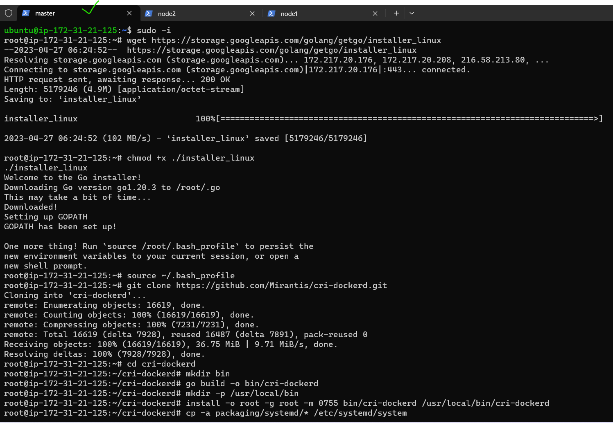
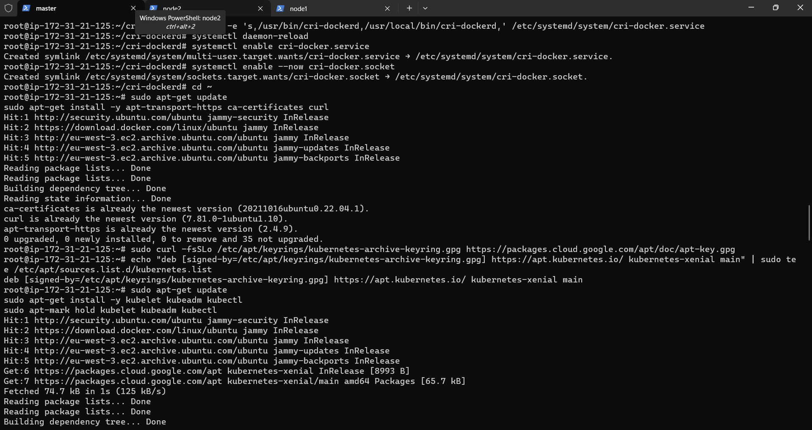
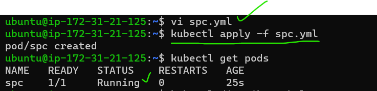
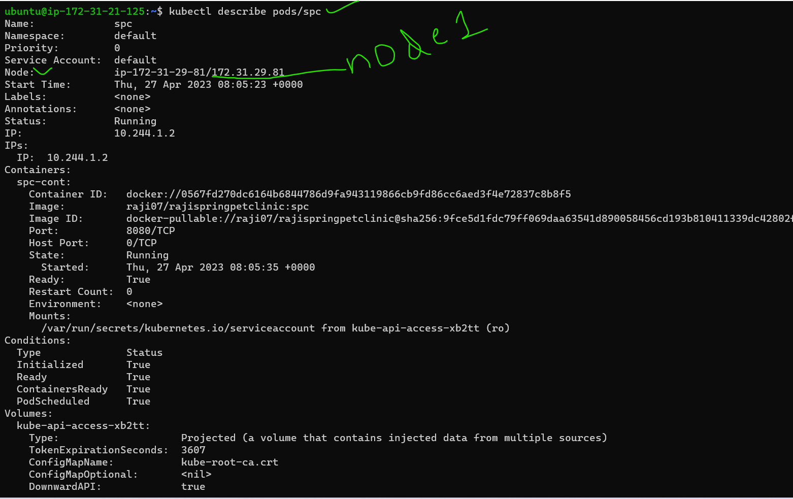
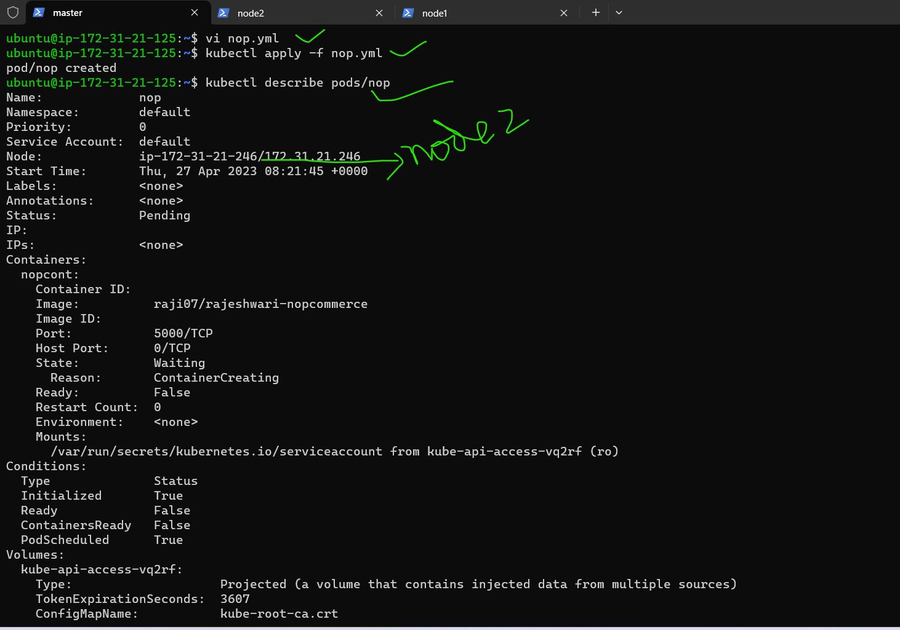

Kubernetes (k8s) Activities (DAY01-26/APR/2023)
# 1) Write a Pod Spec for Spring PetClinic and nopCommerce Applications

* First we can create 3 instances with t2 medium
* Next that 3 nodes 1 is master and another nodes are node1,node2.
* In all 3 nodes install docker with docker commands
```
curl -fsSL https://get.docker.com -o get-docker.sh
sh get-docker.sh
sudo usermod -aG docker ubuntu

exit and relogin
```
* After install docker in all 3 nodes exit and relogin because we can give usermod permissions.
* Next in all 3 nodes install kubeadm,kubectl,kubelet with this commands
```
# Run these commands as root
###Install GO###
wget https://storage.googleapis.com/golang/getgo/installer_linux
chmod +x ./installer_linux
./installer_linux
source ~/.bash_profile

git clone https://github.com/Mirantis/cri-dockerd.git
cd cri-dockerd
mkdir bin
go build -o bin/cri-dockerd
mkdir -p /usr/local/bin
install -o root -g root -m 0755 bin/cri-dockerd /usr/local/bin/cri-dockerd
cp -a packaging/systemd/* /etc/systemd/system
sed -i -e 's,/usr/bin/cri-dockerd,/usr/local/bin/cri-dockerd,' /etc/systemd/system/cri-docker.service
systemctl daemon-reload
systemctl enable cri-docker.service
systemctl enable --now cri-docker.socket
```
# below commands executed only in master node 

* Installing kubadm, kubectl, kubelet [Referhere](https://kubernetes.io/docs/setup/production-environment/tools/kubeadm/install-kubeadm/#installing-kubeadm-kubelet-and-kubectl)

```
cd ~
sudo apt-get update
sudo apt-get install -y apt-transport-https ca-certificates curl
sudo curl -fsSLo /etc/apt/keyrings/kubernetes-archive-keyring.gpg https://packages.cloud.google.com/apt/doc/apt-key.gpg
echo "deb [signed-by=/etc/apt/keyrings/kubernetes-archive-keyring.gpg] https://apt.kubernetes.io/ kubernetes-xenial main" | sudo tee /etc/apt/sources.list.d/kubernetes.list
sudo apt-get update
sudo apt-get install -y kubelet kubeadm kubectl
sudo apt-mark hold kubelet kubeadm kubectl
```
 Now create a cluster from a master node, use the command ``kubeadm init --pod-network-cidr "10.244.0.0/16" --cri-socket "unix:///var/run/cri-dockerd.sock"``

* After this command execution in the output one command is there in that add cri-socket this command is used for connecting nodes.


* To start using your cluster, you need to run the following as a regular user(ubuntu user)
  ```
  exit
  mkdir -p $HOME/.kube
  sudo cp -i /etc/kubernetes/admin.conf $HOME/.kube/config
  sudo chown $(id -u):$(id -g) $HOME/.kube/config
  kubectl get nodes
  ```
* Setup kubeconfig, install flannel use the command ``kubectl apply -f https://github.com/flannel-io/flannel/releases/latest/download/kube-flannel.yml``

* Now you need to run the following command in nodes, it will shows on master node.
* Add nodes to the master use this command(it is in masternode and in that add cri socket)
```
kubeadm join 172.31.21.125:6443 --token tq7q1l.909bo8ioyn6snr1j \
        --cri-socket "unix:///var/run/cri-dockerd.sock" \
        --discovery-token-ca-cert-hash sha256:1e9dfef62c25d0afd62c559741a5d08fce7c8da474fd114160eb9689c9db73d2
```		
* Check in master node ``kubectl get nodes``
* and ``kubectl get nodes -w``

* For check the resources ``kubectl api-resources``






* After that create a manifest file with reference of kubernetes 
[referhere](https://kubernetes.io/docs/concepts/overview/working-with-objects/kubernetes-objects/)
* then create a yml files for spc and nop
  
# 2) Execute the kubectl commands:
   
   ``kubectl get pods ``and ``kubectl describe pods``

# manifest file for spc applications with use Pod spec   

# spc.yml
---
apiVersion: v1
kind: Pod
metadata:
  name: spc
spec:
  containers:
    - name: spc-cont
      image: raji07/rajispringpetclinic:spc
      ports: 
        - containerPort: 8080


* Then execute below commands
```
vi spc.yml
kubectl apply -f spc.yml
kubectl get pods
kubectl describe pods/spc
```
* In that describe pod command we can see node2 IP address


# # manifest file for nop commerce applications with use Pod spec 
# nop.yml
---
apiVersion: v1
kind: Pod
metadata:
  name: nop
spec:
  containers:
    - name: nopcont
      image: raji07/rajeshwari-nopcommerce
      ports:
        - containerPort: 5000
  

* Then execute below commands
```
vi nop.yml
kubectl apply -f nop.yml
kubectl get pods
kubectl describe pods/nop
```
* In that describe pod command we can see node2 IP address



