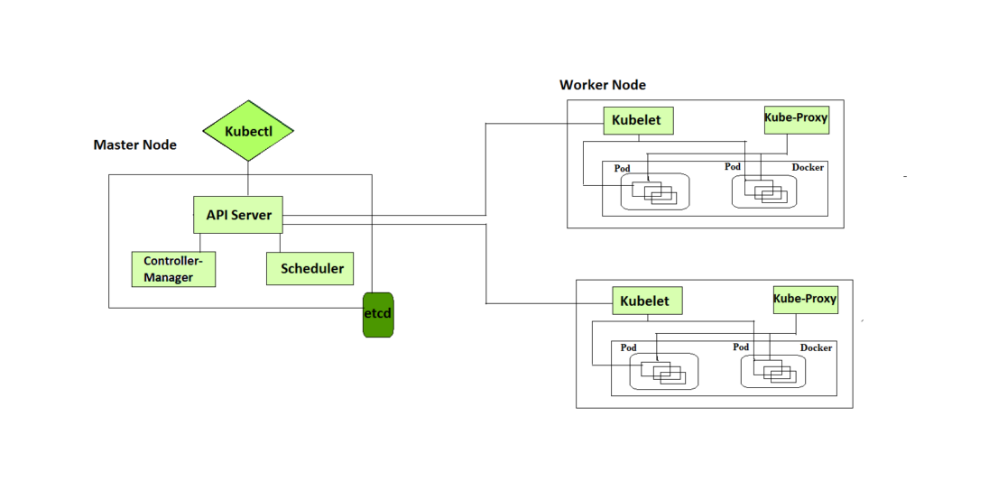
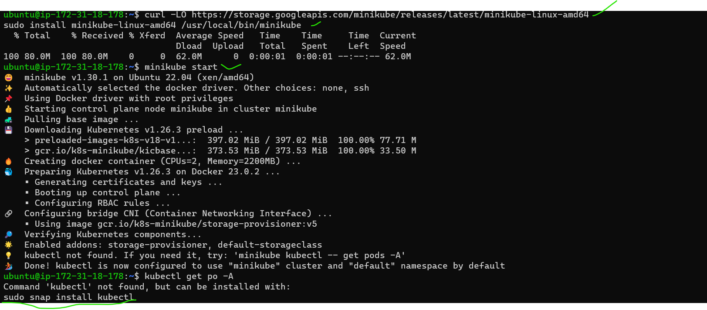
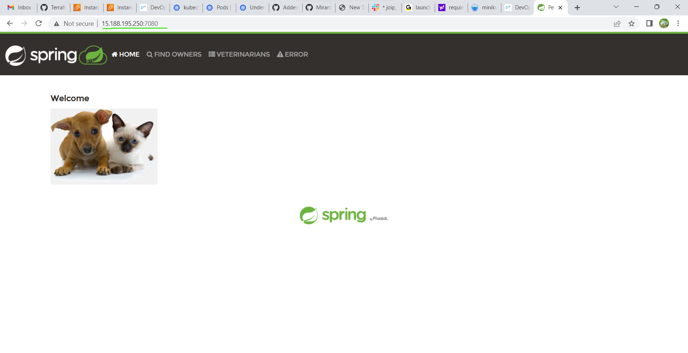

Kubernetes (k8s) Activities (DAY02-27/APR/2023)
--------------------------------------------------------- 

# 1) Explain Kubernetes architecture

Kubernetes – Cluster Architecture
---------------------------------
As can be seen in the diagram below, Kubernetes has a client-server architecture and has master and worker nodes, with the master being installed on a single Linux system and the nodes on many Linux workstations. 

* Kubernetes Components
Kubernetes is composed of a number of components, each of which plays a specific role in the overall system. These components can be divided into two categories:
  * nodes: Each Kubernetes cluster requires at least one worker node, which is a collection of worker machines that make up the nodes where our  container will be deployed.
  * Control plane: The worker nodes and any pods contained within them will be under the control plane. 
 
 Kubernetes Architecture

[referhere](https://www.geeksforgeeks.org/kubernetes-architecture/)


# 2. Setup k8s on single node using minikube and kind
  3. Run the Spring Pet Clinic
* First we can create an instance(t2.medium) in that install docker
```
curl -fsSL https://get.docker.com -o get-docker.sh
sh get-docker.sh
sudo usermod -aG docker ubuntu
docker info
exit and relogin

```
# After that install minikube
  [referhere](https://minikube.sigs.k8s.io/docs/start/)
* This downloads the latest release of minikube for Linux amd64 architecture, installs it, and starts a single-node Kubernetes cluster using the Docker driver.
 
```
curl -LO https://storage.googleapis.com/minikube/releases/latest/minikube-linux-amd64
sudo install minikube-linux-amd64 /usr/local/bin/minikube
minkube start
sudo snap install kubectl --classic
vi spc.yml
kubectl apply -f spc.yml
kubectl get pod
kubectl describe po
kubectl create deployment spc --image=raji07/rajispringpetclinic:spc
kubectl expose deployment spc --type=NodePort --port=8080
kubectl port-forward service/spc --address "0.0.0.0" 7080:8080
```

* Let's create a pod configuration file: vi spc.yml

* This opens a new file in the vi text editor.

* Paste the following YAML code into the file and save it
```
---
apiVersion: v1
kind: Pod
metadata:
  name: spc
spec:
  containers:
    - name: spc-cont
      image: raji07/rajispringpetclinic:spc
      ports: 
        - containerPort: 8080
```
* Let's create pod 
```
kubectl create -f spc.yml
kubectl get pods
kubectl get pods -o wide
```


* Goto new tab copy the node public IP address <publicIP:7080>
* spc page came.


# kind
[referhere](https://kind.sigs.k8s.io/docs/user/quick-start/#installation) in this see linux.

* launch an instance(t2.medium) and in stall docker in that after that run this commands
```
curl -Lo ./kind https://kind.sigs.k8s.io/dl/v0.18.0/kind-linux-amd64
chmod +x ./kind
sudo mv ./kind /usr/local/bin/kind
kind create cluster
sudo snap install kubectl --classic
vi spc.yml
kubectl apply -f spc.yml
kubectl get po
kubectl describe po
```
* Let's create a pod configuration file: vi nop.yml

* This opens a new file in the vi text editor.

* Paste the following YAML code into the file and save it
```
---
apiVersion: v1
kind: Pod
metadata:
  name: spc
spec:
  containers:
    - name: spc-cont
      image: raji07/rajispringpetclinic:spc
      ports: 
        - containerPort: 8080
```

