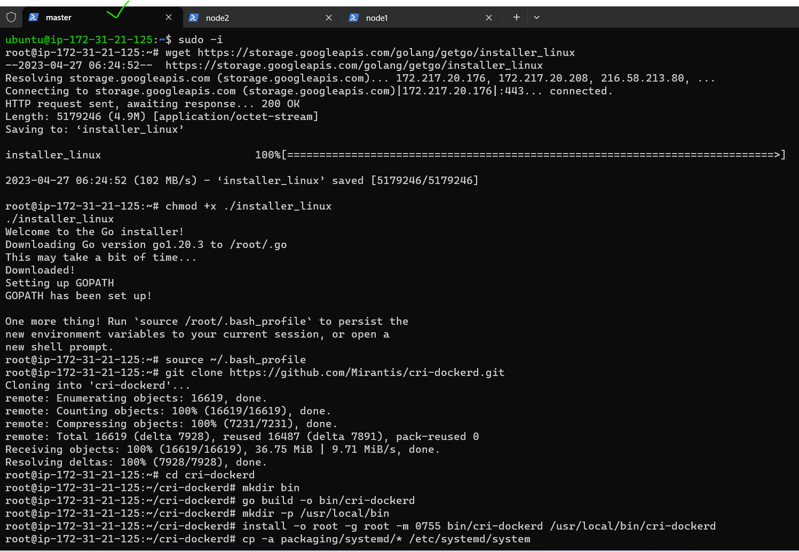

Kubernetes (k8s) Activities (DAY03-28/APR/2023)
---------------------------------------------------------

1) K8s Cluster Installation
   a) kubeadm
   b) minikube
   c) kind

# a) kubeadm

* First we can create 2 instances with t2 medium
* Next that 2 nodes 1 is masternode and another node1(workernode)
* In this 2 nodes install docker with docker commands
```
curl -fsSL https://get.docker.com -o get-docker.sh
sh get-docker.sh
sudo usermod -aG docker ubuntu
docker info
exit and relogin
```
* After install docker in that 2 nodes exit and relogin because we can give usermod permissions.
* After successful installation re-login into your machine
* After re-login try to get docker info $ docker info
* Install CRI-Dockerd [ReferHere](https://github.com/Mirantis/cri-dockerd)
# Run the below commands as root user in all 2 nodes

# Run these commands as root
###Install GO###
```
sudo -i
wget https://storage.googleapis.com/golang/getgo/installer_linux
chmod +x ./installer_linux
./installer_linux
source ~/.bash_profile

git clone https://github.com/Mirantis/cri-dockerd.git
cd cri-dockerd
mkdir bin
go build -o bin/cri-dockerd
mkdir -p /usr/local/bin
install -o root -g root -m 0755 bin/cri-dockerd /usr/local/bin/cri-dockerd
cp -a packaging/systemd/* /etc/systemd/system
sed -i -e 's,/usr/bin/cri-dockerd,/usr/local/bin/cri-dockerd,' /etc/systemd/system/cri-docker.service
systemctl daemon-reload
systemctl enable cri-docker.service
systemctl enable --now cri-docker.socket
```
# Below commands executed only in master node in root user only

* Installing kubadm, kubectl, kubelet [Referhere](https://kubernetes.io/docs/setup/production-environment/tools/kubeadm/install-kubeadm/#installing-kubeadm-kubelet-and-kubectl)

```
cd ~
sudo apt-get update
sudo apt-get install -y apt-transport-https ca-certificates curl
sudo curl -fsSLo /etc/apt/keyrings/kubernetes-archive-keyring.gpg https://packages.cloud.google.com/apt/doc/apt-key.gpg
echo "deb [signed-by=/etc/apt/keyrings/kubernetes-archive-keyring.gpg] https://apt.kubernetes.io/ kubernetes-xenial main" | sudo tee /etc/apt/sources.list.d/kubernetes.list
sudo apt-get update
sudo apt-get install -y kubelet kubeadm kubectl
sudo apt-mark hold kubelet kubeadm kubectl
```
* Now create a cluster from a master node, use the command ``kubeadm init --pod-network-cidr "10.244.0.0/16" --cri-socket "unix:///var/run/cri-dockerd.sock"``
  



# b) minikube

* First we can create an instance(t2.medium) in that install docker

```
curl -fsSL https://get.docker.com -o get-docker.sh
sh get-docker.sh
sudo usermod -aG docker ubuntu
docker info
exit and relogin

```
# After that install minikube
  [referhere](https://minikube.sigs.k8s.io/docs/start/)
* This downloads the latest release of minikube for Linux amd64 architecture, installs it, and starts a single-node Kubernetes cluster using the Docker driver.
 
```
curl -LO https://storage.googleapis.com/minikube/releases/latest/minikube-linux-amd64
sudo install minikube-linux-amd64 /usr/local/bin/minikube
minkube start
sudo snap install kubectl --classic
vi spc.yml
kubectl apply -f spc.yml
kubectl get pod
kubectl describe po
kubectl create deployment spc --image=raji07/rajispringpetclinic:spc
kubectl expose deployment spc --type=NodePort --port=8080
kubectl port-forward service/spc --address "0.0.0.0" 7080:8080
```

* Let's create a pod configuration file: vi spc.yml

* This opens a new file in the vi text editor.

* Paste the following YAML code into the file and save it
```
---
apiVersion: v1
kind: Pod
metadata:
  name: spc
spec:
  containers:
    - name: spc-cont
      image: raji07/rajispringpetclinic:spc
      ports: 
        - containerPort: 8080
```
* Let's create pod 
```
kubectl create -f spc.yml
kubectl get pods
kubectl get pods -o wide
```


* Goto new tab copy the node public IP address <publicIP:7080>
* spc page came.


# c)kind
[referhere](https://kind.sigs.k8s.io/docs/user/quick-start/#installation) in this see linux.

* launch an instance(t2.medium) and in stall docker in that after that run this commands
```
curl -Lo ./kind https://kind.sigs.k8s.io/dl/v0.18.0/kind-linux-amd64
chmod +x ./kind
sudo mv ./kind /usr/local/bin/kind
kind create cluster  #with this command create the cluster in Kind 
sudo snap install kubectl --classic
vi spc.yml
kubectl apply -f spc.yml
kubectl get po
kubectl describe po
```


# 2) Writing the Manifest Files for Spc & nopCommerce Apps.

# spc manifest file

```
---
apiVersion: v1
kind: Pod
metadata:
  name: spc
spec:
  containers:
    - name: spc-cont
      image: raji07/rajispringpetclinic:spc
      ports: 
        - containerPort: 8080
```
* use this commands for creating pod
```
vi spc.yml
kubectl apply -f spc.yml
kubectl get po
kubectl describe po
```

# nop manifest file
```
---
apiVersion: v1
kind: Pod
metadata:
  name: nop
spec:
  containers:
    - name: nopcont
      image: raji07/rajeshwari-nopcommerce
      ports:
        - containerPort: 5000

```
* use this commands for creating pod
```
vi nop.yml
kubectl apply -f nop.yml
kubectl get po
kubectl describe po
```

# 3) Writing the Manifest File for Game of Life App.

```

```


# 4) Creating the Jobs and CronJobs
* K8s has two types of jobs
   * Job: Run an activity/script to completion
   * CronJob: Run an activity/script to completion at specific time period or intervals.
# Now we can create Jobs
* For jobs restartPolicy cannot be Always as job will never finish
* Running job and waiting for completion
* Following this yml file for Jobs
* It's paste in ``vi hellojob.yml``

```
---
apiVersion: batch/v1
kind: Job
metadata:
  name: hellojob
spec:
  template:
    metadata:
      name: jobpod
    spec:
      containers:
        - image: alpine
          command:
            - sleep
            - 10s
```
* Execute the below commands and check the jobs time period in between run the jobs commands again.
```
# kubectl apply -f hellojob.yml
# kubectl get jobs -w
# kubectl get po
# kubectl delete jobs.batch hellojob
# kubectl get jobs
# kubectl get po 
```
# Now we can create the CronJob
* Cronjob manifest which we have written create a job every minute and waits for completion
* Follow the yml file for cronjob
* Paste it in ``vi runmultipletimes.yml``

```
---
apiVersion: batch/v1
kind: CronJob
metadata:
  name: periodicjob
spec:
  schedule: '* * * * *' 
  jobTemplate:
    metadata:
      name: getlivedata
    spec:
      template:
        metadata:
          name: livedatapod
        spec:
          containers:
            - name: alpine
              image: alpine
              command:
                - sleep
                - 3s

```
* Execute the below commands
```
# kubectl apply -f runmultipletimes.yml
# kubectl get cronjobs.batch
# kubectl get cronjobs.batch -w
# kubectl get jobs.batch
# kubectl get po
# kubectl delete cronjobs.batch runmultipletimes.yml
# kubectl get cronjobs.batch
# kubectl get jobs.batch
# kubectl get po              
```

# 5) Creating the ReplicaSet
* ReplicaSet is controller which maintains count of Pods as Desired State
* Write manifest file and paste it in ``vi nginx-rs.yml``  
  
```
---
apiVersion: apps/v1
kind: ReplicaSet
metadata:
  name: nginx-rs
spec:
  minReadySeconds: 1
  replicas: 3
  selector:
    matchLabels:
      app: nginx
  template:
    metadata:
      name: nginx-pod
      labels:
        app: nginx
    spec:
      containers:
        - name: nginx
          image: nginx:1.23
          ports:
            - containerPort: 80

```
* Execute below commands
```
kubectl apply -f nginx-rs.yml
kubectl get replicasets.app
kubectl get po
```
* Let's change the replica count ``kubectl scale --replicas=5 rs/nginx-rs``
* Next check it with ``kubectl get po``
* We can increase (scale out) as well decrease (scale in) the replica count

# 6) Writing the LABELS and Selecting the LABELS using selector concept