Kubernetes (k8s) Activities (DAY03-28/APR/2023)
---------------------------------------------------------

# 1) K8s Cluster Installation
   a) kubeadm
   b) minikube
   c) kind

# a) kubeadm
* Kubeadm is a tool built to provide kubeadm init and kubeadm join as best-practice "fast paths" for creating Kubernetes clusters.

* kubeadm performs the actions necessary to get a minimum viable cluster up and running. By design, it cares only about bootstrapping, not about   provisioning machines.

kubeadm instalation
--------------------
* First we can create 2 instances with t2 medium
* Next that 2 nodes 1 is masternode and another node1(workernode)
* In this 2 nodes install docker with docker commands
```
curl -fsSL https://get.docker.com -o get-docker.sh
sh get-docker.sh
sudo usermod -aG docker ubuntu
docker info
exit and relogin
```
* After install docker in that 2 nodes exit and relogin because we can give usermod permissions.
* After successful installation re-login into your machine
* After re-login try to get docker info $ docker info
* Install CRI-Dockerd [ReferHere](https://github.com/Mirantis/cri-dockerd)
# Run the below commands as root user in all 2 nodes

# Run these commands as root
###Install GO###
```
sudo -i
wget https://storage.googleapis.com/golang/getgo/installer_linux
chmod +x ./installer_linux
./installer_linux
source ~/.bash_profile

git clone https://github.com/Mirantis/cri-dockerd.git
cd cri-dockerd
mkdir bin
go build -o bin/cri-dockerd
mkdir -p /usr/local/bin
install -o root -g root -m 0755 bin/cri-dockerd /usr/local/bin/cri-dockerd
cp -a packaging/systemd/* /etc/systemd/system
sed -i -e 's,/usr/bin/cri-dockerd,/usr/local/bin/cri-dockerd,' /etc/systemd/system/cri-docker.service
systemctl daemon-reload
systemctl enable cri-docker.service
systemctl enable --now cri-docker.socket
```
# Below commands executed only in master node in root user only

* Installing kubadm, kubectl, kubelet [Referhere](https://kubernetes.io/docs/setup/production-environment/tools/kubeadm/install-kubeadm/#installing-kubeadm-kubelet-and-kubectl)

```
cd ~
sudo apt-get update
sudo apt-get install -y apt-transport-https ca-certificates curl
sudo curl -fsSLo /etc/apt/keyrings/kubernetes-archive-keyring.gpg https://packages.cloud.google.com/apt/doc/apt-key.gpg
echo "deb [signed-by=/etc/apt/keyrings/kubernetes-archive-keyring.gpg] https://apt.kubernetes.io/ kubernetes-xenial main" | sudo tee /etc/apt/sources.list.d/kubernetes.list
sudo apt-get update
sudo apt-get install -y kubelet kubeadm kubectl
sudo apt-mark hold kubelet kubeadm kubectl
```
* Now create a cluster from a master node, use the command ``kubeadm init --pod-network-cidr "10.244.0.0/16" --cri-socket "unix:///var/run/cri-dockerd.sock"``
  

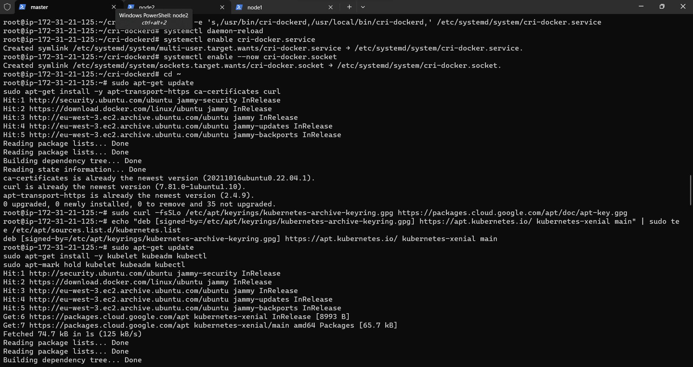


# b) minikube
* A Kubernetes cluster can be deployed on either physical or virtual machines. To get started with Kubernetes development, you can use Minikube. Minikube is a lightweight Kubernetes implementation that creates a VM on your local machine and deploys a simple cluster containing only one node. Minikube is available for Linux, macOS, and Windows systems. The Minikube CLI provides basic bootstrapping operations for working with your cluster, including start, stop, status, and delete.
[Referhere](https://kubernetes.io/docs/tutorials/hello-minikube/)

* First we can create an instance(t2.medium) in that install docker

```
curl -fsSL https://get.docker.com -o get-docker.sh
sh get-docker.sh
sudo usermod -aG docker ubuntu
docker info
exit and relogin

```
# After that install minikube
  [referhere](https://minikube.sigs.k8s.io/docs/start/)
* This downloads the latest release of minikube for Linux amd64 architecture, installs it, and starts a single-node Kubernetes cluster using the Docker driver.
 
```
curl -LO https://storage.googleapis.com/minikube/releases/latest/minikube-linux-amd64
sudo install minikube-linux-amd64 /usr/local/bin/minikube
minkube start
sudo snap install kubectl --classic
vi spc.yml
kubectl apply -f spc.yml
kubectl get pod
kubectl describe po
kubectl create deployment spc --image=raji07/rajispringpetclinic:spc
kubectl expose deployment spc --type=NodePort --port=8080
kubectl port-forward service/spc --address "0.0.0.0" 7080:8080
```

* Let's create a pod configuration file: vi spc.yml

* This opens a new file in the vi text editor.

* Paste the following YAML code into the file and save it
```yml
---
apiVersion: v1
kind: Pod
metadata:
  name: spc
spec:
  containers:
    - name: spc-cont
      image: raji07/rajispringpetclinic:spc
      ports: 
        - containerPort: 8080
```
* Let's create pod 
```
kubectl create -f spc.yml
kubectl get pods
kubectl get pods -o wide
```

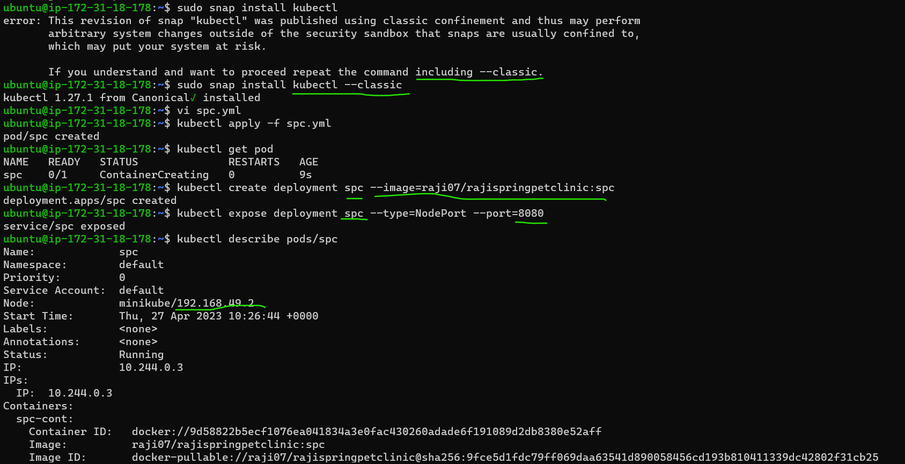

* Goto new tab copy the node public IP address <publicIP:7080>
* spc page came.
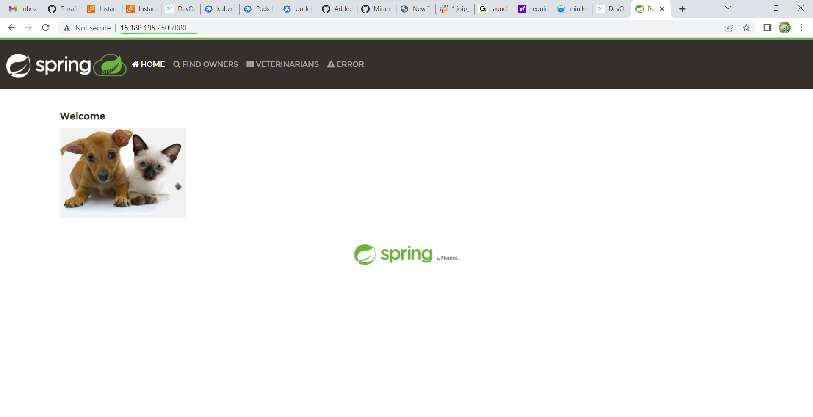

# c)kind
* kind is a tool for running local Kubernetes clusters using Docker container “nodes”.
kind was primarily designed for testing Kubernetes itself, but may be used for local development or CI.
[referhere](https://kind.sigs.k8s.io/docs/user/quick-start/#installation) in this see linux.

* launch an instance(t2.medium) and in stall docker in that after that run this commands
```
curl -Lo ./kind https://kind.sigs.k8s.io/dl/v0.18.0/kind-linux-amd64
chmod +x ./kind
sudo mv ./kind /usr/local/bin/kind
kind create cluster  #with this command create the cluster in Kind 
sudo snap install kubectl --classic
vi spc.yml
kubectl apply -f spc.yml
kubectl get po
kubectl describe po
```


# 2) Writing the Manifest Files for Spc & nopCommerce Apps.

# spc manifest file

```yml
---
apiVersion: v1
kind: Pod
metadata:
  name: spc
spec:
  containers:
    - name: spc-cont
      image: archanaraj/myspcimage:3.0.0
      ports: 
        - containerPort: 8080
```
* use this commands for creating pod
```
vi spc.yml
kubectl apply -f spc.yml
kubectl get po
kubectl describe po
```

# nop manifest file
```yml
---
apiVersion: v1
kind: Pod
metadata:
  name: nop
spec:
  containers:
    - name: nopcont
      image: archanaraj/nop:latest
      ports:
        - containerPort: 5000

```
* use this commands for creating pod
```
vi nop.yml
kubectl apply -f nop.yml
kubectl get po
kubectl describe po
```

# 3) Writing the Manifest File for Game of Life App.

```yml
---
apiVersion: v1
kind: Pod
metadata:
  name: gameoflife
spec:
  containers:
    - name: gol
      image: archanaraj/gol:333
      ports:
        containerPort: 8080
```


# 4) Creating the Jobs and CronJobs
* K8s has two types of jobs
   * Job: Run an activity/script to completion
   * CronJob: Run an activity/script to completion at specific time period or intervals.
# Now we can create Jobs
* Running job and waiting for completion
* Following this yml file for Jobs
* It's paste in ``vi job.yml``

```yml
---
apiVersion: batch/v1
kind: Job
metadata:
  name: hellojob
spec:
  backoffLimit: 2
  activeDeadlineSeconds: 60
  template:
    metadata:
      name: jobpod
    spec:
      restartPolicy: OnFailure
      containers:
        - name: alpine  
          image: alpine
          command:
            - sleep
            - 10s
```
* Execute the below commands and check the jobs time period in between run the jobs commands again.

* The above error came for we didn't give restart policy and backoffLimit also
* Jobs have backoffLimit to limit number of restarts and activeDeadline seconds to limit timeperiod of execution.
* For jobs restartPolicy cannot be Always as job will never finish,so we can give that mandatory for jobs.
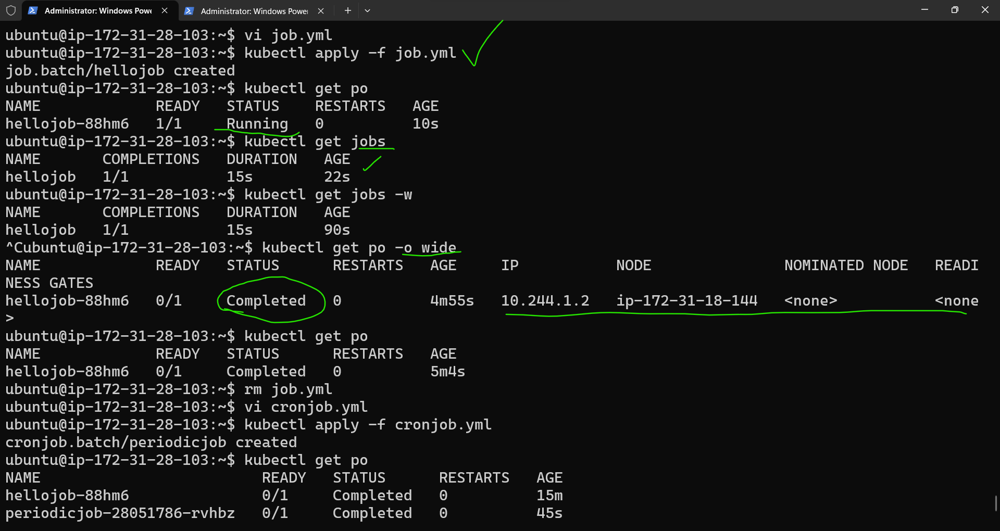
* i can Give active deadline seconds 60 so the pod will be shown completed after 60s .
```
# kubectl apply -f hellojob.yml
# kubectl get jobs -w
# kubectl get po
# kubectl delete jobs.batch hellojob
# kubectl get jobs
# kubectl get po 
```
* For delete the jobs
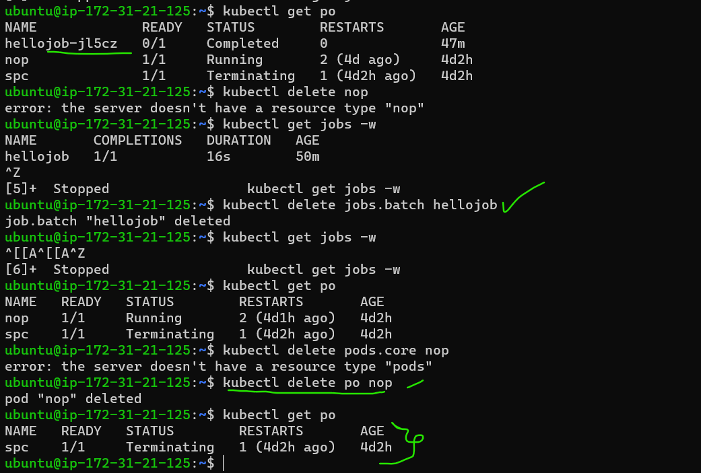

# Now we can create the CronJob
* Cronjob manifest which we have written create a job every minute and waits for completion
* Follow the yml file for cronjob

* Paste it in ``vi runmultipletimes.yml``

```yml
---
apiVersion: batch/v1
kind: CronJob
metadata:
  name: periodicjob
spec:
  schedule: '* * * * *' 
  jobTemplate:
    metadata:
      name: getlivedata
    spec:
      template:
        metadata:
          name: livedatapod
        spec:
          restartPolicy: OnFailure
          containers:
            - name: alpine
              image: alpine
              command:
                - sleep
                - 3s

```
* Execute the below commands
```
# kubectl apply -f runmultipletimes.yml
# kubectl get cronjobs.batch
# kubectl get cronjobs.batch -w
# kubectl get jobs.batch
# kubectl get po
```
* Again execute this commands
```
# kubectl get cronjobs.batch
# kubectl get jobs.batch
# kubectl get po
```
* Then the jobs are created again in every one minute because we can give the cron job time  every minute so it's created at every minute

* Next delete the cronjob,if not deleted it's run every minute so i deleted that with use of below commands
```
# kubectl delete -f runmultipletimes.yml
# kubectl get cronjobs.batch
# kubectl get jobs.batch
# kubectl get po              
```
* All jobs,pods are deleted


# 5) Creating the ReplicaSet
* ReplicaSet is controller which maintains count of Pods as Desired State
* Write manifest file and paste it in ``vi nginx-rs.yml``  
  
```yml
---
apiVersion: apps/v1
kind: ReplicaSet
metadata:
  name: nginx-rs
spec:
  minReadySeconds: 1
  replicas: 3
  selector:
    matchLabels:
      app: nginx
  template:
    metadata:
      name: nginx-pod
      labels:
        app: nginx
    spec:
      containers:
        - name: nginx
          image: nginx:1.23
          ports:
            - containerPort: 80

```
* Execute below commands
```
kubectl apply -f nginx-rs.yml
kubectl get replicasets.apps
kubectl get po
kubectl describe rs
```
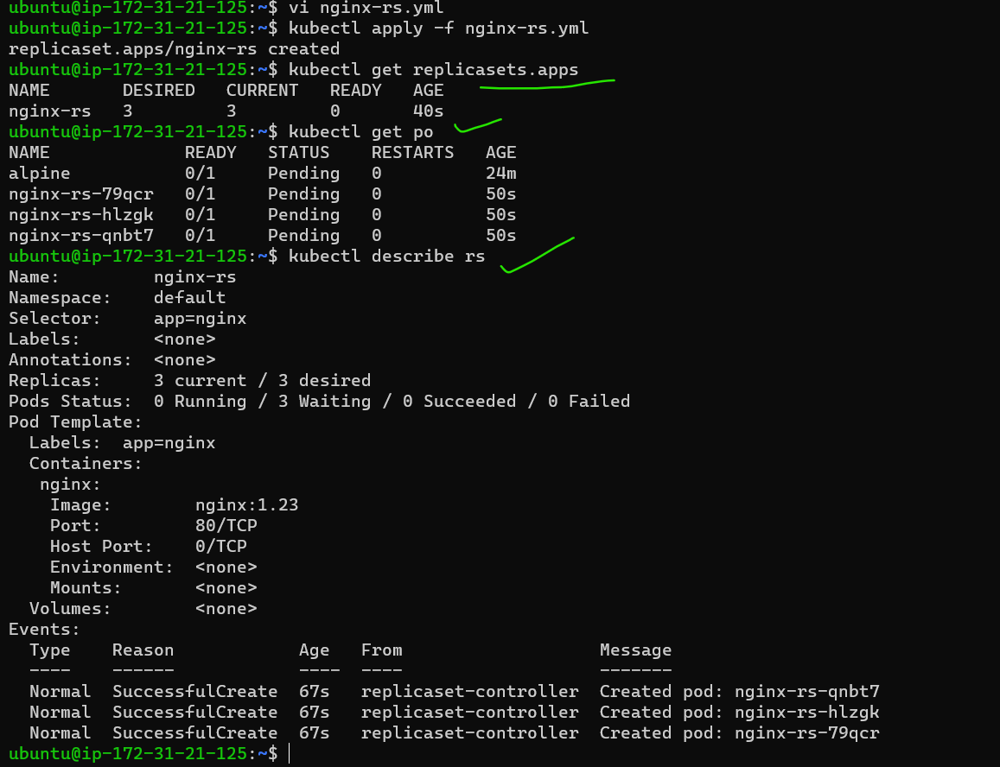
* Let's change the replica count ``kubectl scale --replicas=5 rs/nginx-rs``
* Next check it with ``kubectl get po``

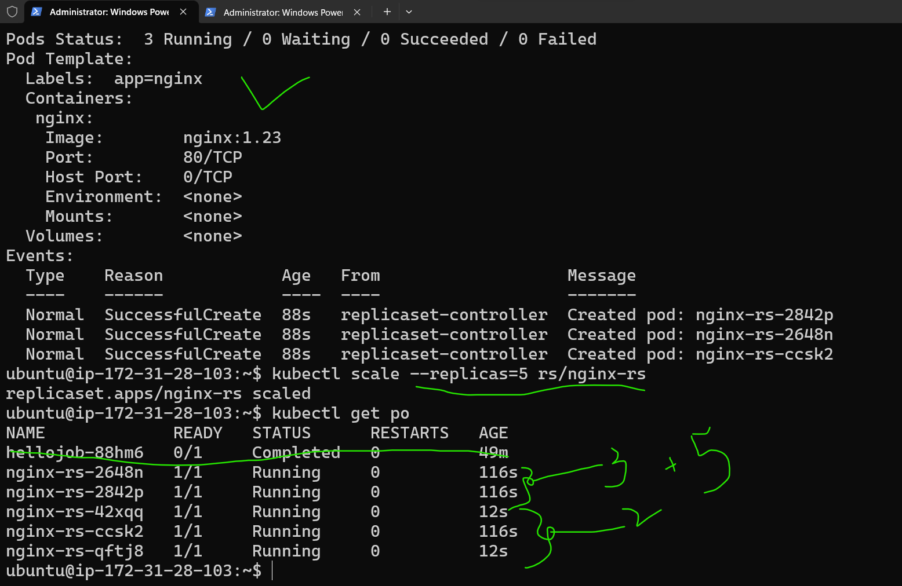
* We can increase (scale out) as well decrease (scale in) the replica count
* Create 5 Pods with jenkins and alpine in one Pod
```yml
---
apiVersion: apps/v1
kind: ReplicaSet
metadata:
  name: jenkins-rs
spec:
  minReadySeconds: 5
  replicas: 5
  selector:
    matchLabels:
      app: jenkins
  template:
    metadata:
      name: jenkins
      labels:
        app: jenkins
    spec:
      containers:
        - name: jenkins
          image: jenkins/jenkins:lts-jdk11
          ports:
            - containerPort: 8080
        - name: alpine
          image: alpine:3
          args:
            - sleep
            - 1d
```
* execute this commands
```
# kubectl apply -f jenkins-rs.yml
# kubectl get rs
# kubectl get po
# kubectl describe rs
```
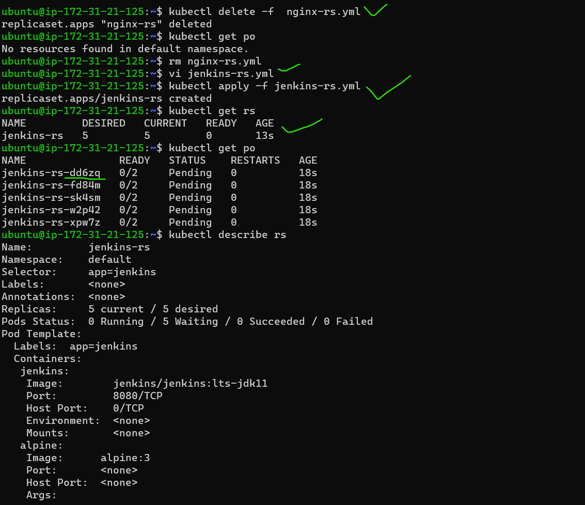
* deleting the pod with this command  ``kubectl delete pod <pod id or name>``  
* After deleting the pod replica will create again 
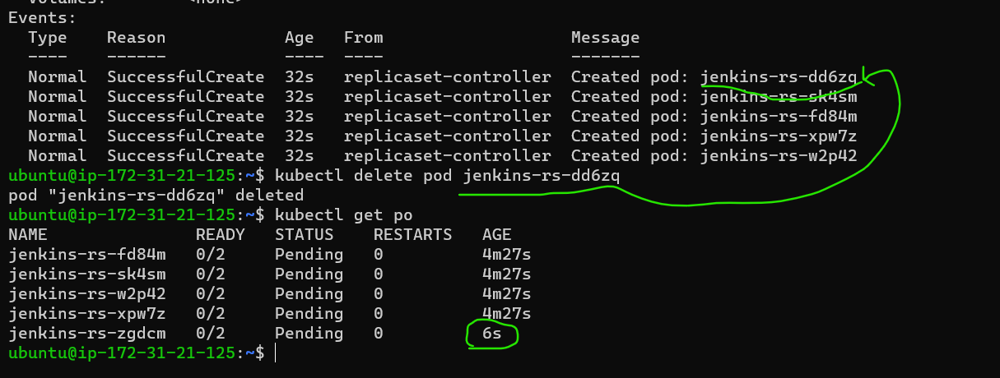
# 6) Writing the LABELS and Selecting the LABELS using selector concept
* Labels are key value pairs that can be attached as metadata to k8s objects.
* Labels help in selecting/querying/filtering objects
* Labels can be selected using
     * equality based
     * set based
* Label Activity 1. Create a nginx pod with label
  Lets create a nginx pod with label app: nginx

```yml
  ---
apiVersion: v1
kind: Pod
metadata:
  name: labeldemo
  labels:
    app: nginx
spec:
  containers:
    - name: nginx
      image: nginx:1.23
      ports:
        - containerPort: 80

```
* execute below commnads
```
# kubectl apply -f labeldemo1.yml
# kubectl get po --show-labels
For manually create the labels means not in yml file in the above we can create label is app-nginx
# kubectl run n1 --image=nginx --labels "app=nginx,component=web"
# kubectl get po --show-labels
# kubectl run n1 --image=nginx --labels "app=web,component=web"
# kubectl get po --show-labels
with using selector
# kubectl get po --selctor "app=nginx" --show-labels
# kubectl get po --selctor "app!=nginx" --show-labels
# kubectl get po --selctor "component,app in (web)" --show-labels
# kubectl get po --selctor "component,app in (web,nginx)" --show-labels
# kubectl get po --show-labels
# same as it is in jenkins also we created labels
```
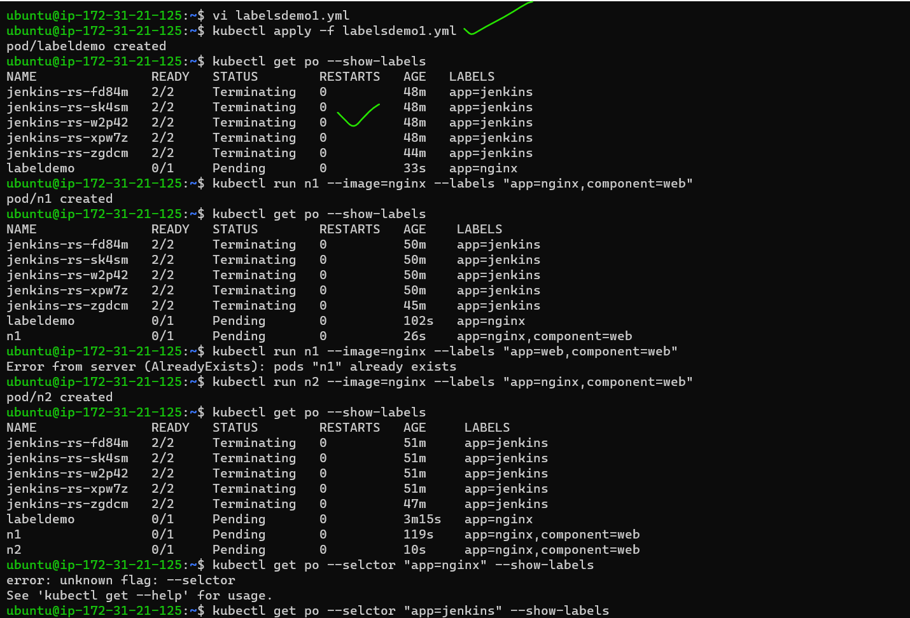
* Create 5 pods with label app=jenkins
```yml
---
apiVersion: apps/v1
kind: ReplicaSet
metadata:
  name: jenkins-rs
spec:
  minReadySeconds: 5
  replicas: 5
  selector:
    matchLabels:
      app: jenkins
  template:
    metadata:
      name: jenkins
      labels:
        app: jenkins
    spec:
      containers:
        - name: jenkins
          image: jenkins/jenkins:lts-jdk11
          ports:
            - containerPort: 8080
        - name: alpine
          image: alpine:3
          args:
            - sleep
            - 1d
```
* Jenkins rs didnt create any pod as there were 5 pods matching label selector. we had deleted one pod which lead to creation of jenkins pod from 
  the template section in above manifest            
* execute beloew commands for check
```
# kubectl get po --show-labels
# kubectl run n3 --image=nginx --labels "app=jenkins"
# kubectl get po --show-labels
# kubectl run n4 --image=nginx --labels "app=jenkins"
# kubectl get po --show-labels
# kubectl apply -f jenkins-label.yml
# kubectl get rs jenkins-rs
# kubectl get po
# kubectl delete po n4
# kubectl get po  
```
* ReplicationController only allows equality based selectors where as ReplicaSet supports set based selectors also
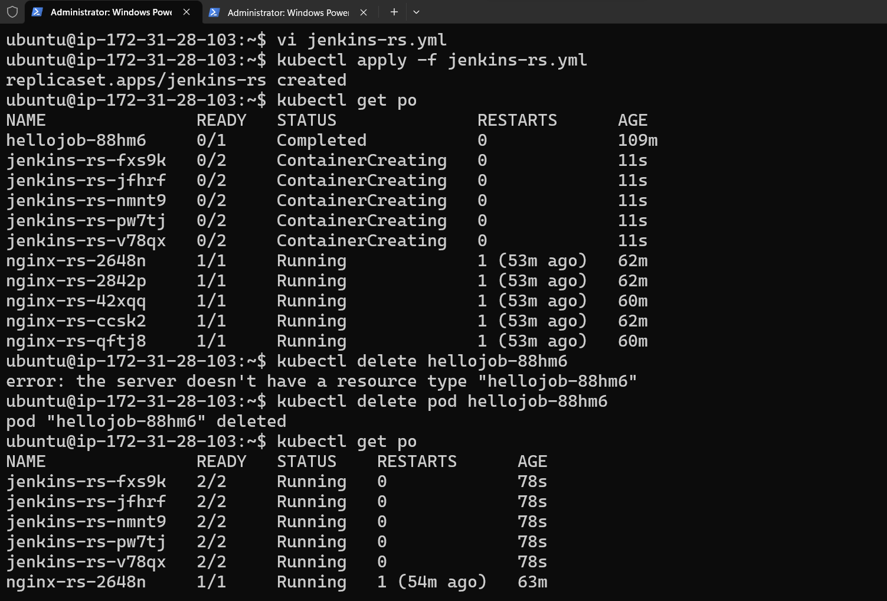

* set based example yml file

```yml
---
apiVersion: apps/v1
kind: ReplicaSet
metadata:
  name: setbased
  labels:
    purpose: understanding
    concept: setbased
spec:
  minReadySeconds: 2
  replicas: 3
  selector:
    matchExpressions:
      - key: app
        operator: In
        values:
          - nginx
          - web
      - key: env
        operator: NotIn
        values:
          - prod
          - uat
      - key: failing
        operator: DoesNotExist
        values:
  template:
    metadata:
      name: nginx
      labels:
        app: nginx
        env: dev
    spec:
      containers:
        - name: nginx
          image: nginx:1.23
          ports:
            - containerPort: 80
```
            