* Kubernetes (k8s) Activities (MAY9th/2023)

# 1.Create a Kubernetes cluster using kubeadm

kubeadm instalation
--------------------
* First we can create 2 instances with t2 medium
* Next that 2 nodes 1 is masternode and another node1(workernode)
* In this 2 nodes install docker with docker commands
```
curl -fsSL https://get.docker.com -o get-docker.sh
sh get-docker.sh
sudo usermod -aG docker ubuntu
docker info
exit and relogin
```
* After install docker in that 2 nodes exit and relogin because we can give usermod permissions.
* After successful installation re-login into your machine
* After re-login try to get docker info $ docker info
* next create ``vi k8s.yml`` for install kubeadm through shell scripting
* next in that vi file paste below commands
```
#!/bin/bash
wget https://storage.googleapis.com/golang/getgo/installer_linux
chmod +x ./installer_linux
./installer_linux
source ~/.bash_profile
git clone https://github.com/Mirantis/cri-dockerd.git
cd cri-dockerd
mkdir bin
go build -o bin/cri-dockerd
mkdir -p /usr/local/bin
install -o root -g root -m 0755 bin/cri-dockerd /usr/local/bin/cri-dockerd
cp -a packaging/systemd/* /etc/systemd/system
sed -i -e 's,/usr/bin/cri-dockerd,/usr/local/bin/cri-dockerd,' /etc/systemd/system/cri-docker.service
systemctl daemon-reload
systemctl enable cri-docker.service
systemctl enable --now cri-docker.socket
cd ~
sudo apt-get update
sudo apt-get install -y apt-transport-https ca-certificates curl
sudo curl -fsSLo /etc/apt/keyrings/kubernetes-archive-keyring.gpg https://packages.cloud.google.com/apt/doc/apt-key.gpg
echo "deb [signed-by=/etc/apt/keyrings/kubernetes-archive-keyring.gpg] https://apt.kubernetes.io/ kubernetes-xenial main" | sudo tee /etc/apt/sources.list.d/kubernetes.list
sudo apt-get update
sudo apt-get install -y kubelet kubeadm kubectl
sudo apt-mark hold kubelet kubeadm kubectl
```

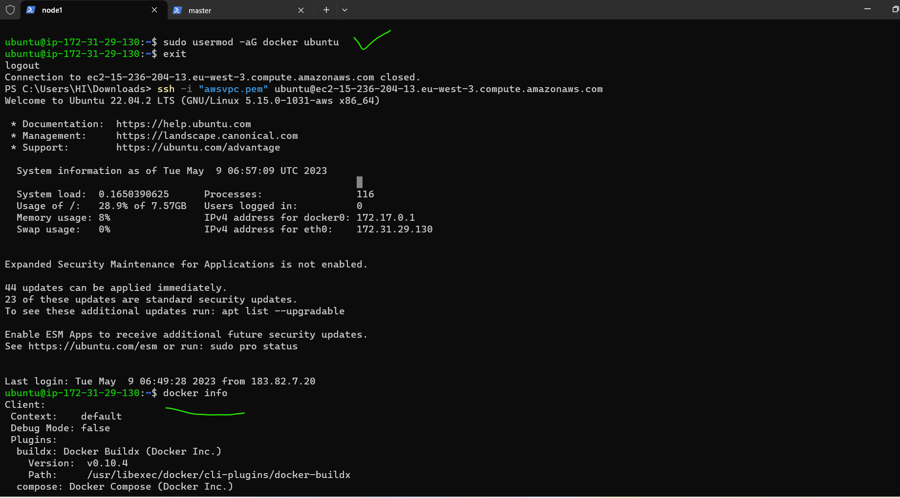
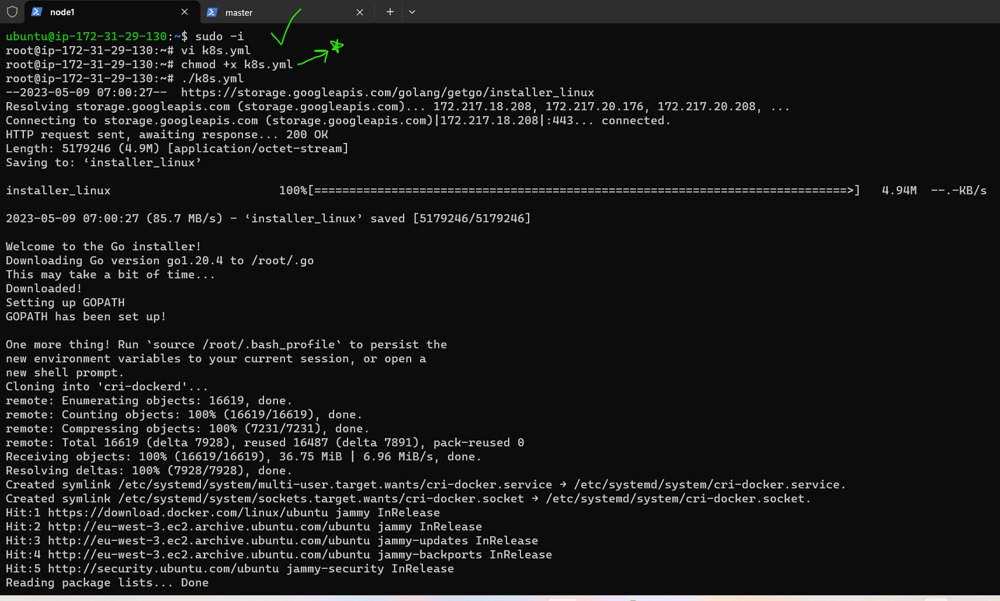
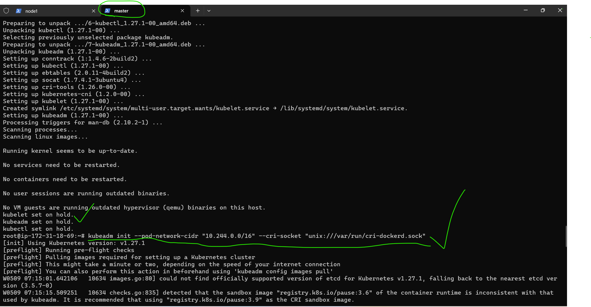


# 2.Deploy any application using kubectl

```yml
apiVersion: apps/v1 
kind: Deployment
metadata:
  name: spc-deploy
  labels:
    app: spc  
spec:
  minReadySeconds: 3
  replicas: 1
  selector:
    matchLabels:
      app: spc
  template:
    metadata:
      labels: 
        app: spc
    spec:
      containers: 
        - name: spc-cont
          image: archanaraj/myspcimage:latest
          ports :
            - containerPort: 8080    
```
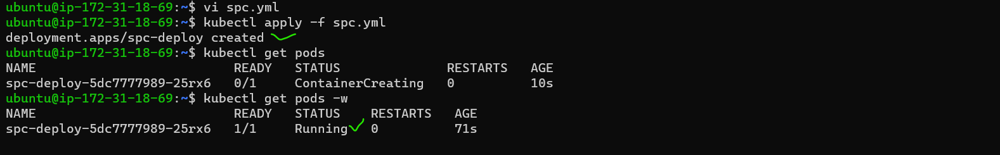

Use below steps to create AKS cluster
--------------------------------------
* create one virtual machine in azure connect in terminal and execute below commmands
```
curl -L https://aka.ms/InstallAzureCli | bash
source ~/.bashrc
az login
az login --tenant 00e5206b-f549-447d-8eaf-917573339f60
az group create --name myResourceGroup --location eastus
az aks create -g myResourceGroup -n myAKSCluster --enable-managed-identity --node-count 2 --enable-addons monitoring --enable-msi-auth-for-monitoring  --generate-ssh-keys
sudo -i
az aks install-cli
exit
az aks get-credentials --resource-group myResourceGroup --name myAKSCluster
```
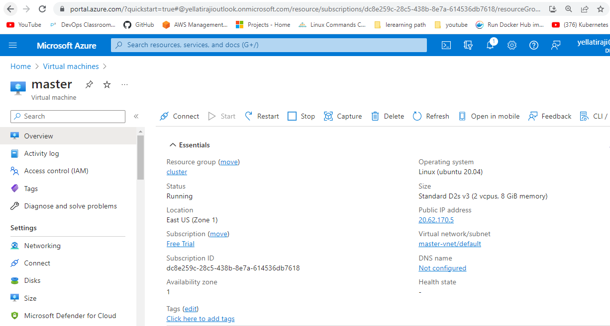
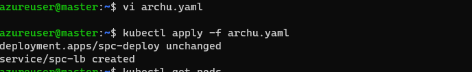
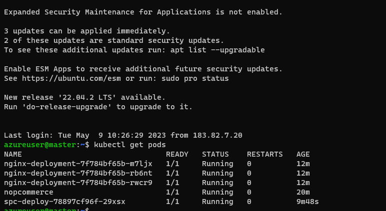

# 3.Backup Kubernetes I.e backup etcd
* 1.Create 1 master node and 2 worker nodes for backup etcd
* First i can create 3 t2.medium nodes(instances) in AWS
* In that 3 nodes we have to install docker with use of below commands
* Next create shell script to install kubeadm
# run the below script in root user
```
vi k8s.yml
chmod +x k8s.yml
./k8s.yml
```

* shell script for install kubeadm
```
#!/bin/bash
apt-get update
curl -fsSL https://get.docker.com -o get-docker.sh
sh get-docker.sh
sudo usermod -aG docker ubuntu
wget https://storage.googleapis.com/golang/getgo/installer_linux
chmod +x ./installer_linux
./installer_linux
source ~/.bash_profile
git clone https://github.com/Mirantis/cri-dockerd.git
cd cri-dockerd
mkdir bin
go build -o bin/cri-dockerd
mkdir -p /usr/local/bin
install -o root -g root -m 0755 bin/cri-dockerd /usr/local/bin/cri-dockerd
cp -a packaging/systemd/* /etc/systemd/system
sed -i -e 's,/usr/bin/cri-dockerd,/usr/local/bin/cri-dockerd,' /etc/systemd/system/cri-docker.service
systemctl daemon-reload
systemctl enable cri-docker.service
systemctl enable --now cri-docker.socket
cd ~
sudo apt-get update
sudo apt-get install -y apt-transport-https ca-certificates curl
# sudo curl -fsSLo /etc/apt/keyrings/kubernetes-archive-keyring.gpg https://packages.cloud.google.com/apt/doc/apt-key.gpg
sudo curl -fsSLo /etc/apt/keyrings/kubernetes-archive-keyring.gpg https://dl.k8s.io/apt/doc/apt-key.gpg
echo "deb [signed-by=/etc/apt/keyrings/kubernetes-archive-keyring.gpg] https://apt.kubernetes.io/ kubernetes-xenial main" | sudo tee /etc/apt/sources.list.d/kubernetes.list
sudo apt-get update
sudo apt-get install -y kubelet kubeadm kubectl
sudo apt-mark hold kubelet kubeadm kubectl
```
# exit and relogin 
* because docker also installed with script so relogin is manditory.
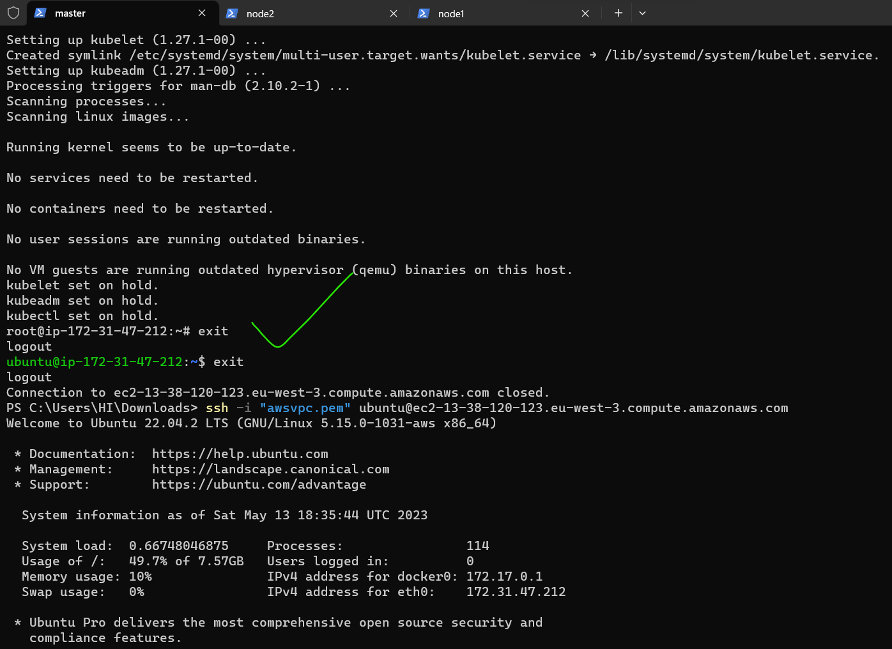
# run the below command in root user
* To create cluster in master node use this command ``kubeadm init --pod-network-cidr "10.244.0.0/16" --cri-socket "unix:///var/run/cri-dockerd.sock"``

* To configure we have to follow below commands in reguler user so we can exit from root user.
* To start using your cluster, you need to run the following as a regular user(ubuntu user)
* below commands execute only in master node 
  ```
  exit
  mkdir -p $HOME/.kube
  sudo cp -i /etc/kubernetes/admin.conf $HOME/.kube/config
  sudo chown $(id -u):$(id -g) $HOME/.kube/config
  ```
* To setup configure run this command to install flannel ``kubectl apply -f https://github.com/flannel-io/flannel/releases/latest/download/kube-flannel.yml``

* To attach nodes to the master node run this command by providing CRI-DOCKER in node1,node2 as a root user ``kubeadm join 172.31.47.212:6443 --token o3w92f.36k6full7pu2ygi0 \
                       --cri-socket "unix:///var/run/cri-dockerd.sock" \
                --discovery-token-ca-cert-hash sha256:bac5374430a738a01b6914e68058ac1f95c5682b2f113462779c908bf4411ebe``
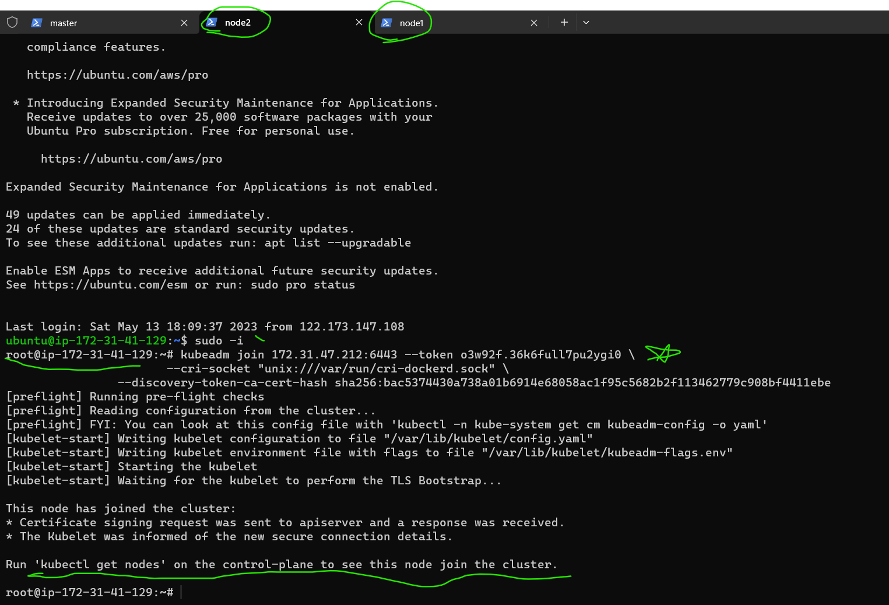in this control plane means master node.(master node also called as control plane)             
* In master node ``kubectl get nodes -w`` 

* [referhere](https://k21academy.com/docker-kubernetes/etcd-backup-restore-in-k8s-step-by-step/) for etcd backup

* for etcd backup run this commands in masternode``sudo apt  install etcd-client``
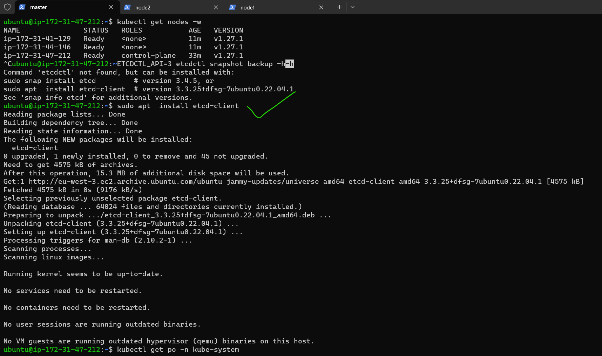
* we can get the details about pod running status with namespaces in the kube-system`` kubectl get po -n kube-system`` `` kubectl describe pod etcd-ip-<maternodeIP> -n kube-system`` like this ``kubectl describe pod etcd-ip-172-31-47-212 -n kube-system``
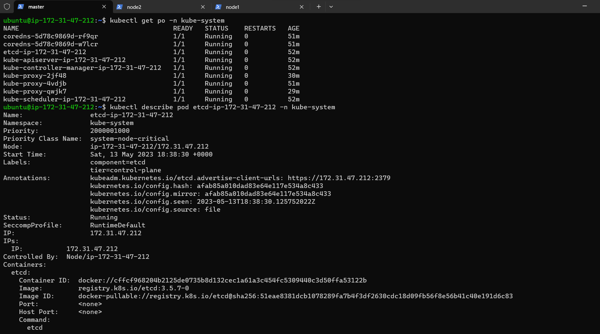
* Take a snapshot of the etcd datastore using etcdctl:
``ETCDCTL_API=3 etcdctl snapshot save snapshot.db --cacert /etc/kubernetes/pki/etcd/ca.crt --cert /etc/kubernetes/pki/etcd/server.crt --key /etc/kubernetes/pki/etcd/server.key``

* Next verify the snapshot status command is ``sudo ETCDCTL_API=3 etcdctl snapshot status snapshot.db`` ``sudo ETCDCTL_API=3 etcdctl --write-out=table snapshot status snapshot.db``
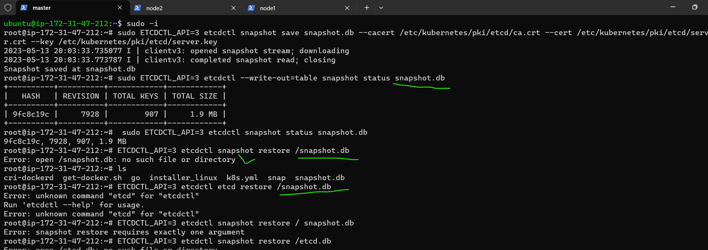
* for status command is ``sudo ETCDCTL_API=3 etcdctl snapshot status snapshot.db`` 
* for restore command is ``ETCDCTL_API=3 etcdctl snapshot restore /snapshot.db``
* after backup again ckeck the pods in runnig status with namespace command is ``kubectl get po -n kube-system``
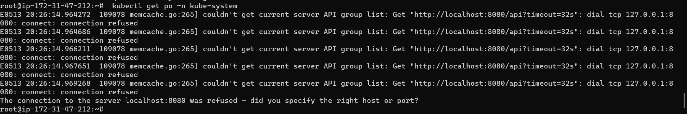

# 4.List out all the pod’s running in kube system namespace
* command is ``kubectl get pods --all-namespaces``
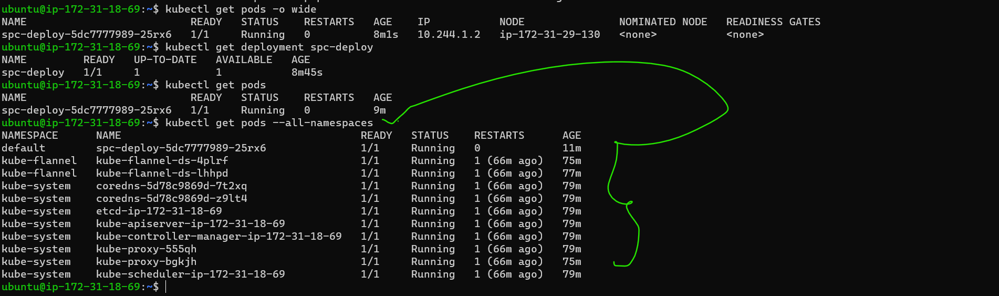

# 5.Write down all the steps required to make Kubernetes highly available
* [referhere](https://kubernetes.io/docs/setup/production-environment/tools/kubeadm/ha-topology/)for HA in k8s
* In the context of Kubernetes, high availability is a set of configurations that aim to provide a minimal level of service. For example, the application will still have a minimal level of service while a node goes down.

* To make Kubernetes highly available, you need to ensure that the control plane components and worker nodes are resilient to failures. Here are the steps involved in achieving high availability for Kubernetes:

1. Cluster Design: Plan your Kubernetes cluster architecture with high availability in mind.  onsider factors such as the number of control plane nodes, worker nodes, and networking requirements.

2. Control Plane Replication: Set up multiple replicas of the control plane components, such as the API server, controller manager, and scheduler. Distribute these components across multiple physical or virtual machines to avoid a single point of failure.

3. Load Balancing: Configure a load balancer in front of the control plane replicas to distribute incoming traffic and ensure high availability. The load balancer can perform health checks on the control plane nodes and route requests to healthy nodes.

4. etcd Cluster: etcd is the distributed key-value store used by Kubernetes to store cluster data. Deploy an etcd cluster with an odd number of nodes (e.g., 3, 5, or 7) for fault tolerance. Spread the etcd nodes across different physical or virtual machines.

5. Networking: Set up a reliable and redundant network infrastructure to connect all the components in your Kubernetes cluster. Use network protocols and technologies that provide fault tolerance and load balancing, such as Virtual IP (VIP) or network overlay solutions.

6. Worker Node High Availability: Ensure that your worker nodes are highly available by distributing them across multiple physical or virtual machines. Use a container runtime like Docker or containerd that supports node-level redundancy and automatic rescheduling of containers in case of node failures.

7. Monitoring and Health Checks: Implement monitoring and health checking mechanisms for all components in your Kubernetes cluster. Utilize tools like Prometheus, Grafana, or Kubernetes-native solutions like kube-state-metrics to collect metrics and detect failures.

8. Automated Cluster Healing: Implement self-healing mechanisms to automatically recover from failures. Use tools like Kubernetes Operator Framework, Kubernetes-native controllers, or custom scripts to monitor the cluster state and trigger necessary actions, such as scaling up replicas or rescheduling pods.

9. Regular Backups: Take regular backups of the etcd data to ensure data recovery in case of catastrophic failures. Use tools like Velero or custom backup scripts to create backups and test the restoration process.

10. Disaster Recovery: Plan for disaster recovery scenarios by having a backup cluster in a separate geographical location or cloud region. Replicate cluster configurations, resources, and data to the backup cluster and establish mechanisms to switch traffic to the backup cluster when needed.

11. Testing and Simulations: Regularly perform tests and simulations to validate the high availability setup. Conduct failure tests by intentionally triggering failures in different components to ensure the system behaves as expected and recovers automatically.

12. Documentation and Runbooks: Document the entire high availability setup, including configurations, procedures, and runbooks. This documentation will serve as a reference for troubleshooting, maintenance, and training purposes.

By following these steps, you can achieve high availability for your Kubernetes cluster, ensuring that it remains resilient to failures and provides continuous service availability.

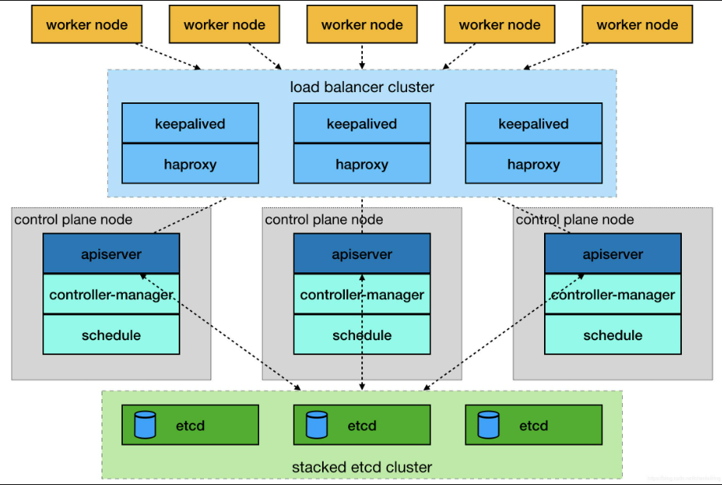
* [referhere](https://www.kubesphere.io/blogs/k8s-ha-practices/) for using kubekey HA in k8s.

# 6.Do a rolling update and roll back(30/04directdevops)
* means rolling update is update the version(ex:java17) if we want for the application
* if we want previous version(ex:java11) i.e roll back
* Role and ClusterRole:
They are just a set of rules that represent a set of permissions. A Role can only be used to grant access to resources within namespaces. A ClusterRole can be used to grant the same permissions as a Role but they can also be used to grant access to cluster-scoped resources, non-resource endpoints.
* RoleBinding and ClusterRoleBinding:
As the name implies, it’s just the binding between a subject and a Role or a ClusterRole.
```yml
---
apiVersion: apps/v1
kind: Deployment
metadata:
  name: nginx-deployment
  labels:
    app: nginx
spec:
  replicas: 1
  selector:
    matchLabels:
      app: nginx
  template:
    metadata:
      labels:
        app: nginx
    spec:
      containers:
      - name: nginx
        image: nginx:1
        ports:
        - containerPort: 80
```
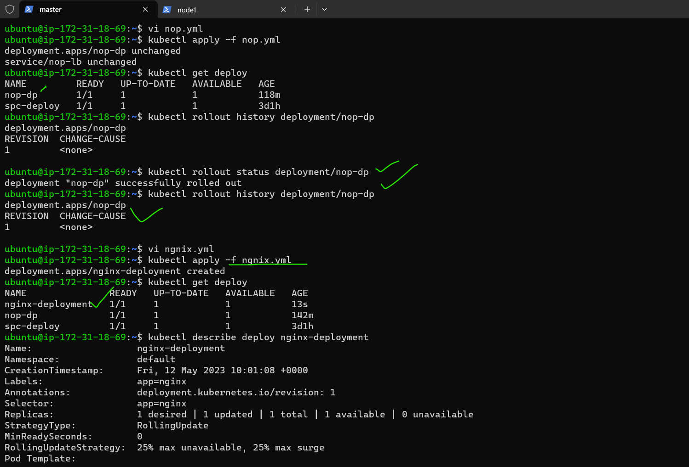
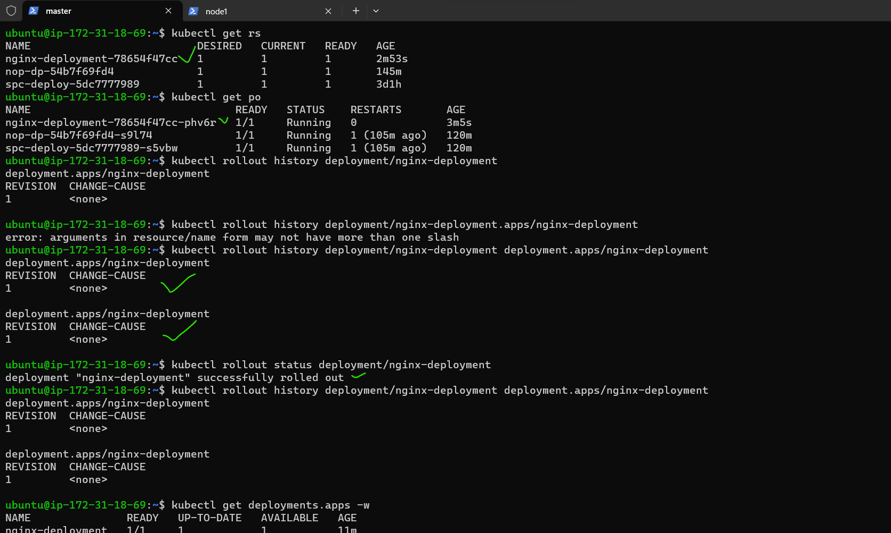

* rollout command is ``kubectl rollout history deployment/<deployment file name>`` 
* example``kubectl rollout history deployment/ngnix-deploy``
* check the status``kubectl rollout status deployment/nginx-deploy``
* Now to rollback to previous versions and update multiple versions ``kubectl rollout undo``
* next check the history again``kubectl rollout history deployment/ngnix-deploy`` 
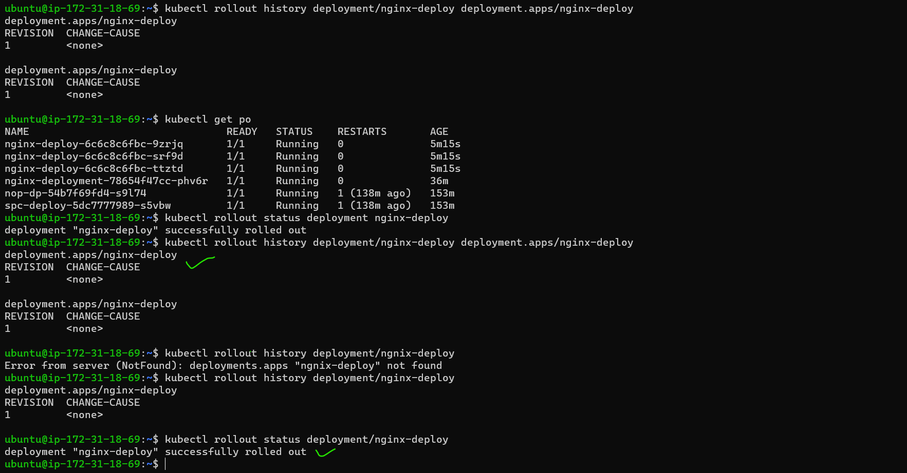

# 7.Ensure usage of secret in MySQL and configmaps
* configmaps yml file

```yml
---
apiVersion: v1
kind: ConfigMap
metadata:
  name: mysql-cm
data:
  MYSQL_USER: archana
  MYSQL_PASSWORD: "1234"
  MYSQL_ROOT_PASSWORD: "1234"
  MYSQL_DATABASE: employees
```
* First apply above file means after configmap then only set the env below file
* command ``kubectl apply -f mysql-config.yml``
* 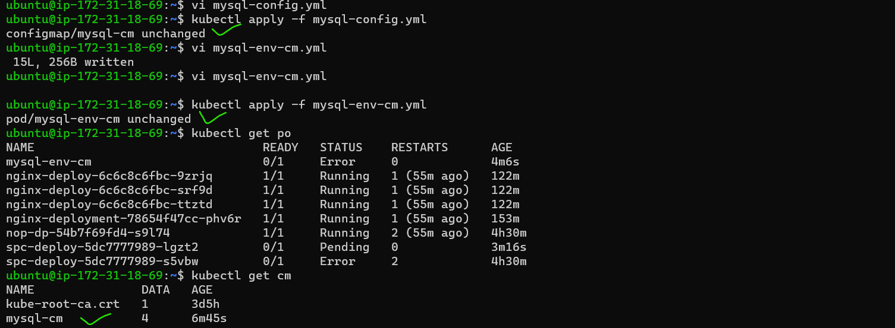
* If pods create error came then delete all resources 
* 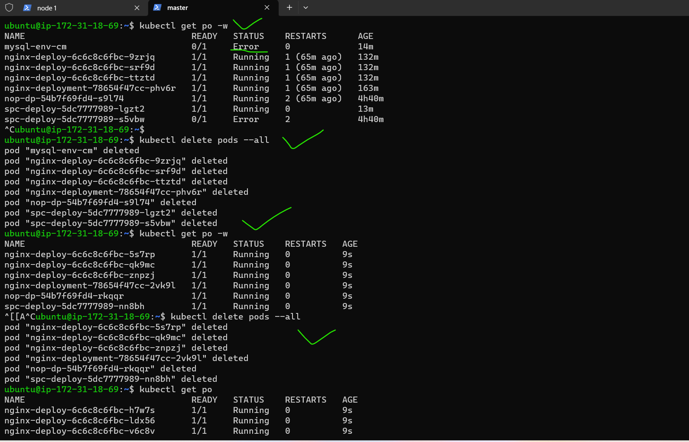then apply the files 
  
* pod creation with config file
```yml
---
apiVersion: v1
kind: Pod
metadata:
  name: mysql-env-cm
spec:
  containers:
    - name: mysql
      image: mysql:8
      envFrom:
        - configMapRef:
            name: mysql-cm
            optional: false
      ports:
        - containerPort: 3306
```

* for see the env variables ``kubectl exec mysql-env-cm -- printenv``
* 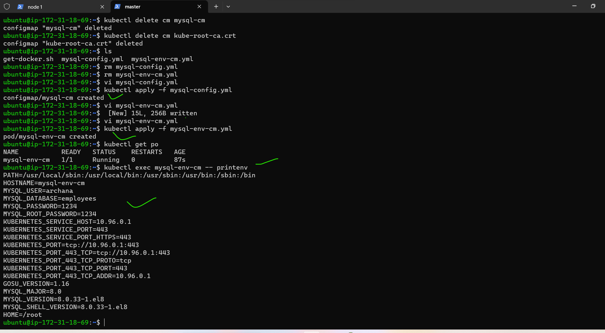
* 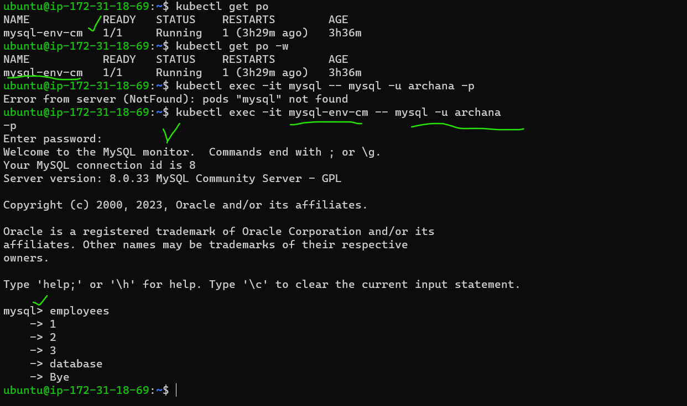

Secrets
-------

* To deal with confidential data k8s has secrets
* pod secret yaml file for mysql
* copy and paste the yml file``vi mysql-secret.yml``
* First we can execute the mysql-secret.yml file `` kubectl apply -f mysql-secret.yml``

```yml
---
apiVersion: v1
kind: Secret
metadata:
  name: mysql-secret
data:
  MYSQL_PASSWORD: MTIzNDUK #12345
  MYSQL_ROOT_PASSWORD: bXlwYXNzd29yZAo= #mypassword
  MYSQL_DATABASE: ZW1wbG95ZWVzCg== #employees
  MYSQL_USER: YXJjaGFuYQ== #archana

```
* For encode the secrets[referhere](https://www.base64encode.org/)
* copy and paste the yml file``vi mysql-pod-scrt.yml``
* First we can execute the mysql-secret.yml file `` kubectl apply -f mysql-pod-scrt.yml``

```yml
---
apiVersion: v1
kind: Pod
metadata:
  name: mysql
spec:
  containers:
    - name: mysql
      image: mysql:8
      envFrom:
        - secretRef:
            name: mysql-secret
            optional: false
      ports:
        - containerPort: 3306
```
* check the pods``kubectl get pods``
* describe the mysql secret data``kubectl describe secret mysql-secret`` 
* enter into the mysql container ``kubectl exec -it mysql -- mysql -u archana -p``
* 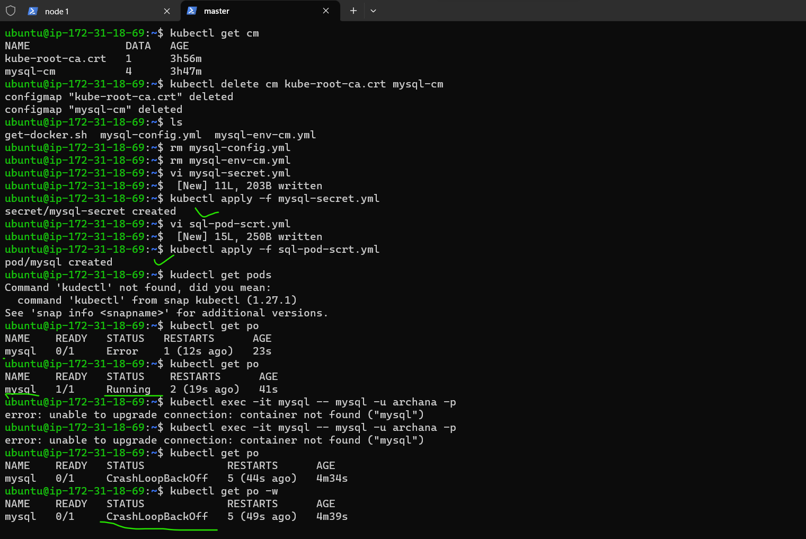
* 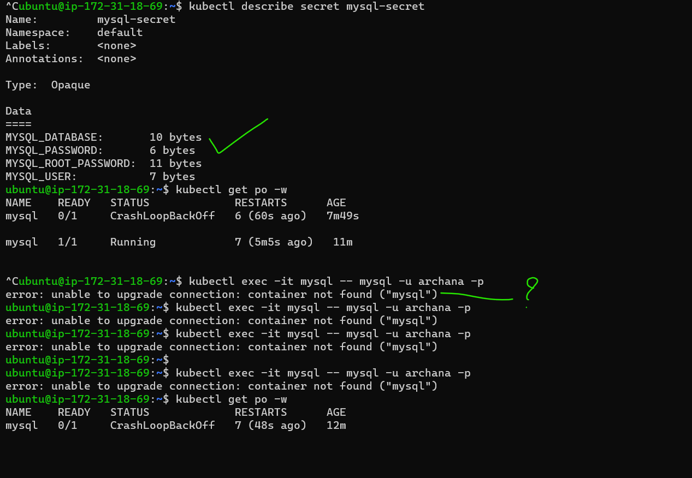

# 8.Create a nop commerce deployment with MySQL statefulset and nop deployment
nop commerce deployment yml file
---------------------------------

```yml
---
apiVersion: apps/v1 
kind: Deployment
metadata:
  name: nop-deploy
  labels:
    app: nop  
spec:
  minReadySeconds: 5
  replicas: 1
  selector:
    matchLabels:
      app: nop
  template:
    metadata:
      name: nop
    spec:
      containers: 
        - name: nop-cont  
          image: archanaraj/nop:latest
          ports :
            - ContainerPort: 5000    
```
* for pods creation command is `` kubectl apply -f nop.yml``

* for checking ``kubectl get deploy``

* my sql statefulset yml file

```yml
---
apiVersion: apps/v1
kind:	StatefulSet
metadata:
  name: mysql
  labels:
    app: mysql
spec:
  replicas: 1
  serviceName: mysql-svc 
  selector:
    matchLabels:
      app: mysql
  template:
    metadata:
      name: mysql
      labels:
        app: mysql
    spec:
      containers:
        - name: mysql
          image: mysql:5
          env: 
            - name: MYSQL_ROOT_PASSWORD
              value: password
            - name: MYSQL_USER
              value: Archana
            - name: MYSQL_USER
              value: password  
            - name: MYSQL_DATABASE
              value: students
          ports:
            - containerPort: 3306
          volumeMounts:
            - name: mysql
              mountPath: /var/lib/mysql
          volumes:
            name: mysql

---
apiVersion: v1
kind: Service
metadata:
  name: mysql-svc
spec:
  selector:
    app: mysql
  ports:
    - name: mysql
      port: 31000
      targetPort: 3306            
```
* above two files paste in ``vi mysql.yml``
* for pods creation command is `` kubectl apply -f mysql.yml``
* view servicefile(svc) `` kubectl get svc`` 
* Iam using kubeadm so external Ip is <none>
* for that Ip address we can use cluster AKS or EKS 
* 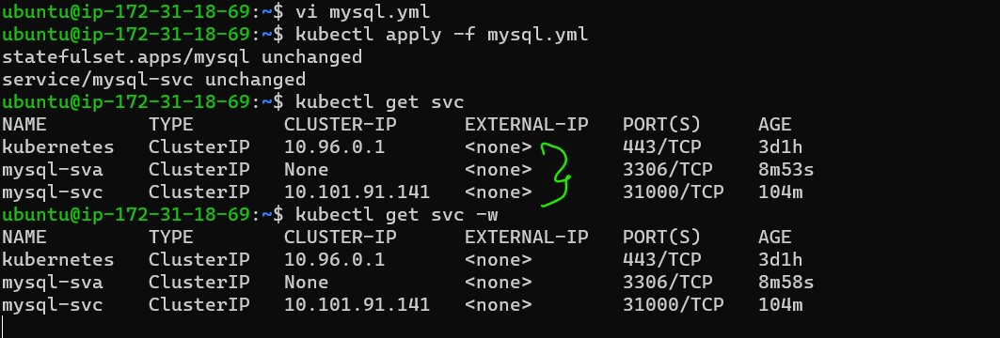 