# k8s CICD with jenkins
* For documentation [Referhere](https://jhooq.com/ci-cd-jenkins-kubernetes/)but it is different.so i can follow anotherway

Pre-Requisites
--------------
1. we start setting up our CI/CD pipeline.
2. Where does Github and Docker Hub fits in the CI/CD
We will use Git Hub as version control to push our application code. In this lab session we will be using Springpetclinic.
* Secondly we will use DockerHub for uploading/pushing the Docker image. Here is the overview of our GitHub and DockerHub flow 
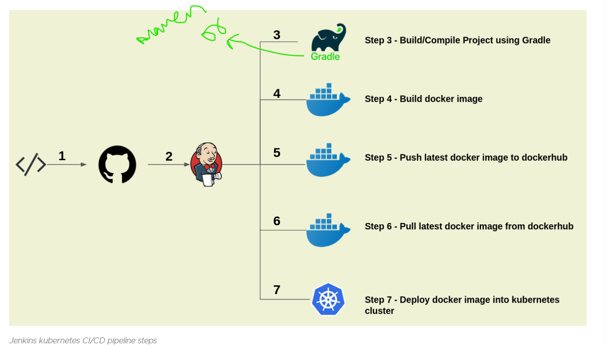
Step 1 - Checkin/Push your code to GitHub

Step 2 - Pull your code from GitHub into your Jenkins server

Step 3 - Use Gradle/Maven build tool for building the artifacts

Step 4 - Create Docker image

Step 5 - Push your latest Docker image to DockerHub

Step 6 - Pull the latest image from DockerHub into jenkins.

Step 7 - Then use spc-deployment.yml to deploy your application inside your kubernetes cluster.

3. Install Jenkins on jenkinsserver

* In jenkins node install jenkins with use of below commands
* Install Java: we also need Java as pre-requisite for installing jenkins, so lets first install java
```
sudo apt-get update
sudo apt install openjdk-11-jdk(any java version 8,11,17)
java --version
wget -q -O - https://pkg.jenkins.io/debian-stable/jenkins.io.key | sudo apt-key add -
sudo sh -c 'echo deb https://pkg.jenkins.io/debian-stable binary/ > \
    /etc/apt/sources.list.d/jenkins.list'
sudo apt-get update
sudo apt-get install jenkins
```
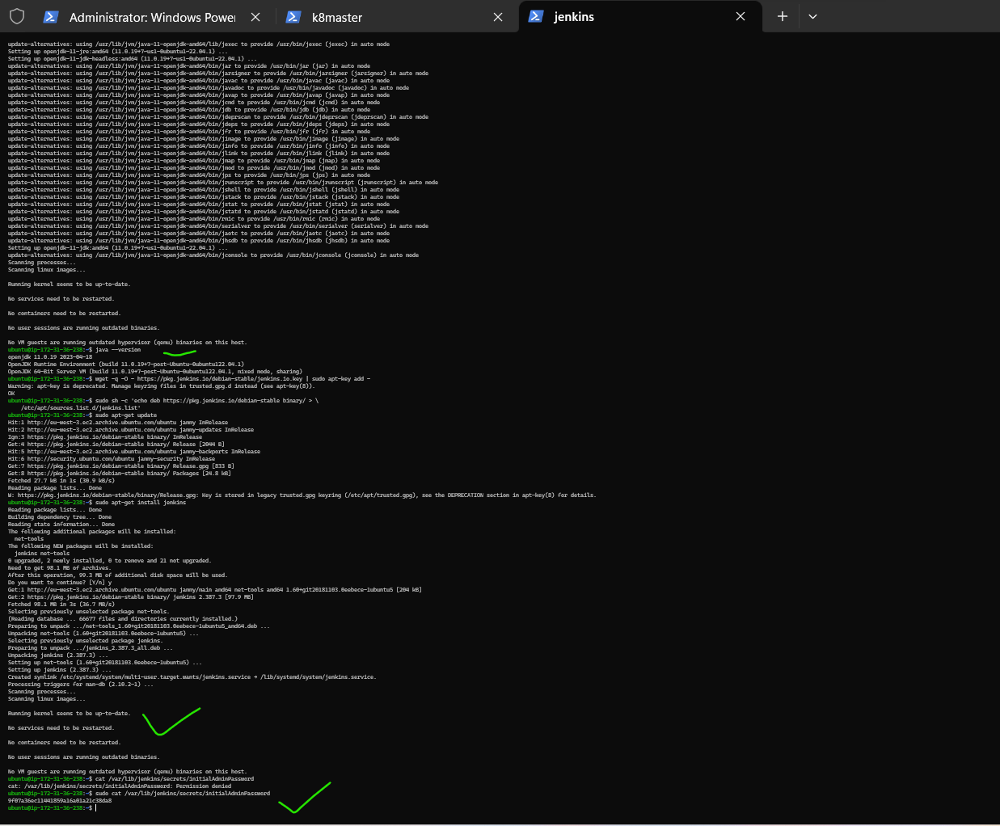
4. Verify Jenkins installation:
* After installing Jenkins we can verify the jenkins installation by accessing the initial login page of the jenkins.

* Since we have installed Jenkins on virtual machine with IP address:8080

* Find Default jenkins password:
 As we can see we need to provide Default jenkins(initialAdminPassword) administrator password.on this path ``cat /var/lib/jenkins/secrets/initialAdminPassword``
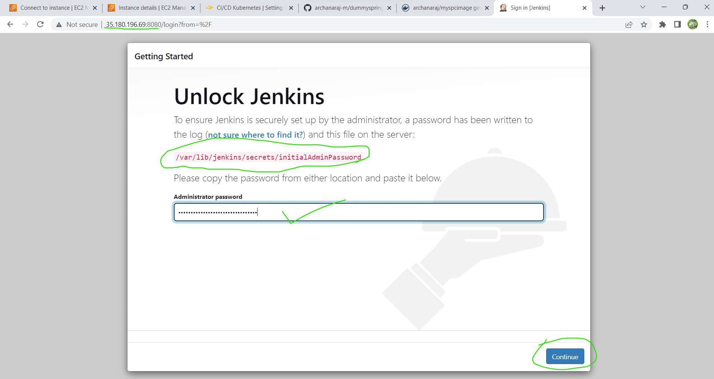
* After enter the password customize jenkins page opened in that click on install suggested plugin.
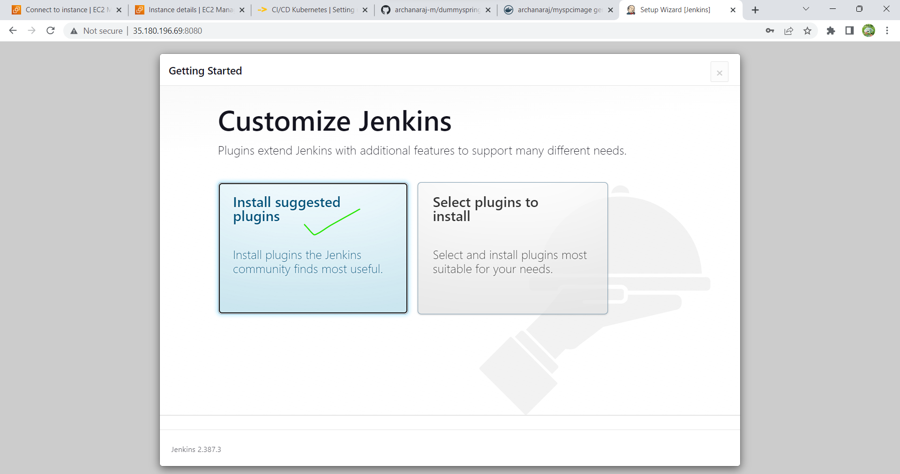
* Select install suggested plugin and then it should install all the default plugins which is required for running Jenkins.
* After successful login setup username and password
* After we have installed all the suggested default plugins, it will prompt you for setting up username and password
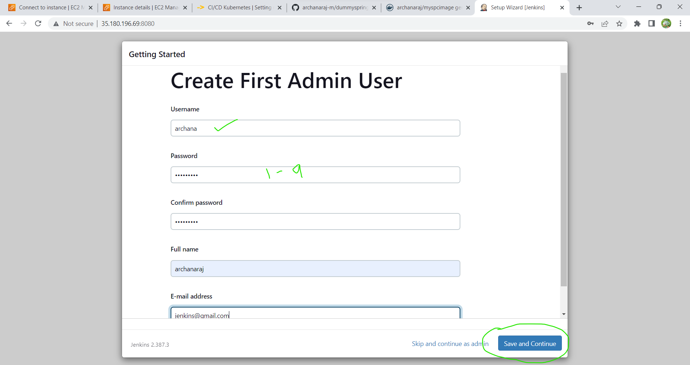
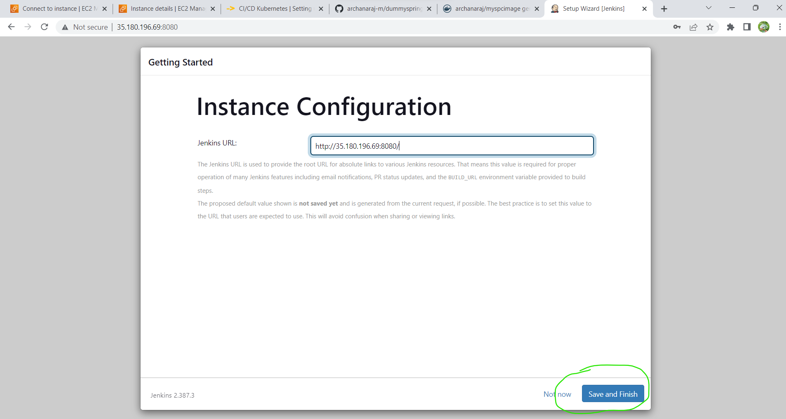
* After that jenkins is ready to use click on start using jenkins
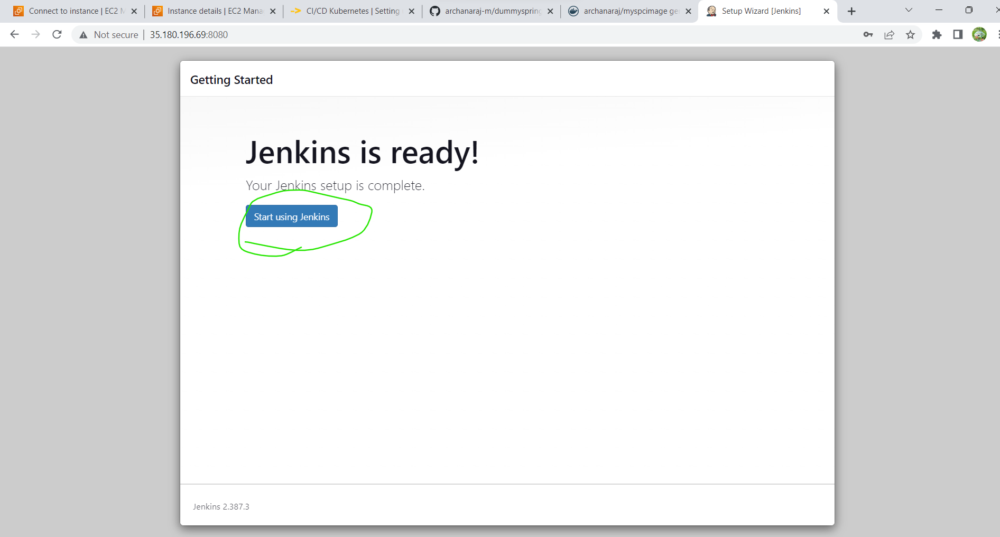
5. Jenkins - If needed Install "SSH Pipeline Steps" plugin and "Gradle":
* SSH Pipeline Steps:
* we need to install one more plugin SSH Pipeline Steps which we are going to use for SSH into k8smaster and k8sworker server.

* For installing plugin please goto - Manage Jenkins -> Manage Plugin -> Available then in the search box type SSH Pipeline Steps.

* Select the plugin and install it without restart.
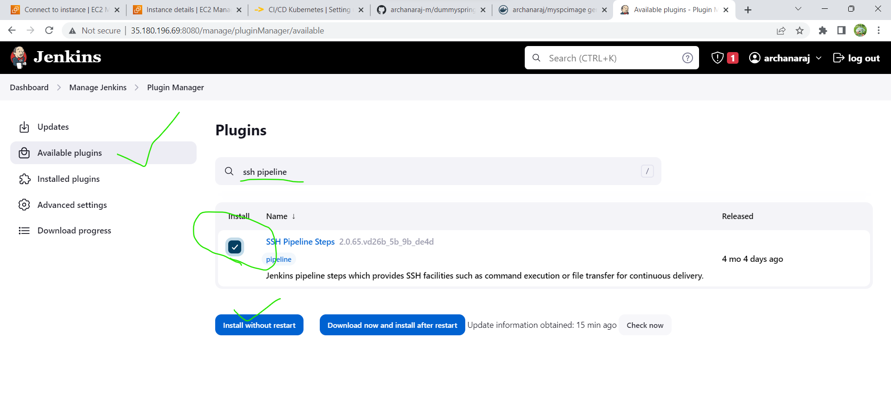
* Setup Gradle:(if we can use gradle then follow this step other wise follow maven steps)
For this lab session we are going to use Spring pet clinic Application, so for that we need Gradle as our build tool.

* To setup Gradle Goto - Manage Jenkins -> Global Tool Configuration -> Gradle

* Click on Add Grdle/maven and then enter name default.

* After that click on the checkbox - Install Automatically and from the drop down Install from Gradle.org select latest version.
* Now We are not installing any plugins for jenkins,we have completed the jenkins and jenkins plugin setup.
* Next connect to the jenkins instance in CLI in that alredy jenkins user created so we have to give sudoers permission to that jenkins user, after that connected with user

1. Install Docker on jenkinsserver:
* Now we need to install Docker on jenkinsserver since we need to push our docker image to DockerHub.
* Install Docker:
Use the following command to install the Docker
```
curl -fsSL https://get.docker.com -o get-docker.sh
sh get-docker.sh
sudo usermod -aG docker jenkins 
exit and relogin
docker info
```
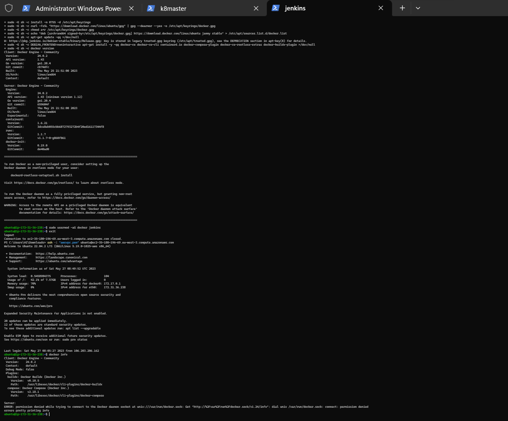 
1. Take spc application 
* Now its time for you to look at our application which we are going to deploy inside kubernetes cluster using Jenkins Pipeline.
* you can clone the code repo from - Source Code
```yml
---
apiVersion: apps/v1 
kind: Deployment
metadata:
  name: spc-deploy
  labels:
    app: spc  
spec:
  minReadySeconds: 3
  replicas: 1
  selector:
    matchLabels:
      app: spc
  template:
    metadata:
      labels: 
        app: spc
    spec:
      containers: 
        - name: spc-cont
          image: archanaraj/myspcimage:latest
          ports :
            - containerPort: 8080    

---
apiVersion: v1
kind: Service
metadata: 
  name: spc-lb
spec:
  selector:
    app: spc
  ports:
    - name: spc 
      port: 32000
      targetPort: 8080
  type: LoadBalancer 
```
* The source code also include the Dockerfile for building the dockerimage(now I can use mutistage dockerfile)

```dockerfile
FROM alpine/git AS vcs
RUN cd / && git clone https://github.com/spring-projects/spring-petclinic.git && \
    pwd && ls /spring-petclinic

FROM maven:3-amazoncorretto-17 AS builder
COPY --from=vcs /spring-petclinic /spring-petclinic
RUN ls /spring-petclinic 
RUN cd /spring-petclinic && mvn package

FROM amazoncorretto:17-alpine-jdk
LABEL author="archana"
EXPOSE 8080
ARG HOME_DIR=/spc
WORKDIR ${HOME_DIR}
COPY --from=builder /spring-petclinic/target/spring-*.jar ${HOME_DIR}/spring-petclinic.jar
EXPOSE 8080
CMD ["java", "-jar", "spring-petclinic.jar"]
```

8. Write the Pipeline script:
* CI/CD Jenkins Pipeline script into steps
8.1 Create Jenkins Pipeline
* The first step for you would be to create a pipeline.

Goto : Jenkins -> New Items

=>Enter an item name : mynode

=>Select Pipeline

=>Click Ok

8.2 Clone the Git Repo
* The first principle of the CI/CD pipeline is to clone/checkout the source code, using the same principle we are going to clone the GIT Repo inside Jenkins

8.3 Jenkins store git credentials
* As you know we cannot store plain text password inside jenkins scripts, so we need to store it somewhere securely.
* Jenkins Manage Credential provides very elegant way to store GitHub Username and Password.
* Goto : Jenkins -> Manage Jenkins -> Manage Credentials
* Keep the ID somewhere store so that you remember - GIT_HUB_CREDENTIALS
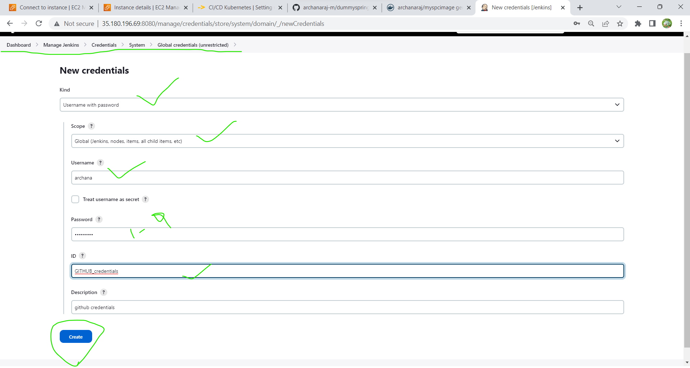
8.4 Build the Spring Pet Clinic
* Next step would be to build the Spc Using /Maven(now i can use maven)

8.5 Build Docker image and tag it
* After successful Gradle Build we are going to build Docker Image and after that I am going to tag it with the name myspcimage-latest this commands used in pipeline``docker build -t spcimage .``&&``docker image tag spcimage archanaraj/spcimage:latest``

8.6 Jenkins store DockerHub credentials
* For storing DockerHub Credentials you need to GOTO: Jenkins -> Manage Jenkins -> Manage Credentials -> Stored scoped to jenkins -> global -> Add Credentials

* From the Kind dropdown please select Secret text
   1. Secret - Type in the DockerHub Password
   2. ID - DOCKER_HUB_PASSWORD
   3. Description - Docker Hub password
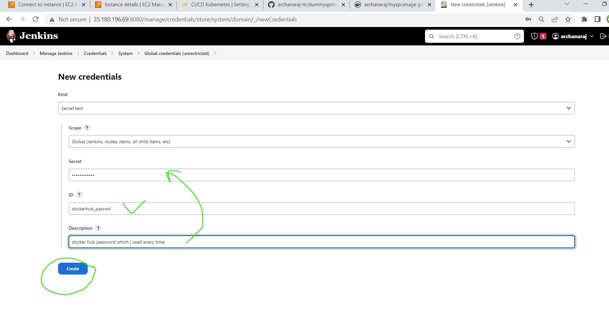
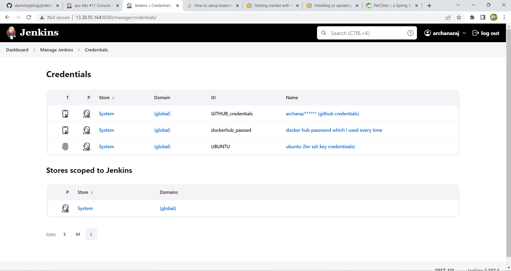
8.7 Docker Login via CLI
* Since I am working inside Jenkins so every step I perform I need to write pipeline script. Now after building and tagging the Docker Image we need to push it to the DockerHub. But before you push to DockerHub you need to authenticate yourself via CLI(command line interface) using docker login.
* $DOCKER_HUB_PASSWORD -I stored my DockerHub Password into Jenkins and assigned the ID $DOCKER_HUB_PASSWORD see above preview i give dockerhub credentials also.
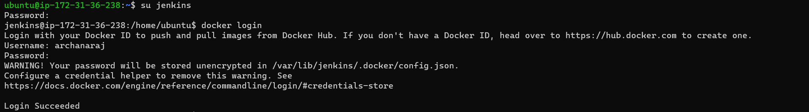
8.8 Push Docker Image into DockerHub
* After successful Docker login now we need to push the image to DockerHub
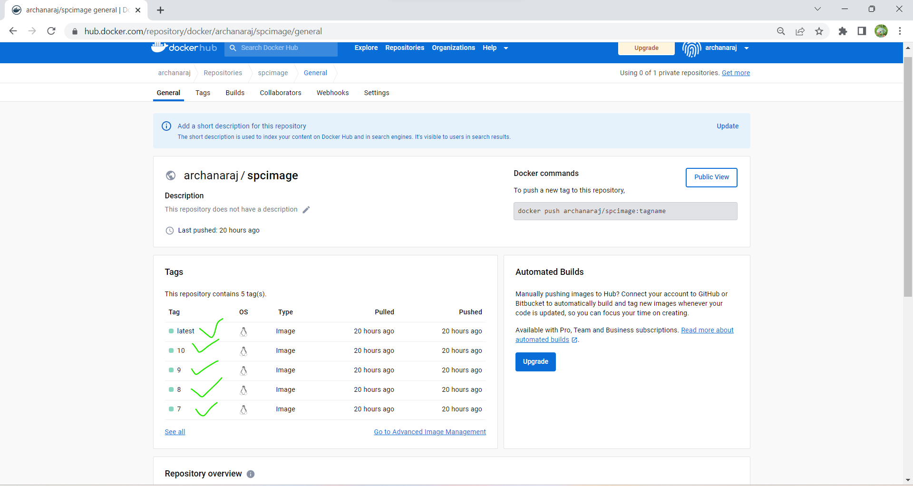
8.9 Junit test results
* we can see test results with this junit 

8.10 Now k8s deploy for that i copy spc deployment and svc files and paste in that dummyspring(cicd branch) spc.yml

8.11 Create kubernetes deployment and service
* Apply the k8s-spc-deployment.yml which will eventually -
   1. Create deployment with name - spc
   2. Expose service on NodePort

* Next i can create the cluster in jenkins server only
* EKS Cluster
-----------
* EKS cluster can be created in many ways
  * aws console
  * aws cli
  * terraform
  * eksctl this will be used
* Features [referhere](https://aws.amazon.com/eks/features/)
* Create a linux instance(t2micro), install aws cli, create iam credentials
* After connecting the ubuntu ``sudo apt update``&&``sudo apt install unzip -y``
* For install awscli
```
curl "https://awscli.amazonaws.com/awscli-exe-linux-x86_64.zip" -o "awscliv2.zip"
unzip awscliv2.zip
sudo ./aws/install
```
* Next check it ``aws --version`` and ``aws configure``
* install kubectl [Refer Here](https://kubernetes.io/docs/tasks/tools/install-kubectl-linux/#install-using-other-package-management)
* we had followed direct installation [Refer Here](https://kubernetes.io/docs/tasks/tools/install-kubectl-linux/#install-kubectl-binary-with-curl-on-linux)
* For install kubectl command is``curl -LO "https://dl.k8s.io/release/$(curl -L -s https://dl.k8s.io/release/stable.txt)/bin/linux/amd64/kubectl" ``&&``sudo install -o root -g root -m 0755 kubectl /usr/local/bin/kubectl``
* After install kubectl check ``kubectl version``

* Install eksctl [Refer Here](https://eksctl.io/introduction/#for-unix)
```bash
# for ARM systems, set ARCH to: `arm64`, `armv6` or `armv7`
ARCH=amd64
PLATFORM=$(uname -s)_$ARCH

curl -sLO "https://github.com/weaveworks/eksctl/releases/latest/download/eksctl_$PLATFORM.tar.gz"

# (Optional) Verify checksum
curl -sL "https://github.com/weaveworks/eksctl/releases/latest/download/eksctl_checksums.txt" | grep $PLATFORM | sha256sum --check

tar -xzf eksctl_$PLATFORM.tar.gz -C /tmp && rm eksctl_$PLATFORM.tar.gz

sudo mv /tmp/eksctl /usr/local/bin
```
* Before that cluster creation with yml file we have to do aws configure and kubectl configure must.
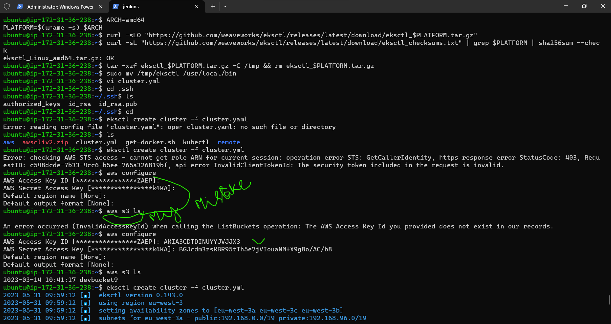
* Before creating cluster we execute ssh-keygen ``ssh-keygen``
* Create a file called as cluster.yml with the following content
* paste below yaml file in this ``vi cluster.yml``
```yml
apiVersion: eksctl.io/v1alpha5
kind: ClusterConfig

metadata:
  name: mycluster # we can give any name it is cluster name
  region: eu-west-3

nodeGroups:
  - name: basic # node group name
    instanceType: t2.medium
    desiredCapacity: 2
    volumeSize: 20
    ssh:
      allow: true # will use ~/.ssh/id_rsa.pub as the default ssh key
```
* before creating cluster we execute ssh-keygen ``ssh-keygen``
* Now execute the command ``eksctl create cluster -f cluster.yml``
* After creation execute``kubectl get nodes``&&``kubectl get pods --all-namespaces``

# For deleting the cluster ``eksctl delete cluster --name=<name> [--region=<region>]``example ``eksctl delete cluster --name=mycluster --region=eu-west-3``

* After creating cluster i give the permissions for jenkins user 
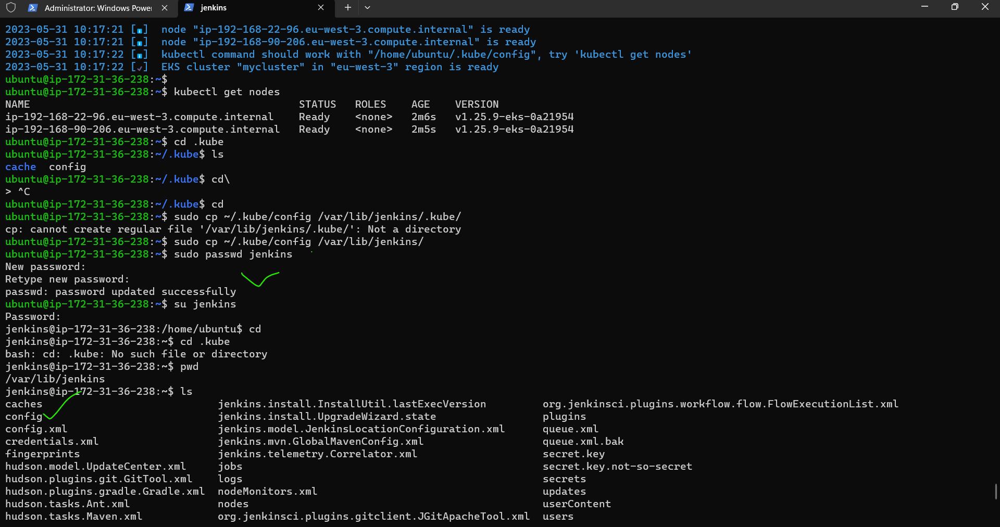
* Next for move config file to jenkins user .kube folder and give all permissions 
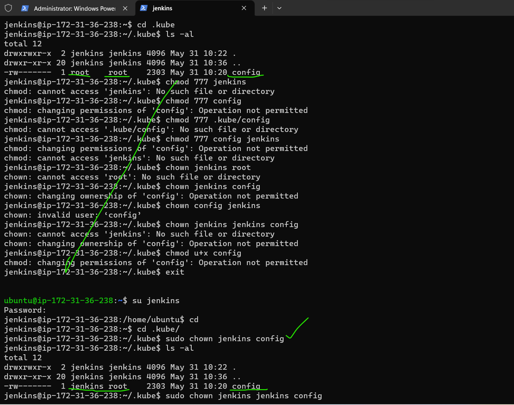
* For copy the config files commands are ``sudo cp ~/.kube/config ~jenkins/.kube/``&&
``sudo chown -R jenkins: ~jenkins/.kube/``
* Next build the pipeline in jenkins 
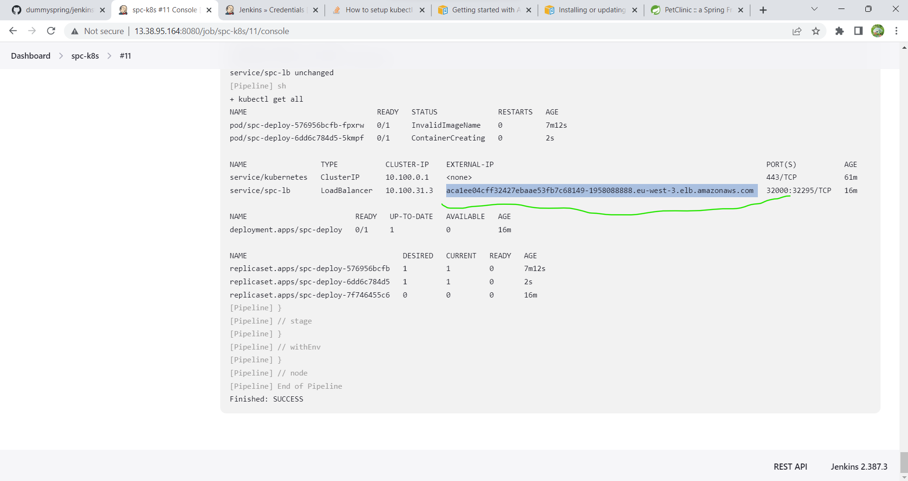
* After build success check ``kubectl all`` in that externalIP, port is there, copy and paste it in new tab with port spc page came.
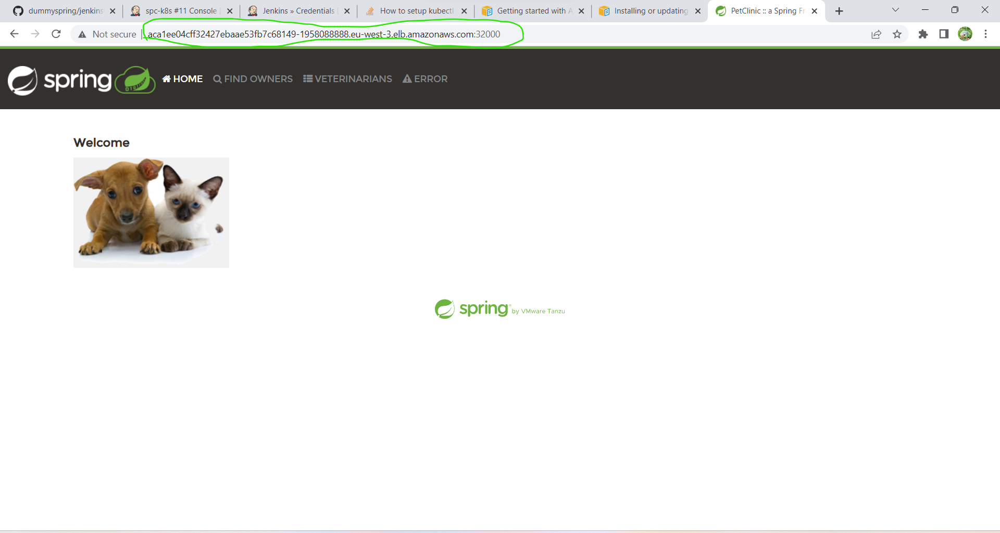
* So here is the final complete pipeline script for my CI/CD Jenkins kubernetes pipeline
```js
pipeline {
    agent 'any'
    //triggers { pollSCM ('* * * * *') }
    parameters {
        choice(name: 'MAVEN_GOAL', choices: ['package', 'install', 'clean'], description: 'Maven Goal')
    }
    stages {
        stage('vcs') {
            steps {
                git url: 'https://github.com/archanaraj-m/dummyspring.git',
                    branch: 'cicd'
            }
        }
        stage('package') {
            //tools {
            //   jdk 'JDK_17_UBUNTU'
            //}
            steps {
                sh "./mvnw ${params.MAVEN_GOAL}"
            }
        }
        stage('junit') {
            steps {
                archiveArtifacts artifacts: '**/spring-petclinic-3.0.0-SNAPSHOT.jar',
                                 onlyIfSuccessful: true
                junit testResults: '**/*.xml'
            }
        } 
        stage("Docker build"){
            steps { 
                sh 'docker build -t spcimage .'
                sh 'docker image list'
                sh 'docker image tag spcimage archanaraj/spcimage:latest'
            }
        } 
       // withCredentials([string(credentialsId: 'DOCKER_HUB_PASSWORD', variable: 'PASSWORD')]) {
       // sh 'docker login -u archanraj -p password'
        stage("Push Image to Docker Hub"){
            steps {
                sh 'docker image push  archanaraj/spcimage:latest'      
            }
        }
        stage('k8s deploy') {
            steps {
                sh 'kubectl apply -f spc.yml'
                sh 'kubectl get all'
            }
        }
    }
}  
```
Conclusion:
-------------
1. First thing which I did is - Install Jenkins in one server
2. Give the permissions to jenkins user
3. connect with jenkins user then
4. Install Docker in Jenkins server
5. Create the cluster in jenkins server
6. Give github , docker credentials in Jenkins
7. After login into the docker ,next give the permissions for .kube config file 
8. Next I created Jenkins Pipeline script for continuous Deployment.

* this below error came because i didn't create aws credentials correctly so that error came 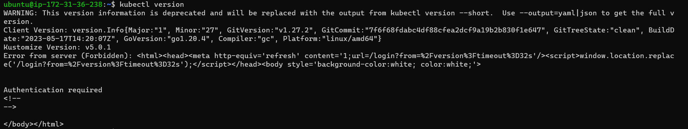
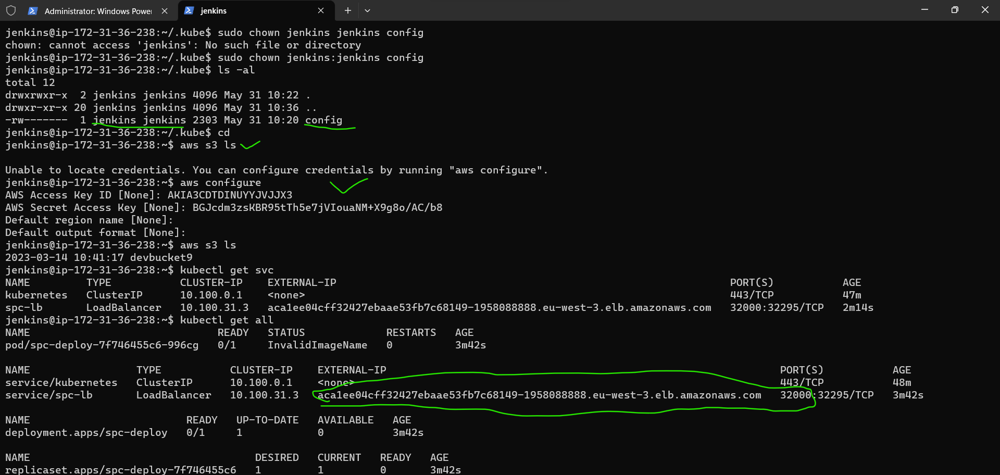
