# Kubernetes tasks – 11-05-2023
* 1.Create 1 master node and 2 worker nodes – run app on node1 and db on node2 by using
* First i can create 3 t2.medium nodes(instances) in AWS
* In that 3 nodes we have to install docker with use of below commands
* Next create shell script to install kubeadm
# run the below script in root user
```
vi k8s.yml
chmod +x k8s.yml
./k8s.yml
```
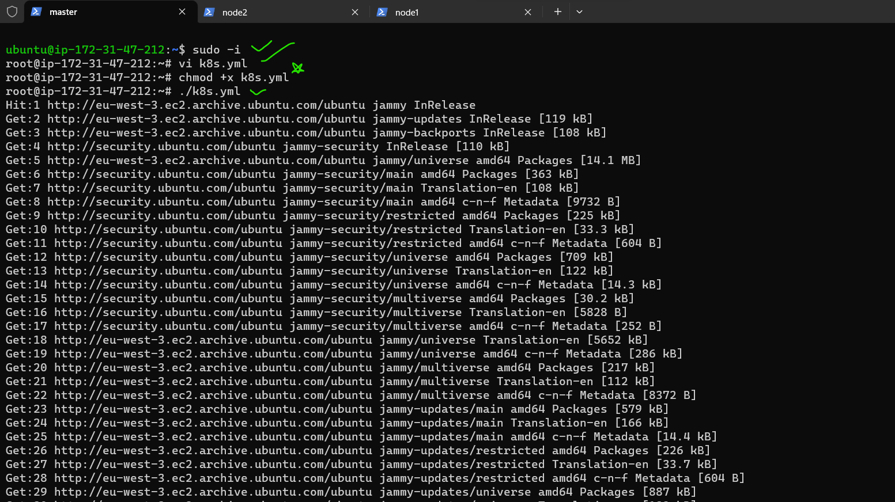
* shell script for install kubeadm
```
#!/bin/bash
apt-get update
curl -fsSL https://get.docker.com -o get-docker.sh
sh get-docker.sh
sudo usermod -aG docker ubuntu
wget https://storage.googleapis.com/golang/getgo/installer_linux
chmod +x ./installer_linux
./installer_linux
source ~/.bash_profile
git clone https://github.com/Mirantis/cri-dockerd.git
cd cri-dockerd
mkdir bin
go build -o bin/cri-dockerd
mkdir -p /usr/local/bin
install -o root -g root -m 0755 bin/cri-dockerd /usr/local/bin/cri-dockerd
cp -a packaging/systemd/* /etc/systemd/system
sed -i -e 's,/usr/bin/cri-dockerd,/usr/local/bin/cri-dockerd,' /etc/systemd/system/cri-docker.service
systemctl daemon-reload
systemctl enable cri-docker.service
systemctl enable --now cri-docker.socket
cd ~
sudo apt-get update
sudo apt-get install -y apt-transport-https ca-certificates curl
sudo curl -fsSLo /etc/apt/keyrings/kubernetes-archive-keyring.gpg https://packages.cloud.google.com/apt/doc/apt-key.gpg
echo "deb [signed-by=/etc/apt/keyrings/kubernetes-archive-keyring.gpg] https://apt.kubernetes.io/ kubernetes-xenial main" | sudo tee /etc/apt/sources.list.d/kubernetes.list
sudo apt-get update
sudo apt-get install -y kubelet kubeadm kubectl
sudo apt-mark hold kubelet kubeadm kubectl
```
# exit and relogin 
* because docker also installed with script so relogin is manditory.
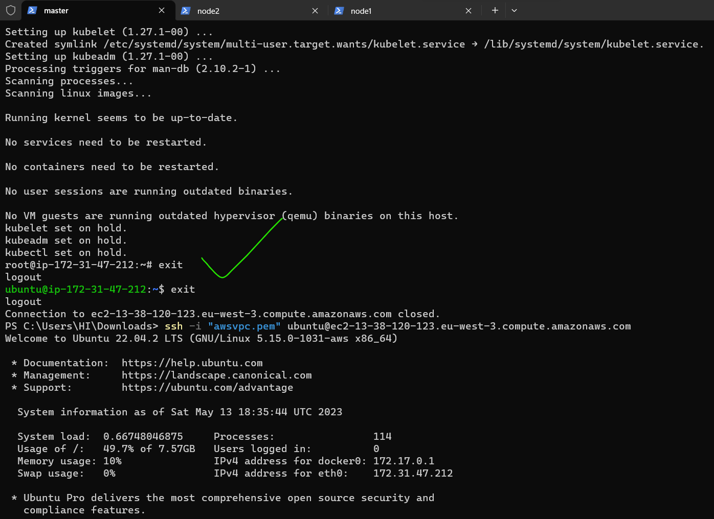
# run the above script in root user
* To create cluster in master node use this command ``kubeadm init --pod-network-cidr "10.244.0.0/16" --cri-socket "unix:///var/run/cri-dockerd.sock"``
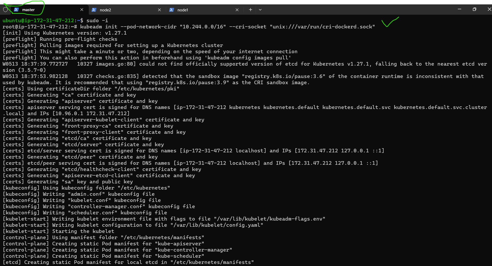
* To configure we have to follow below commands in reguler user so we can exit from root user.
* To start using your cluster, you need to run the following as a regular user(ubuntu user)
* below commands execute only in master node 
  ```
  exit
  mkdir -p $HOME/.kube
  sudo cp -i /etc/kubernetes/admin.conf $HOME/.kube/config
  sudo chown $(id -u):$(id -g) $HOME/.kube/config
  ```
* To setup configure run this command to install flannel ``kubectl apply -f https://github.com/flannel-io/flannel/releases/latest/download/kube-flannel.yml``
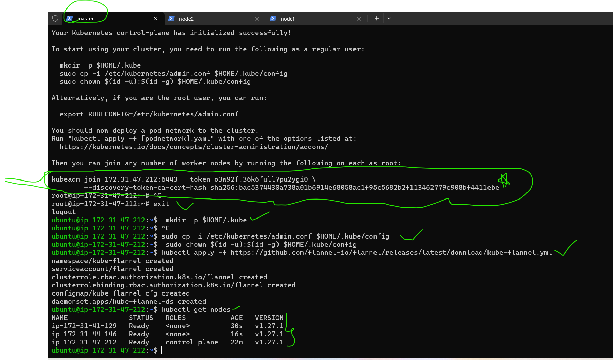
* To attach nodes to the master node run this command by providing CRI-DOCKER in node1,node2 as a root user ``kubeadm join 172.31.47.212:6443 --token o3w92f.36k6full7pu2ygi0 \
                       --cri-socket "unix:///var/run/cri-dockerd.sock" \
                --discovery-token-ca-cert-hash sha256:bac5374430a738a01b6914e68058ac1f95c5682b2f113462779c908bf4411ebe``
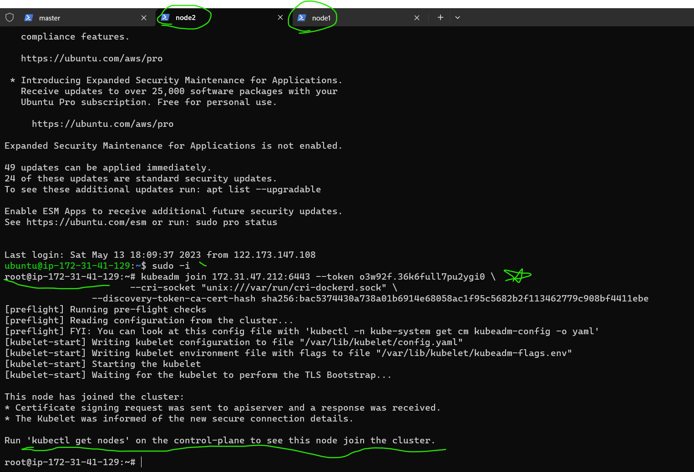in this control plane means master node.(master node also called as control plane)             
* In master node ``kubectl get nodes -w`` 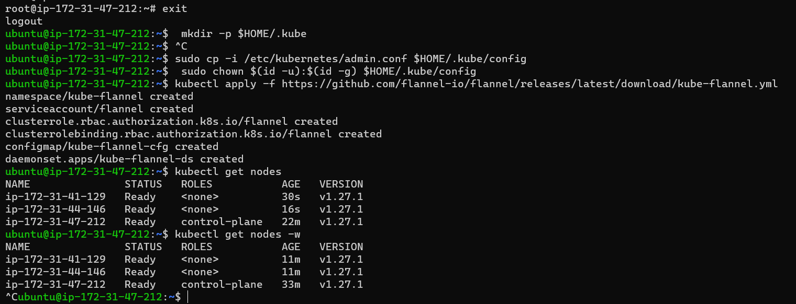

# 1. Node selector
* we can use node selector for scheduling pods.
* first we create pods and services with manifests files.
* To see the nodes and labels commands are ``kubectlget nodes`` `` kubectl get nodes --show-labels``
* vi nop.yml
* ``kubectl apply -f nop.yml``

```yml
---
apiVersion: apps/v1
kind: Deployment
metadata: 
  name: nop-dp
  labels:
    app: nop
spec:
  replicas: 1
  selector:
    matchLabels:
      app: nop
  template: 
    metadata:
      name: nop
      labels:
        app: nop
    spec:
      containers:
      - name: nopcont
        image: archanaraj/nop:latest
        ports:
        - containerPort: 5000     
---
apiVersion: v1
kind: Service
metadata: 
  name: nop-lb
spec:
  selector:
    app: nop
  ports:
    - name: nop 
      port: 32000
      targetPort: 5000 
  type: LoadBalancer         
```
*  To assign the labels to the nodes ``kubectl label nodes <nodename> <key=value>``&&`` kubectl label nodes ip-172-31-47-212 app=nop``
*  To create nop manifest file to assign specific node by using nodeselector option ``kubectl apply -f nop.yml``&& ``kubectl get po -o wide``
*  
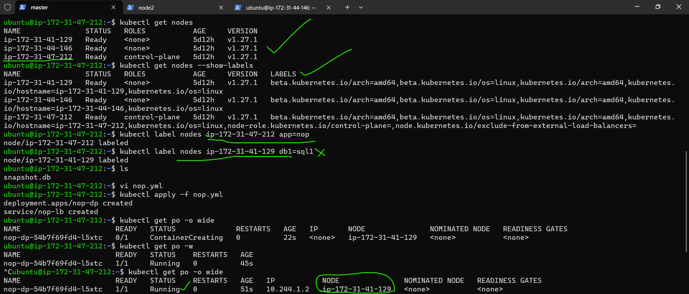

```yml
---
apiVersion: apps/v1
kind:   StatefulSet
metadata:
  name: mysql
  labels:
    app: mysql
spec:
  replicas: 2
  serviceName: mysql-svc
  selector:
    matchLabels:
      app: mysql
  template:
    metadata:
      name: mysql
      labels:
        app: mysql
    spec:
      containers:
        - name: mysql
          image: mysql:5
          env:
            - name: MYSQL_ROOT_PASSWORD
              value: password
            - name: MYSQL_USER
              value: Archana
            - name: MYSQL_PASSWORD
              value: rootroot
            - name: MYSQL_DATABASE
              value: students
          ports:
            - containerPort: 3306

---
apiVersion: v1
kind: Service
metadata:
  name: mysql-svc
spec:
  selector:
    app: mysql
  ports:
    - name: mysql
      port: 31000
      targetPort: 3306
```
* check the pod and node selector node name``kubectl get po -o wide``		  
*  To assign the labels to the nodes ``kubectl label nodes <nodename> <key=value>``&&`` kubectl label nodes ip-172-31-41-129 app=mysql``
*  To create mysql manifest file to assign specific node by using nodeselector option ``kubectl apply -f mysql.yml``&& ``kubectl get po -o wide``
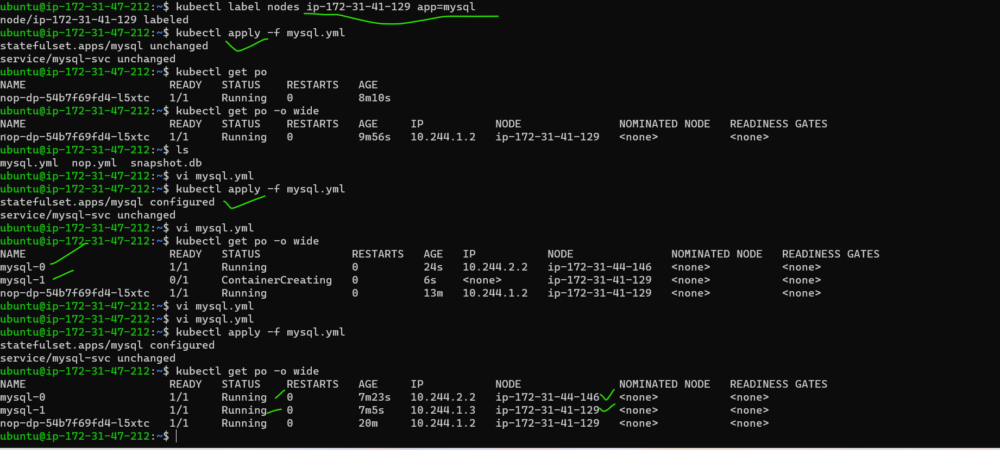


# 2. Affinity
-----------
[referhere](https://kubernetes.io/docs/tasks/configure-pod-container/assign-pods-nodes-using-node-affinity/)for affinity documentation
# Assign Pods to Nodes using Node Affinity
* Node affinity is a property of Pods that attracts them to a set of nodes (either as a preference or a hard requirement). 

* For this Kubernetes server must be at or later than version v1.10. To check the version, enter ``kubectl version``.
* List the nodes in your cluster, along with their labels``kubectl get nodes`` && ``kubectl get nodes --show-labels``
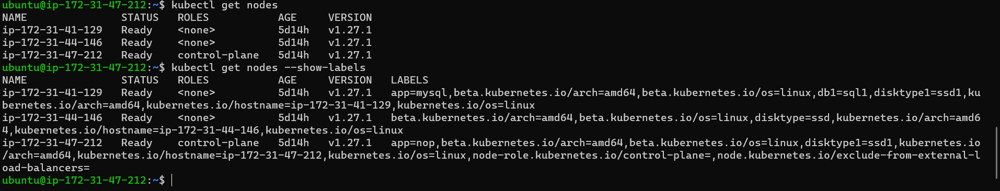

* Schedule a Pod using required node affinity
-----------------------------------------------
* This manifest describes a Pod that has a requiredDuringSchedulingIgnoredDuringExecution node affinity,disktype: ssd. This means that the pod will get scheduled only on a node that has a disktype=ssd label.

* yml file for nop required affinity with key value disktype

```yml
---
apiVersion: apps/v1
kind: Deployment
metadata: 
  name: nop-dp
  labels:
    app: nop
spec:
  replicas: 1
  selector:
    matchLabels:
      app: nop
  template: 
    metadata:
      name: nop
      labels:
        app: nop
    spec:
      affinity:
        nodeAffinity:
          requiredDuringSchedulingIgnoredDuringExecution:
            nodeSelectorTerms:
            - matchExpressions:
              - key: disktype
                operator: In
                values:
                - ssd
      containers:
      - name: nopcont
        image: archanaraj/nop:latest
        ports:
        - containerPort: 5000     
---
apiVersion: v1
kind: Service
metadata: 
  name: nop-lb
spec:
  selector:
    app: nop
  ports:
    - name: nop 
      port: 32000
      targetPort: 5000 
  type: LoadBalancer     
```

* creating pods ``kubectl apply -f nop-affinity.yml``

* check the pods``kubectl get pods -o wide``
* *  To assign the labels to the nodes ``kubectl label nodes <nodename> <key=value>``
* For example for one node label is ssd`` kubectl label nodes ip-172-31-41-129 disktype=ssd``
* And for another node label is ssd1``kubectl label nodes ip-172-31-47-212 disktype1=ssd1``
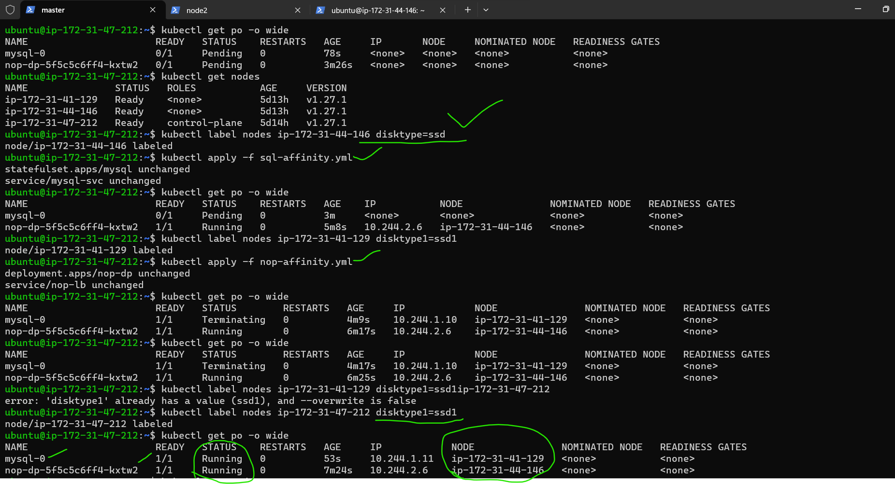

* Schedule a Pod using preferred node affinity 
----------------------------------------------

* This manifest describes a Pod that has a preferredDuringSchedulingIgnoredDuringExecution node affinity,disktype: ssd. This means that the pod will prefer a node that has a disktype=ssd label.

```yml
---
apiVersion: v1
kind: Pod
metadata:
  name: nginx
spec:
  affinity:
    nodeAffinity:
      preferredDuringSchedulingIgnoredDuringExecution:
      - weight: 1
        preference:
          matchExpressions:
          - key: disktype
            operator: In
            values:
            - ssd          
  containers:
  - name: nginx
    image: nginx
```
* create pod``kubectl apply -f nginx-affinity.yaml``
* verify pod ``kubectl get pods -o wide``
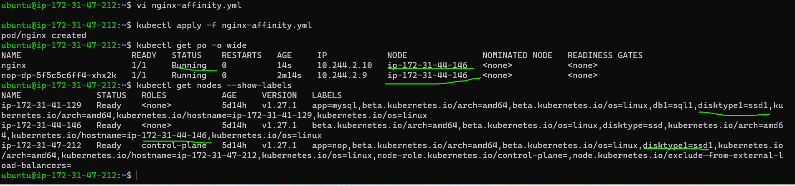 

# 3. Taints and tolerances
------------------------
* Taints are the opposite to node affinity and they allow a node to repel(force) a set of pods.
* Tolerations are applied to pods.
* Taints and tolerations work together to ensure that pods are not scheduled onto inappropriate nodes. One or more taints are applied to a node; this marks that the node should not accept any pods that do not tolerate the taints.
* commands For add a taint to a node using ``kubectl taint``For example,``kubectl taint nodes node1 key1=value1:NoSchedule``
* To remove the taint``kubectl taint nodes node1 key1=value1:NoSchedule-``

* yml file for using tolerations
```yml
---
apiVersion: apps/v1
kind: Deployment
metadata: 
  name: nop-dp
  labels:
    app: nop
spec:
  replicas: 1
  selector:
    matchLabels:
      app: nop
  template: 
    metadata:
      name: nop
      labels:
        app: nop
    spec:
      tolerations:
        - key: "example-key"
          operator: "Exists"
          effect: "NoSchedule"
      containers:
        - name: nopcont
          image: archanaraj/nop:latest
          ports:
          - containerPort: 5000     
---
apiVersion: v1
kind: Service
metadata: 
  name: nop-lb
spec:
  selector:
    app: nop
  ports:
    - name: nop 
      port: 32000
      targetPort: 5000 
  type: LoadBalancer         
```
* ``vi nop-tol.yml``
* create pod``kubectl apply -f nop-tol.yaml``
* verify pod ``kubectl get pods -o wide``
* commands For add a taint to a node using ``kubectl taint``For example,``kubectl taint nodes ip-172-31-44-146 disktype=ssd:NoSchedule``
* To remove the taint``kubectl taint nodes ip-172-31-44-146 disktype=ssd:NoSchedule-``
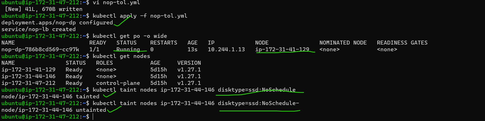


# 2.Create k8s cluster with version 1.25 and run any deployment(nginx/any) and then upgrade  custer to version 1.27 
[referhere](https://k21academy.com/docker-kubernetes/k8s-cluster-upgrade-step-by-step/) for documentation. 

* For install specfic version command is ``sudo apt-get install -qy kubelet=<version> kubectl=<version> kubeadm=<version>``
* Choose a version to upgrade to, and run the appropriate command. For example:
``sudo kubeadm upgrade apply v1.27.x``(replace x with the patch version you picked for this upgrade)
The Upgrade Workflow
--------------------
* When you are upgrading the Kubernetes cluster created with kubeadm, the flow should be from version 1.25.x to version 1.26.x, and from version 1.26.x to 1.26.y (where y > x). Skipping MINOR versions when upgrading is unsupported.
* The upgrade workflow at a high level is the following:
   * Upgrade the primary control plane node.
   * Upgrade additional control plane nodes.
   * Upgrade worker nodes.
Prerequisites:
--------------
1) Make sure you have a K8s cluster deployed already.
* In all 3 nodes install docker 
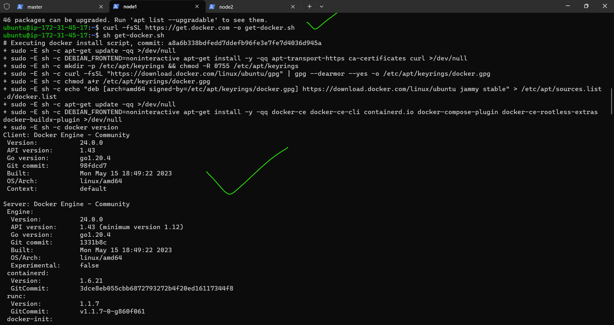
* means in all 3 nodes install k8s all commands execute same as it is but before ``sudo apt-get update``&&``sudo apt-get install -y kubelet kubeadm kubectl`` this command execute below commands
* follow this [referhere](https://k21academy.com/docker-kubernetes/three-node-kubernetes-cluster/)
```
KUBE_VERSION=1.23.0
apt-get update
apt-get install -y kubelet=${KUBE_VERSION}-00 kubeadm=${KUBE_VERSION}-00 kubectl=${KUBE_VERSION}-00 kubernetes-cni=0.8.7-00
apt-mark hold kubelet kubeadm kubectl
systemctl enable kubelet && systemctl start kubelet
```
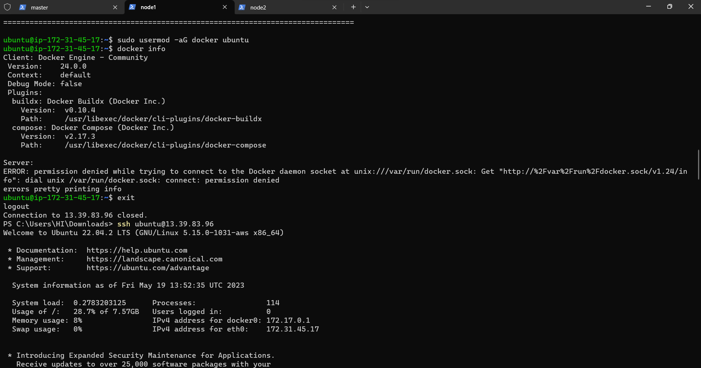
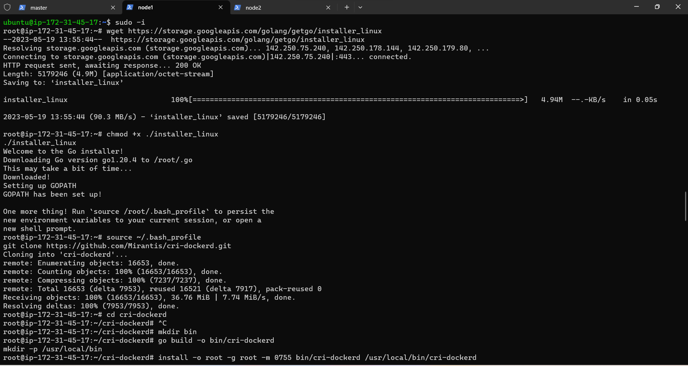
create a kubernetes cluster
---------------------------
* 1) We have to initialize kubeadm on the master node. This command will check against the node that we have all the required dependencies. If it is passed, then it will install control plane components.
* Run this command in Master Node only``kubeadm init --kubernetes-version=${KUBE_VERSION}``
* 2) To start using the cluster, we have to set the environment variable on the master node.
To temporarily set the environment variables on the master node, run the following commands:
* Every time you are starting the Master, you have to set these Environment Variables.
```
cp /etc/kubernetes/admin.conf $HOME/
chown  $(id -u) $HOME/admin.conf
export KUBECONFIG=$HOME/admin.conf
```
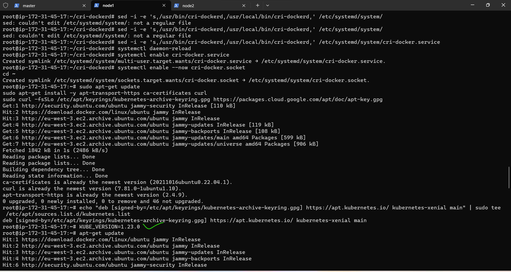
* Join Worker Nodes to the Kubernetes Cluster:
* this command execute in worker nodes only ``kubeadm join 172.31.43.184:6443 --token 4fcwjt.g75w91tawz2wkf2x \
       --cri-socket "unix:///var/run/cri-dockerd.sock"
        --discovery-token-ca-cert-hash sha256:3eda4a37010fe82cb1523c01c22a80efe749924e8609766326d906dc77a7aee1``
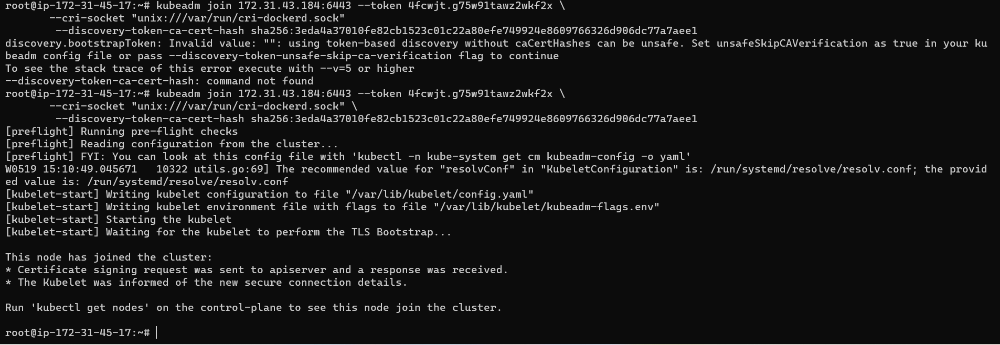
* ``kubectl get nodes`` run this command in master node if nodes not ready then execute this command in master node ``kubectl apply -f https://github.com/weaveworks/weave/releases/download/v2.8.1/weave-daemonset-k8s.yaml``
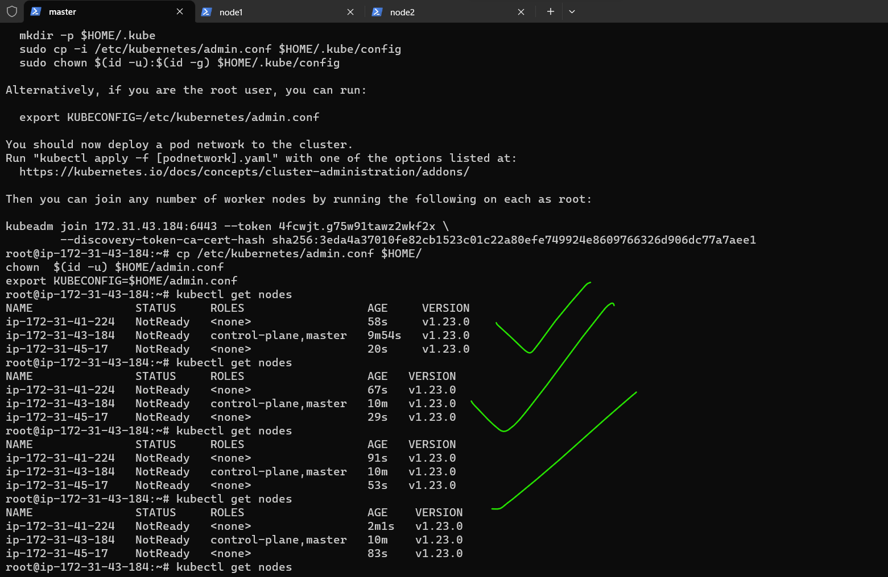
* after that for check the nodes ``kubectl get nodes``
* for checking the pods ``kubectl get pods -n kube-system `` 
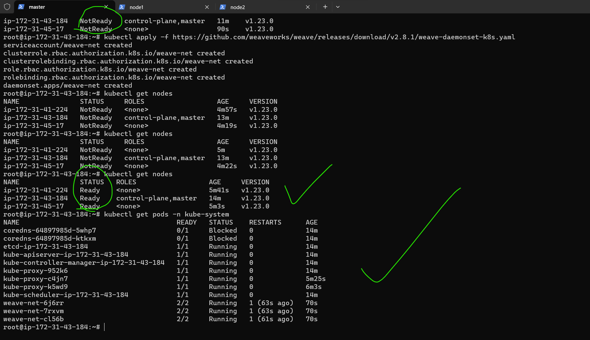        
