JOIP Task for (kubernetes trained batch)(16-05-2023)
---------------------------------------------------
1. Installing EKS and Aks
2. installations using helm chart
        1. Mysql
        2. PostgreSql
        3. mongoDB
        3. Redis cache
3. make Mysql as Stateful set
4. write headless service for Mysql1
5. write kostomize file by creating files for 3 environments
        1.dev-environment
        2.qa-environment
        3.test-environment
6. every environment should have their own secrets
1. Installing EKS and Aks
EKS Cluster
-----------
* Elastic kubernetes Services is a managed k8s from aws
* EKS cluster can be created in many ways
  * aws console
  * aws cli
  * terraform
  * eksctl this will be used
* Features [referhere](https://aws.amazon.com/eks/features/)
* Create a linux instance, install aws cli, create iam credentials
* After connecting the ubuntu ``sudo apt update``&&``sudo apt install unzip -y``
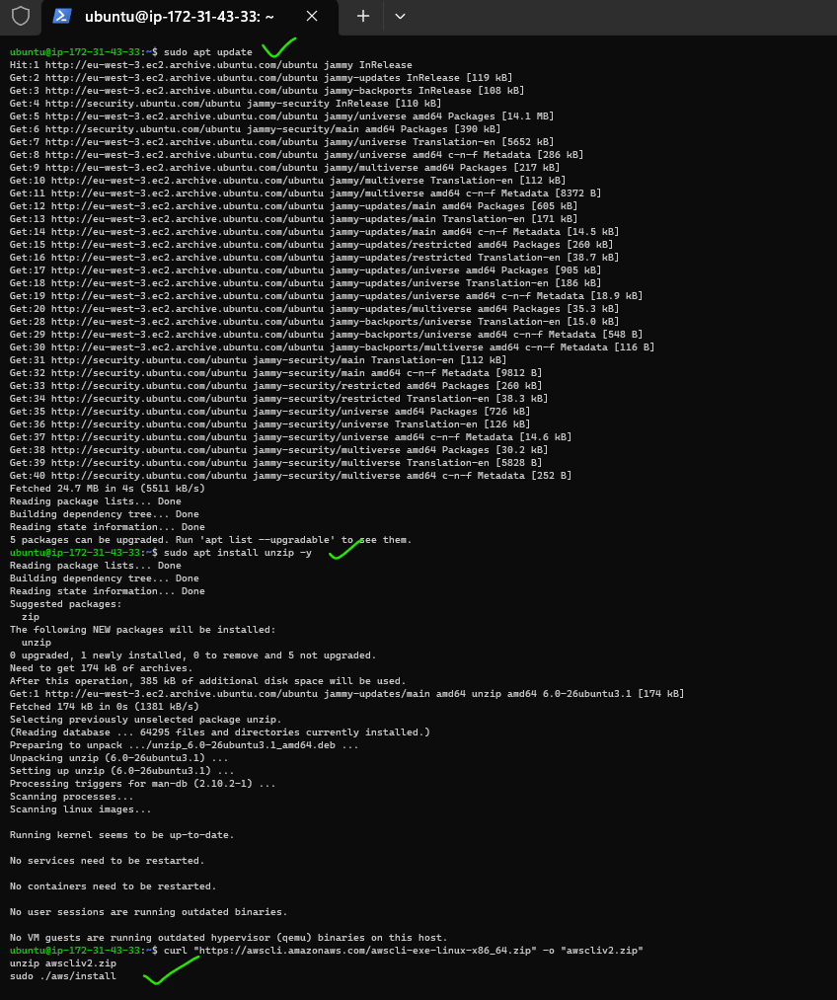
* For install awscli
```
curl "https://awscli.amazonaws.com/awscli-exe-linux-x86_64.zip" -o "awscliv2.zip"
unzip awscliv2.zip
sudo ./aws/install
```
* Next check it ``aws --version`` and ``awsconfigure``
* install kubectl [Refer Here](https://kubernetes.io/docs/tasks/tools/install-kubectl-linux/#install-using-other-package-management)
* we had followed direct installation [Refer Here](https://kubernetes.io/docs/tasks/tools/install-kubectl-linux/#install-kubectl-binary-with-curl-on-linux)
* For install kubectl command is``curl -LO "https://dl.k8s.io/release/$(curl -L -s https://dl.k8s.io/release/stable.txt)/bin/linux/amd64/kubectl" ``&&``sudo install -o root -g root -m 0755 kubectl /usr/local/bin/kubectl``
* After install kubectl check ``kubectl version``
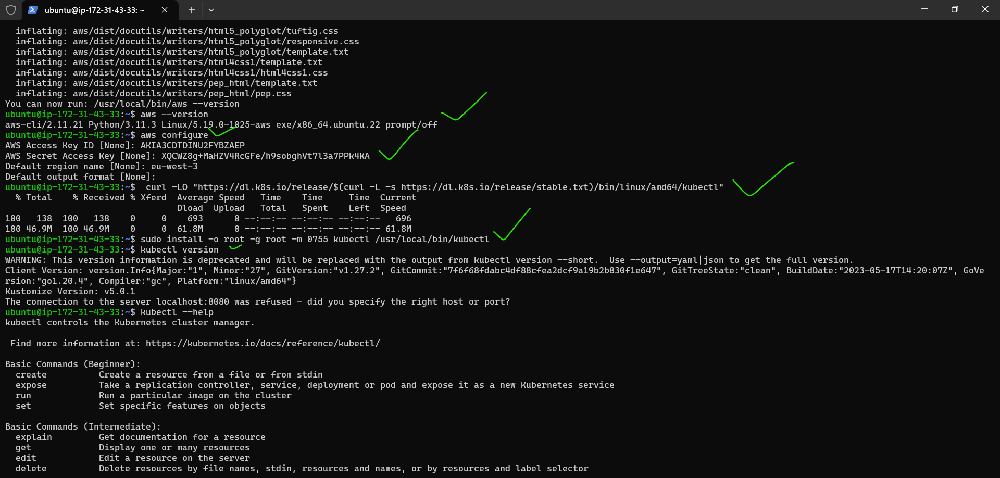
* Install eksctl [Refer Here](https://eksctl.io/introduction/#for-unix)
```bash
# for ARM systems, set ARCH to: `arm64`, `armv6` or `armv7`
ARCH=amd64
PLATFORM=$(uname -s)_$ARCH

curl -sLO "https://github.com/weaveworks/eksctl/releases/latest/download/eksctl_$PLATFORM.tar.gz"

# (Optional) Verify checksum
curl -sL "https://github.com/weaveworks/eksctl/releases/latest/download/eksctl_checksums.txt" | grep $PLATFORM | sha256sum --check

tar -xzf eksctl_$PLATFORM.tar.gz -C /tmp && rm eksctl_$PLATFORM.tar.gz

sudo mv /tmp/eksctl /usr/local/bin
```
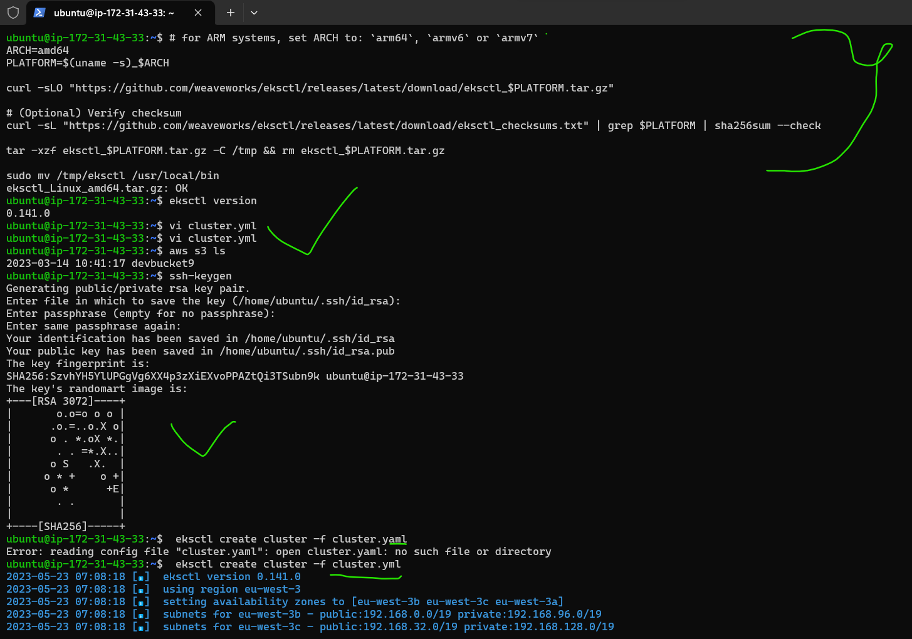
* before that cluster creation with yml file we have to do aws configure and kubectl configure must.
* before creating cluster we execute ssh-keygen ``ssh-keygen``
* Create a file called as cluster.yml with the following content
* paste below yaml file in this ``vi cluster.yml``
```yml
apiVersion: eksctl.io/v1alpha5
kind: ClusterConfig

metadata:
  name: basic-cluster # we can give any name it is cluster name
  region: eu-west-3

nodeGroups:
  - name: basic # node group name
    instanceType: t2.large
    desiredCapacity: 2
    volumeSize: 20
    ssh:
      allow: true # will use ~/.ssh/id_rsa.pub as the default ssh key
```
* before creating cluster we execute ssh-keygen ``ssh-keygen``
* Now execute the command ``eksctl create cluster -f cluster.yml``
* After creation execute``kubectl get nodes``&&``kubectl get pods --all-namespaces``
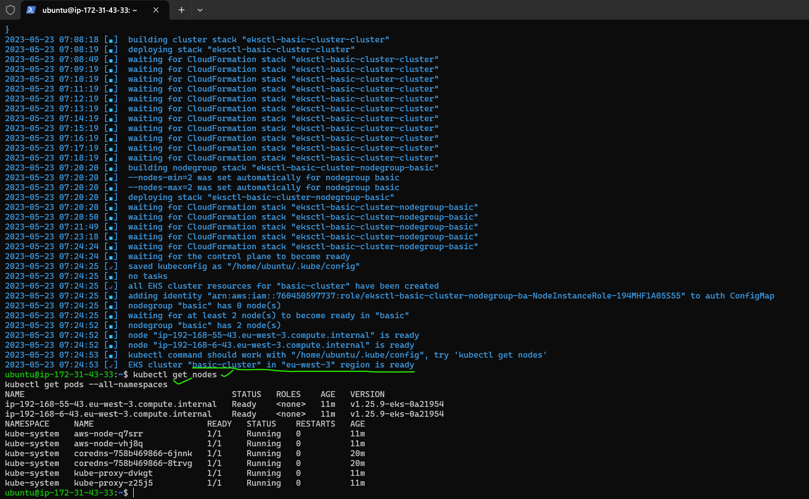
# For deleting the cluster ``eksctl delete cluster --name=<name> [--region=<region>]``example ``eksctl delete cluster --name=basic-cluster --region=eu-west-3``
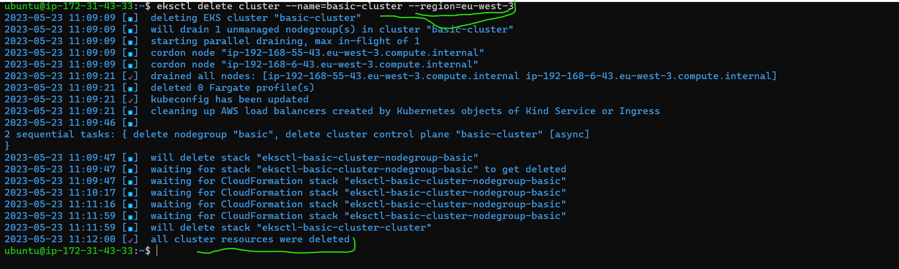
* After delete the cluster check in our aws all regions instances,auto scalling groups,volumes.

2.Helm chart
----------
* creating helm chart commands are
[referhere](https://helm.sh/docs/intro/install/)

```
curl -fsSL -o get_helm.sh https://raw.githubusercontent.com/helm/helm/main/scripts/get-helm-3
chmod 700 get_helm.sh
./get_helm.sh
```

* After that run this command ``helm install my-release oci://registry-1.docker.io/bitnamicharts/wordpress``
* [referhere](https://bitnami.com/stack/wordpress/helm)(googlesearch-helm wordpress)
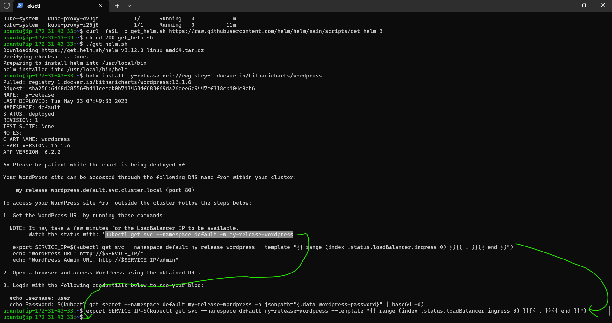

* for uninstall the helm command is ``helm uninstall my-release oci://registry-1.docker.io/bitnamicharts/wordpress``
* creating helm chart [referhere](https://phoenixnap.com/kb/create-helm-chart)
* command is ``helm create <chartname>``
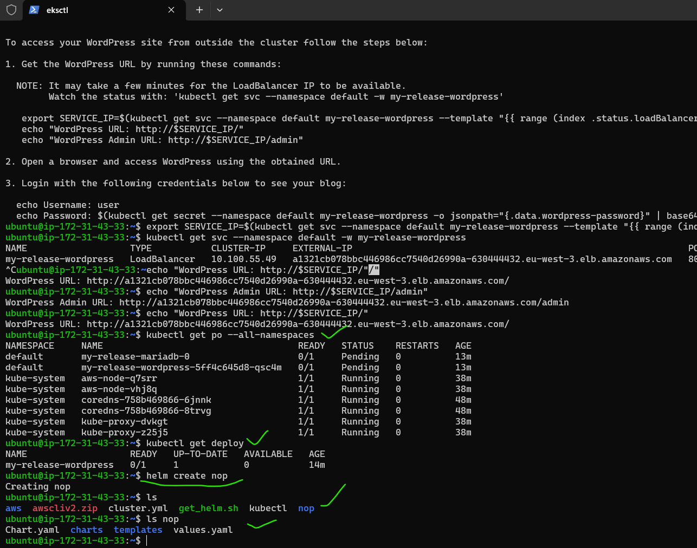
* For install the hem chart ``helm install <chart name> <flagname>`` like ``helm install nop nop/``
* when we create the helm chart this files are autometically in that helm chart 
values.yaml,charts,chatrs.yaml,templetes.
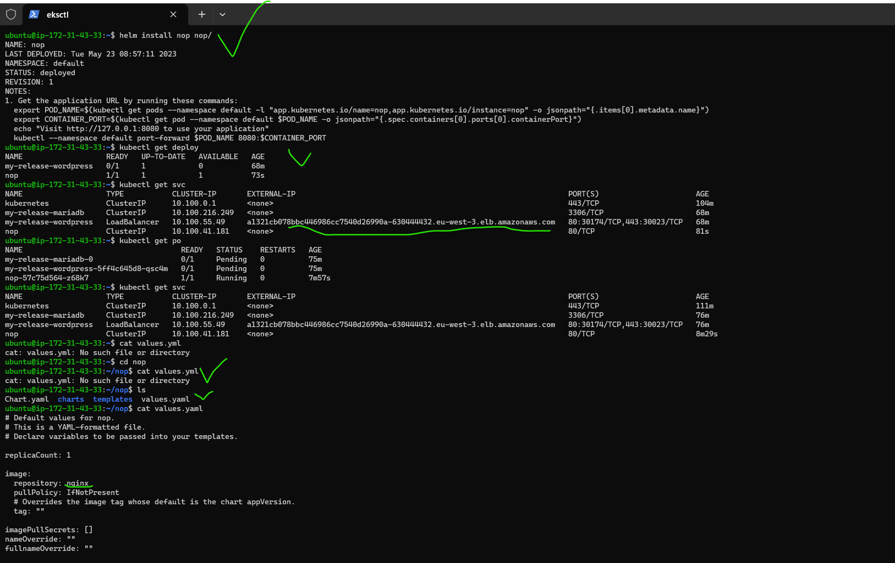
* In the above process coreect bit ngnix page not came because i did not change clusterIP type in values.yaml so that page not came. 
* now i got to ``cd nop`` then change the type name as LoadBalncer``vi values.yaml``
* In the ``vi values.yaml`` we can change <type: LoadBalncer>
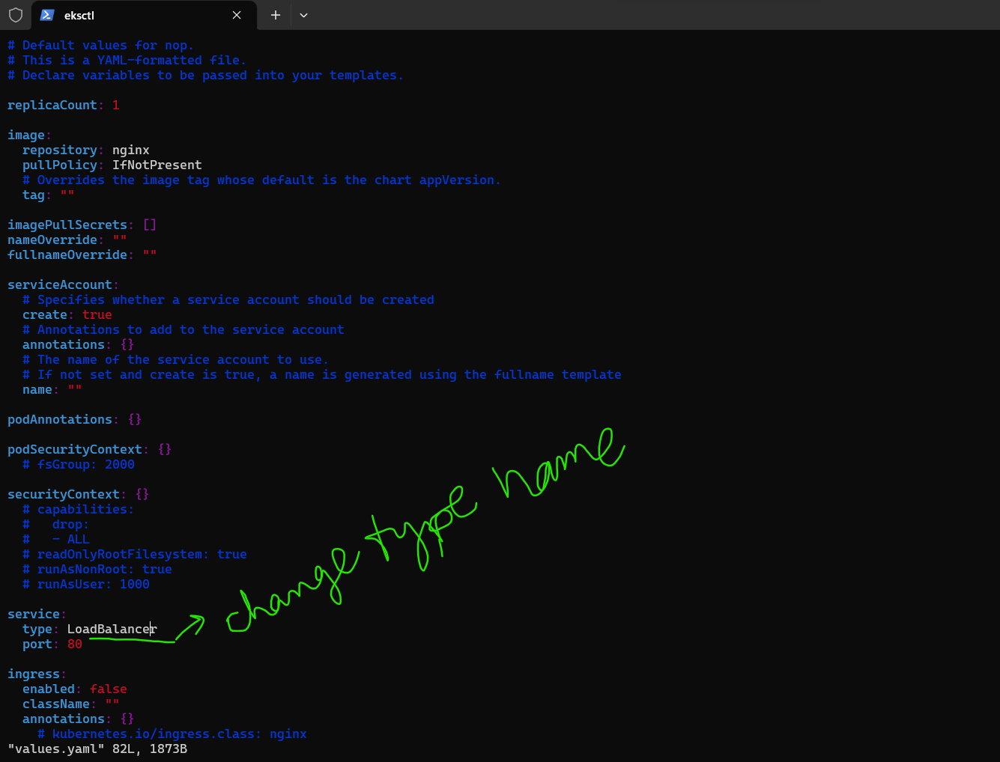
* so again i create another helm chart with name nop1
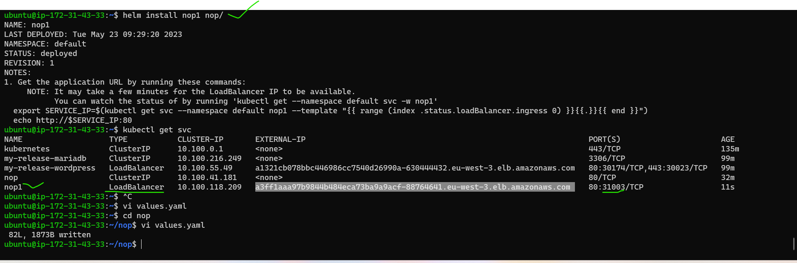
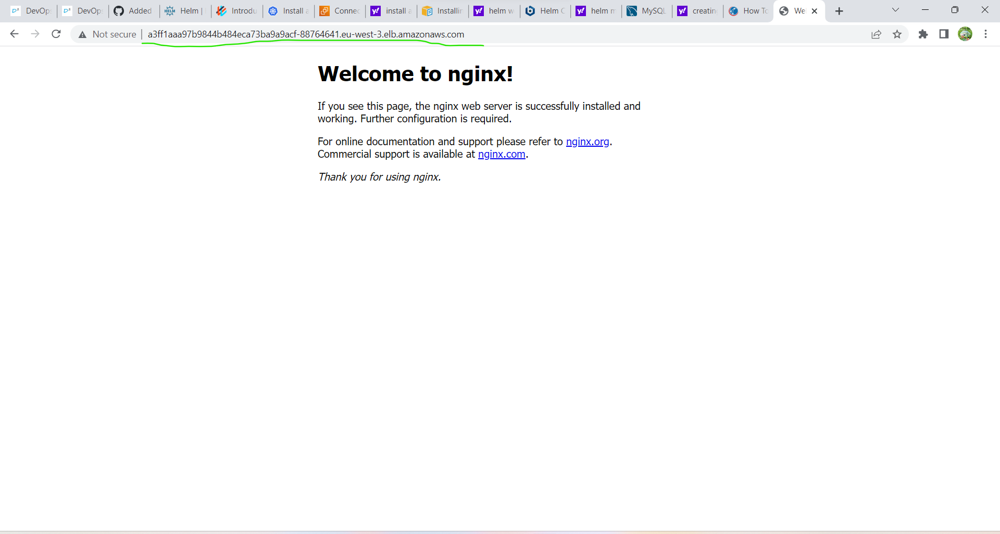
* For deleting the helmchart ``helm delete <chartname>``
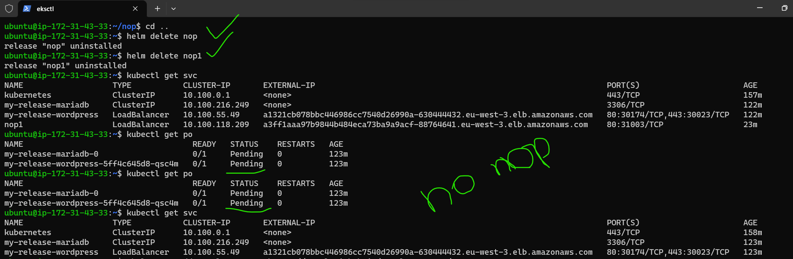
1. installations using helm chart
# 1. Mysql
* [referhere](https://bitnami.com/stack/mysql/helm)
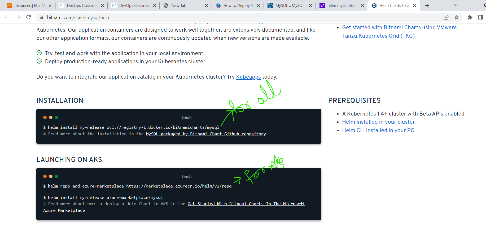
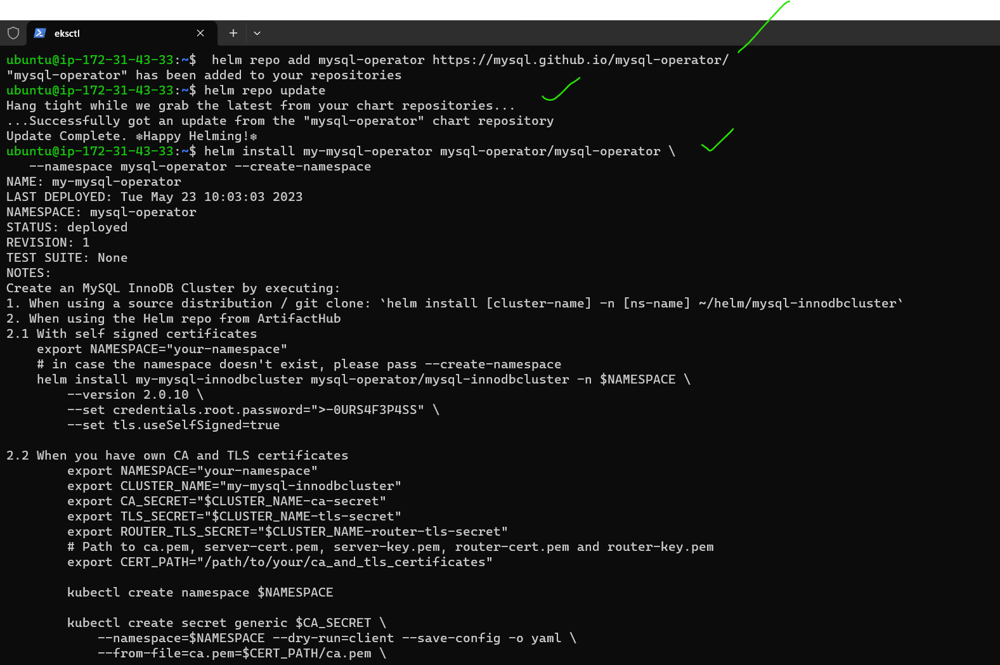
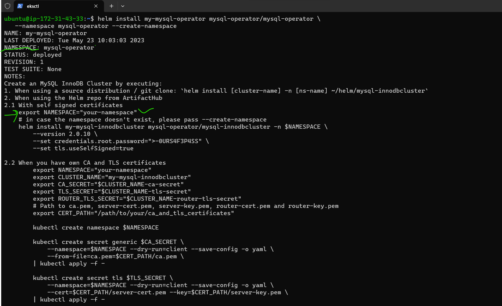
* For installation mysql helm command is ``helm install my-release oci://registry-1.docker.io/bitnamicharts/mysql``
* Above preview they are created helm chart and pods created with the namespaces so we can search pods with namespaces``kubectl get -n mysql-operator po``
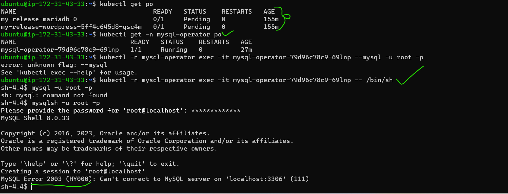
* pod is running so enter to db ``kubectl -n mysql-operator exec -it mysql-operator-79d96c78c9-69lnp -- /bin/sh``
* in that mysql-operator is my repo name
* enter the details in above they are mentioned in that see preview116 
  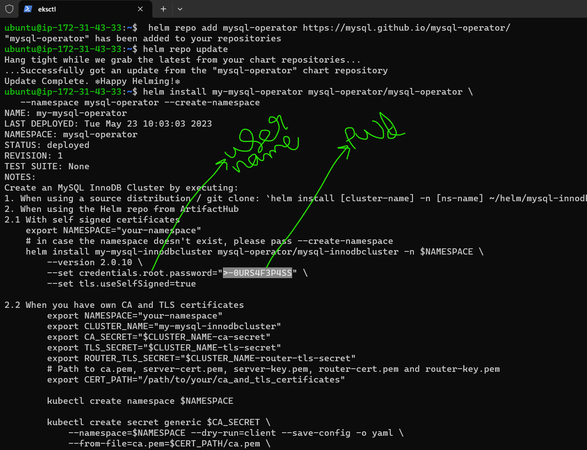
* the given password is not working error came.  
# 2. PostgreSql
* [referhere](https://bitnami.com/stack/postgresql/helm)
* For installation postgresql helm command is ``helm install my-release oci://registry-1.docker.io/bitnamicharts/postgresql``
# 3. mongoDB
* [referhere](https://bitnami.com/stack/mongodb/helm)
* For installation mongodb helm command is ``helm install my-release oci://registry-1.docker.io/bitnamicharts/mongodb``
# 4. Redis cache
* [Referhere](https://bitnami.com/stack/redis/helm)
* For installation redis cache helm command is``helm install my-release oci://registry-1.docker.io/bitnamicharts/redis``
* kostomize is better then helmchart because in kostomize we can use reusable files.


3. make Mysql as Stateful set


4. write headless service for Mysql1


5. write kostomize file by creating files for 3 environments
        1.dev-environment
        2.qa-environment
        3.test-environment
kustomize
---------
* For kustomize[Referhere](https://kustomize.io/)
* for kustomize usage[referhere](https://kubectl.docs.kubernetes.io/guides/introduction/kustomize/)  
* kustimize is a tool where we can natively(natively means In particuler system) mange the configurations.
* Natively manage dynamic configurations to k8s manifests
      * create a service file exposed as LoadBalancer
* For kustomization yaml file [referhere](https://www.digitalocean.com/community/tutorials/how-to-manage-your-kubernetes-configurations-with-kustomize)
* After creating all folders and kustomization files we can create namespaces``kubectl create ns <namespace name>``like this``kubectl create ns dev``(in <namespace name> dev,qt,uat)
* For creating  ``kubectl apply -k ./``
* For apply ``kubectl apply -k overlays/dev``&&``kubectl apply -k overlays/qt``&&``kubectl apply -k overlays/uat``
* For deploy ``kubectl get deploy -n dev``
* For pods  ``kubectl get po -n dev``
* For delete dev environment``kubectl delete -k -n dev ./`` (in this command if we didn't clone form windows we can mentioned namespace -n dev otherwise we can goto that dev folder then delete for that command is ``kubectl delete -k ./``)
* For see the all resources in dev namespace ``kubectl get all -n dev``
* For build ``kubectl build overlays/dev``
* After creating the labels ``kubectl apply -k ./``
* After creating the labels ``kubectl apply -k overlays/dev``
* For show pods in dev namespaces``kubectl get po --show-labels -n dev``
* For deleting ``kubectl delete -k ./``


1. every environment should have their own secrets