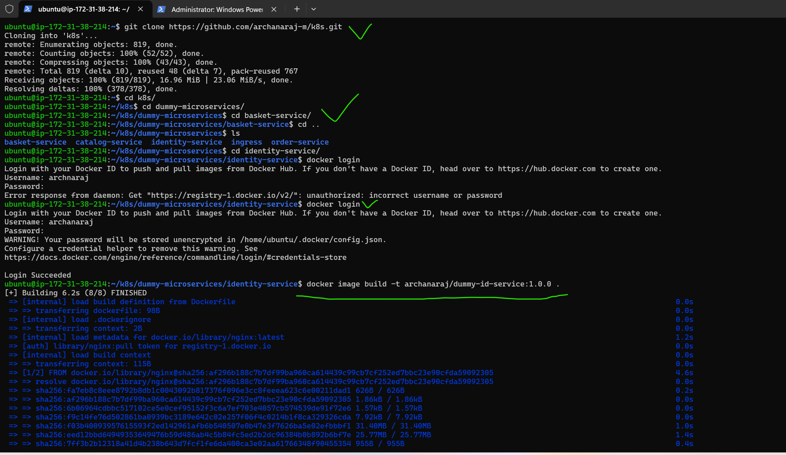

Ingress:
--------
* What is Kubernetes Ingress and why is it useful?
Kubernetes Ingress is an API object that provides routing rules to manage external users' access to the services in a Kubernetes cluster, typically via HTTPS/HTTP. With Ingress, you can easily set up rules for routing traffic without creating a bunch of Load Balancers or exposing each service on the node. This makes it the best option to use in production environments. 

[referhere](https://www.ibm.com/cloud/blog/kubernetes-ingress) for ingress documentation.
[referhere](https://kubernetes.io/docs/concepts/services-networking/ingress/)
* Traefik:[referhere](https://doc.traefik.io/traefik/getting-started/concepts/)
Traefik is based on the concept of EntryPoints, Routers, Middelwares and Services.

* The main features include dynamic configuration, automatic service discovery, and support for multiple backends and protocols.

* EntryPoints: EntryPoints are the network entry points into Traefik. They define the port which will receive the packets, and whether to listen for TCP or UDP.

* Routers: A router is in charge of connecting incoming requests to the services that can handle them.

* Middlewares: Attached to the routers, middlewares can modify the requests or responses before they are sent to your service

* Services: Services are responsible for configuring how to reach the actual services that will eventually handle the incoming requMany different rules

Edge Router
-----------
* Traefik is an Edge Router, it means that it's the door to your platform, and that it intercepts and routes every incoming request: it knows all the logic and every rule that determine which services handle which requests (based on the path, the host, headers, etc.).


Auto Service Discovery
----------------------
* Where traditionally edge routers (or reverse proxies) need a configuration file that contains every possible route to your services, Traefik gets them from the services themselves.
* Deploying your services, you attach information that tells Traefik the characteristics of the requests the services can handle.


* In the example above, we used the request path rule to determine which service was in charge. Certainly, you can use many other different rules.

* How does Traefik discover the services?
Traefik is able to use your cluster API to discover the services and read the attached information. In Traefik, these connectors are called providers because they provide the configuration to Traefik.

* Using Traefik for Business Applications?
If you are using Traefik in your organization, consider Traefik Enterprise. You can use it as your:
API Gateway
Kubernetes Ingress Controller
Docker Swarm Ingress Controller
Traefik Enterprise simplifies the discovery, security, and deployment of APIs and microservices across any environmentests.
* First in cluster node or take any another node  install docker with docker commands
```
curl -fsSL https://get.docker.com -o get-docker.sh
sh get-docker.sh
sudo usermod -aG docker ubuntu 
exit and relogin
docker info
```
 
* create one folder for micro services
* In that create 4 different micro services with names basket,identity,order,catalog.
* In that create docker file and index.html
* In that create ingress folder in that deployment.yml,service.yml
* Next login to the docker instance(or cluster instance) clone my git k8s.
# importent if any changes in my K8s in vcs(visual studio code)after git push, In my ubuntu git pull is madtory for pull the changes.
 
* After docker login create docker image in idity service``docker image build -t archanaraj/dummy-id-service:1.0.0 .`` 

* Then run the container``docker container run -d -P archanaraj/dummy-id-service:1.0.0``
* Next ``docker container ls``
* copy the instance publicIP:that port then page came

* Then push the image to ``docker image push <dockerhub username>/<imagename>`` ``docker image push archanaraj/dummy-id-service:1.0.0``
* same as like for all services


* After creating cluster``kubectl get nodes``
* In k8s we have 3 major objects which will help in ingress (layer 7 loadbalancing)
   * ingress
   * ingressController: This is a third party implementation Refer Here
   * ingressClass
* K8s doesnot have controller for ingress.
* Now we are using nginx-ingress-controller with helm in eks 
* For that first we install helm in that cluster(master node)
```
curl -fsSL -o get_helm.sh https://raw.githubusercontent.com/helm/helm/main/scripts/get-helm-3
chmod 700 get_helm.sh
./get_helm.sh
```
* lets install nginx-ingress controller using helm
```
helm repo add nginx-stable https://helm.nginx.com/stable
helm repo update
helm upgrade --install ingress-nginx ingress-nginx \
             --repo https://kubernetes.github.io/ingress-nginx \
             --namespace ingress-nginx --create-namespace

``` 


* After last command we see output which better copy to some notepad
* Now execute the following command to watch for external ip to nginx ingress controller   ``kubectl --namespace ingress-nginx get services -o wide -w ingress-nginx-controller``

* Then create deployment and service files in ingress folder
* Get ingress classes and there should be nginx ingress class from helm chart
* 
* lets deploy application and services.
* Goto ingress folder (because i clone my repo k8s)then goto that ingress folder apply command is ``kubectl apply -f .``
 
* For all resources``kubectl get all``

* After that add ecommerce-ingree.yml file add thenafter git push ``git pull`` see preview157
* Next goto that folder then ``kubectl apply -f ecommerce-ingress.yml``
* Next ``kubectl get ingress``
* Next for external-IP``ubectl --namespace ingress-nginx get services -o wide -w ingress-nginx-controller``
 
* copy that EXTERNAL-IP then paste it in new tab/order or /basket or /catalog or /identity see previews


* Next delete the cluster don't forget.

Activity :1
1. Creating the EKS Cluster or AKS cluster
2. Enabling Cloud Monitoring for the Cluster
EKS logs: Viewing Logs and Metrics on the CloudWatch Dashboard for EKS
AKS logs: Once the monitoring is enabled, you can access the Azure Monitor console and navigate to the Log Analytics workspace or the AKS cluster's monitoring section to view the logs and metrics. 
Activity :2 
1. After Activity 1 then enable ELK for K8s Monitoring
2. create sample Dashboard