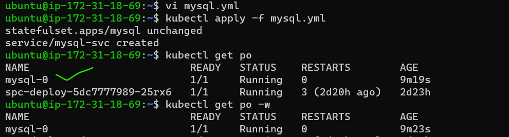
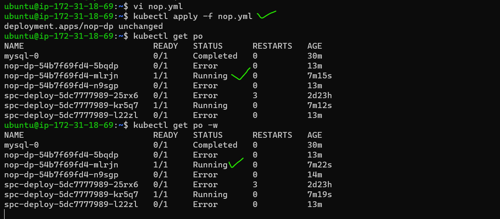
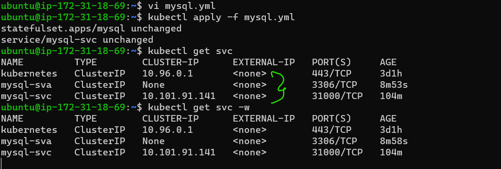
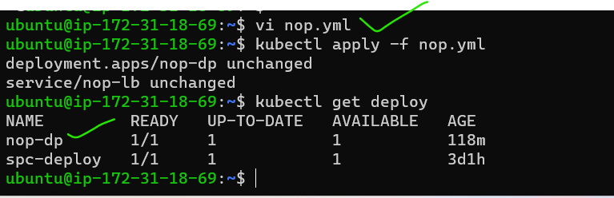

k8s activity1(may5)
* 1. Create a MySQL pod with Stateful Set with 1 replica
* 2. Create a nopCommerce deployment with 1 replica
* 3. Create a Headless Service to interact with nopCommerce with MySQL 
* 4. Create a Load Balancer to expose the nopCommerce to External World 
   NOTE: Try to draw the Architecture Diagram for the above by using Draw.io Tool.
1. Create a MySQL pod with Stateful Set with 1 replica   
* First i wrote the yml file for MYSQL (resouces is stateful set)
```yml
---
apiVersion: apps/v1
kind:	StatefulSet
metadata:
  name: mysql
  labels:
    app: mysql
spec:
  replicas: 1
  serviceName: mysql-svc 
  selector:
    matchLabels:
      app: mysql
  template:
    metadata:
      name: mysql
      labels:
        app: mysql
    spec:
      containers:
        - name: mysql
          image: mysql:5
          env: 
            - name: MYSQL_ROOT_PASSWORD
              value: password
            - name: MYSQL_USER
              value: Archana
            - name: MYSQL_PASSWORD
              value: password  
            - name: MYSQL_DATABASE
              value: students
          ports:
            - containerPort: 3306
          volumeMounts:
            - name: mysql
              mountPath: /var/lib/mysql
---
apiVersion: v1
kind: Service
metadata: 
  name: mysql-svc
spec:
  selector:
    app: mysql
  ports:
    - name: mysql
      port: 31000
      targetPort: 3306  
```
* above two files paste in ``vi mysql.yml``
* for pods creation command is `` kubectl apply -f mysql.yml``

* view servicefile(svc) `` kubectl get svc`` 

* 2. Create a nopCommerce deployment with 1 replica
* Next nop commerce deployment file
```yml
---
apiVersion: apps/v1
kind: Deployment
metadata: 
  name: nop-dp
  labels:
    app: nop
spec:
  replicas: 1
  selector:
    matchLabels:
      app: nop
  template: 
    metadata:
      name: nop
      labels:
        app: nop
    spec:
      containers:
      - name: nopcont
        image: archanaraj/nop:latest
        ports:
        - containerPort: 5000   
```
* for pods creation command is `` kubectl apply -f nop.yml``

* for checking ``kubectl get deploy``
* view pods `` kubectl get po``  and view running pods ``kubectl get po -w``
* 3. Create a Headless Service to interact with nopCommerce with MySQL 
```yml
---
apiVersion: apps/v1
kind:   StatefulSet
metadata:
  name: mysql
  labels:
    app: mysql
spec:
  replicas: 1
  serviceName: mysql-svc
  selector:
    matchLabels:
      app: mysql
  template:
    metadata:
      name: mysql
      labels:
        app: mysql
    spec:
      containers:
        - name: mysql
          image: mysql:5
          env:
            - name: MYSQL_ROOT_PASSWORD
              value: password
            - name: MYSQL_USER
              value: Archana
            - name: MYSQL_PASSWORD
              value: password
            - name: MYSQL_DATABASE
              value: students
          ports:
            - containerPort: 3306
          volumeMounts:
            - name: mysql
              mountPath: /var/lib/mysql

---
apiVersion: v1
kind: Service
metadata:
  name: mysql-svc
spec:
  selector:
    app: mysql
  ports:
    - name: mysql
      port: 31000
      targetPort: 3306
```
* above two files paste in ``vi mysql.yml``
* for pods creation command is `` kubectl apply -f mysql.yml``
* view servicefile(svc) `` kubectl get svc`` 
* Iam using kubeadm so external Ip is <none>
* for that Ip address we can use cluster AKS or EKS 
*                       

* 4. Create a Load Balancer to expose the nopCommerce to External World 
* nop commerce service file with loadbalncer

```yml
---
apiVersion: apps/v1
kind: Deployment
metadata: 
  name: nop-dp
  labels:
    app: nop
spec:
  replicas: 1
  selector:
    matchLabels:
      app: nop
  template: 
    metadata:
      name: nop
      labels:
        app: nop
    spec:
      containers:
      - name: nopcont
        image: archanaraj/nop:latest
        ports:
        - containerPort: 5000    
---
apiVersion: v1
kind: Service
metadata: 
  name: nop-lb
spec:
  selector:
    app: nop
  ports:
    - name: nop 
      port: 32000
      targetPort: 5000 
  type: LoadBalancer 
  
``` 
* above two files paste in ``vi nop.yml``
* for pods creation command is `` kubectl apply -f nop.yml``
* view servicefile(svc) `` kubectl get deploy`` 
*    
             