# Kubernetes (k8s) Activities (MAY9th/2023)
* 1.Create a Kubernetes cluster using kubeadm
kubeadm instalation
--------------------
* First we can create 2 instances with t2 medium
* Next that 2 nodes 1 is masternode and another node1(workernode)
* In this 2 nodes install docker with docker commands
```
curl -fsSL https://get.docker.com -o get-docker.sh
sh get-docker.sh
sudo usermod -aG docker ubuntu
docker info
exit and relogin
```
* After install docker in that 2 nodes exit and relogin because we can give usermod permissions.
* After successful installation re-login into your machine
* After re-login try to get docker info $ docker info
* next create ``vi k8s.yml`` for install kubeadm through shell scripting
* next in that vi file paste below commands
```
#!/bin/bash
wget https://storage.googleapis.com/golang/getgo/installer_linux
chmod +x ./installer_linux
./installer_linux
source ~/.bash_profile
git clone https://github.com/Mirantis/cri-dockerd.git
cd cri-dockerd
mkdir bin
go build -o bin/cri-dockerd
mkdir -p /usr/local/bin
install -o root -g root -m 0755 bin/cri-dockerd /usr/local/bin/cri-dockerd
cp -a packaging/systemd/* /etc/systemd/system
sed -i -e 's,/usr/bin/cri-dockerd,/usr/local/bin/cri-dockerd,' /etc/systemd/system/cri-docker.service
systemctl daemon-reload
systemctl enable cri-docker.service
systemctl enable --now cri-docker.socket
cd ~
sudo apt-get update
sudo apt-get install -y apt-transport-https ca-certificates curl
sudo curl -fsSLo /etc/apt/keyrings/kubernetes-archive-keyring.gpg https://packages.cloud.google.com/apt/doc/apt-key.gpg
echo "deb [signed-by=/etc/apt/keyrings/kubernetes-archive-keyring.gpg] https://apt.kubernetes.io/ kubernetes-xenial main" | sudo tee /etc/apt/sources.list.d/kubernetes.list
sudo apt-get update
sudo apt-get install -y kubelet kubeadm kubectl
sudo apt-mark hold kubelet kubeadm kubectl
```
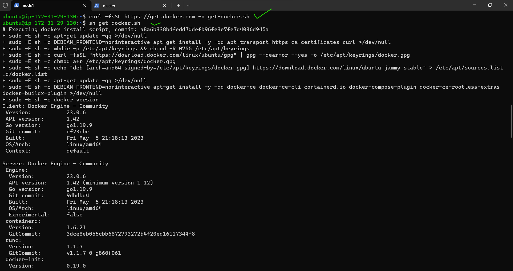
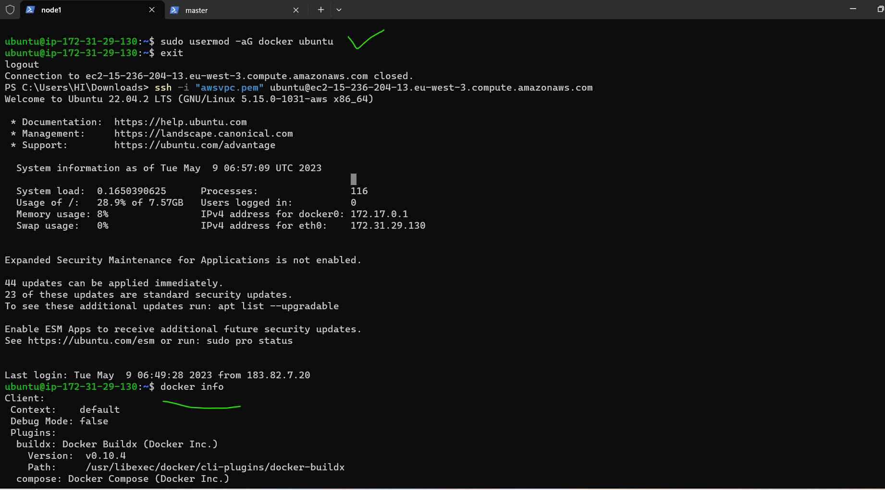

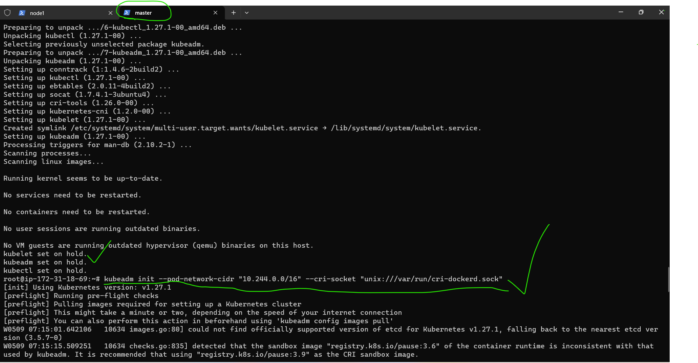
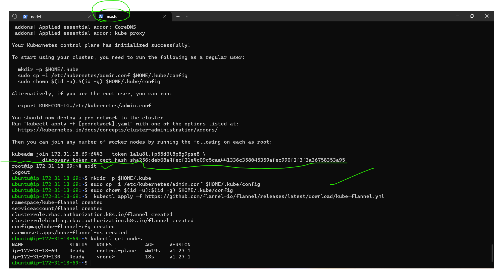
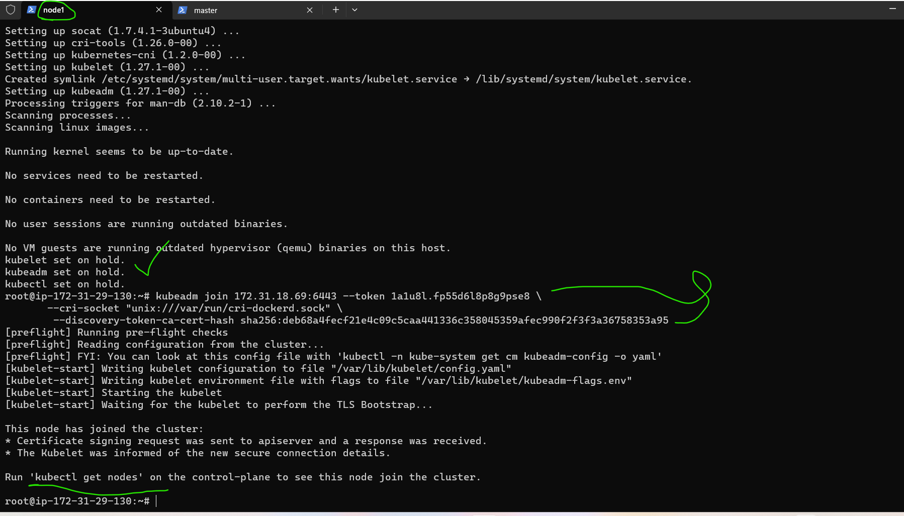

# 2.Deploy any application using kubectl

```yml
apiVersion: apps/v1 
kind: Deployment
metadata:
  name: spc-deploy
  labels:
    app: spc  
spec:
  minReadySeconds: 3
  replicas: 1
  selector:
    matchLabels:
      app: spc
  template:
    metadata:
      labels: 
        app: spc
    spec:
      containers: 
        - name: spc-cont
          image: archanaraj/myspcimage:latest
          ports :
            - containerPort: 8080    
```
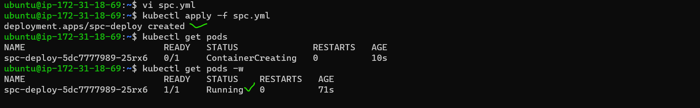

Use below steps to create AKS cluster
--------------------------------------
* create one virtual machine in azure connect in terminal and execute below commmands
```
curl -L https://aka.ms/InstallAzureCli | bash
source ~/.bashrc
az login
az login --tenant 00e5206b-f549-447d-8eaf-917573339f60
az group create --name myResourceGroup --location eastus
az aks create -g myResourceGroup -n myAKSCluster --enable-managed-identity --node-count 2 --enable-addons monitoring --enable-msi-auth-for-monitoring  --generate-ssh-keys
sudo -i
az aks install-cli
exit
az aks get-credentials --resource-group myResourceGroup --name myAKSCluster
```
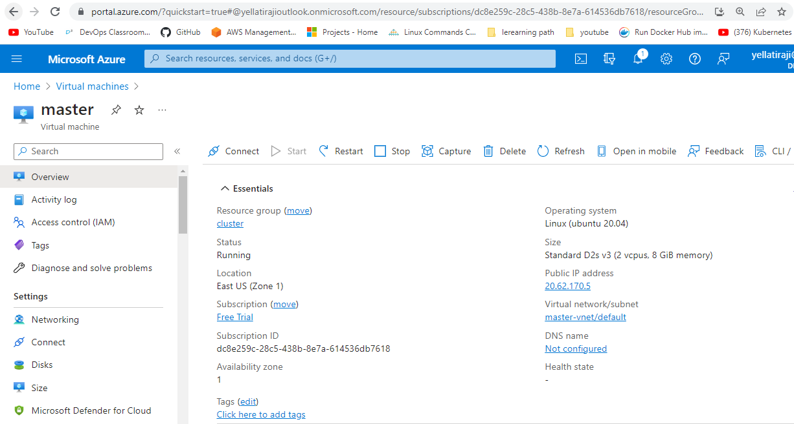
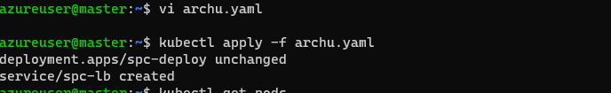
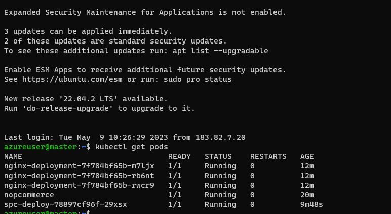

# 3.Backup Kubernetes I.e backup etcd

# 4.List out all the pod’s running in kube system namespace
* command is ``kubectl get pods --all-namespaces``
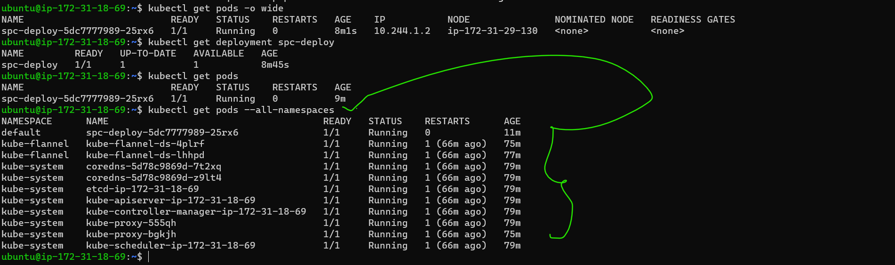

# 5.Write down all the steps required to make Kubernetes highly available
* https://kubernetes.io/docs/setup/production-environment/tools/kubeadm/ha-topology/

# 6.Do a rolling update and roll back(30/04directdevops)
* means rolling update is update the version(ex:java17) if we want for the application
* if we want previous version(ex:java11) i.e roll back
* Role and ClusterRole:
They are just a set of rules that represent a set of permissions. A Role can only be used to grant access to resources within namespaces. A ClusterRole can be used to grant the same permissions as a Role but they can also be used to grant access to cluster-scoped resources, non-resource endpoints.
* RoleBinding and ClusterRoleBinding:
As the name implies, it’s just the binding between a subject and a Role or a ClusterRole.
```yml
---
apiVersion: apps/v1
kind: Deployment
metadata:
  name: nginx-deployment
  labels:
    app: nginx
spec:
  replicas: 1
  selector:
    matchLabels:
      app: nginx
  template:
    metadata:
      labels:
        app: nginx
    spec:
      containers:
      - name: nginx
        image: nginx:1
        ports:
        - containerPort: 80
```
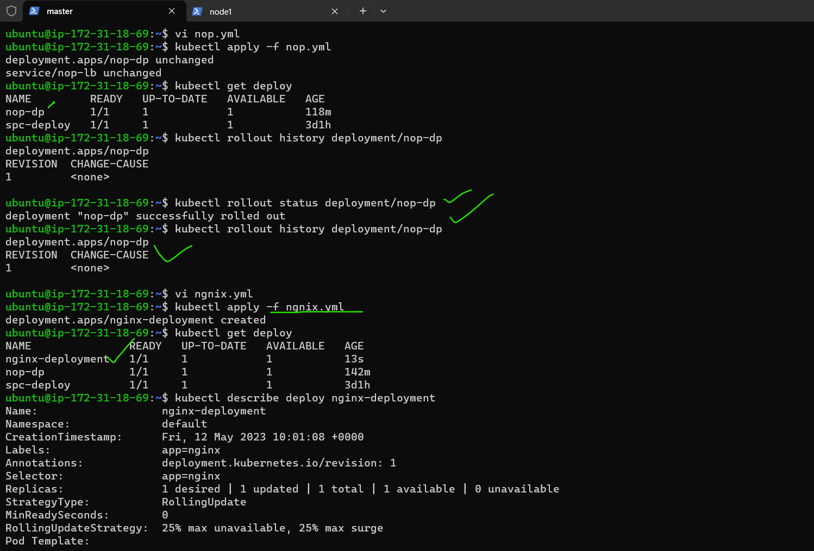
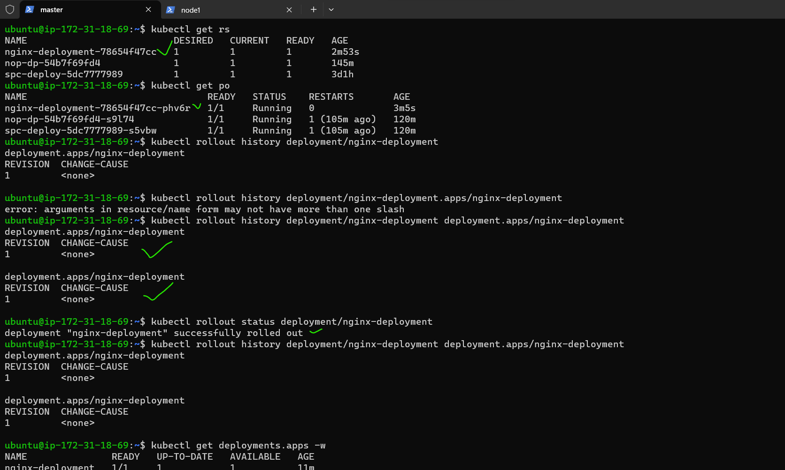

* rollout command is ``kubectl rollout history deployment/<deployment file name>`` 
* example``kubectl rollout history deployment/ngnix-deploy``
* check the status``kubectl rollout status deployment/nginx-deploy``
* Now to rollback to previous versions and update multiple versions ``kubectl rollout undo``
* next check the history again``kubectl rollout history deployment/ngnix-deploy`` 
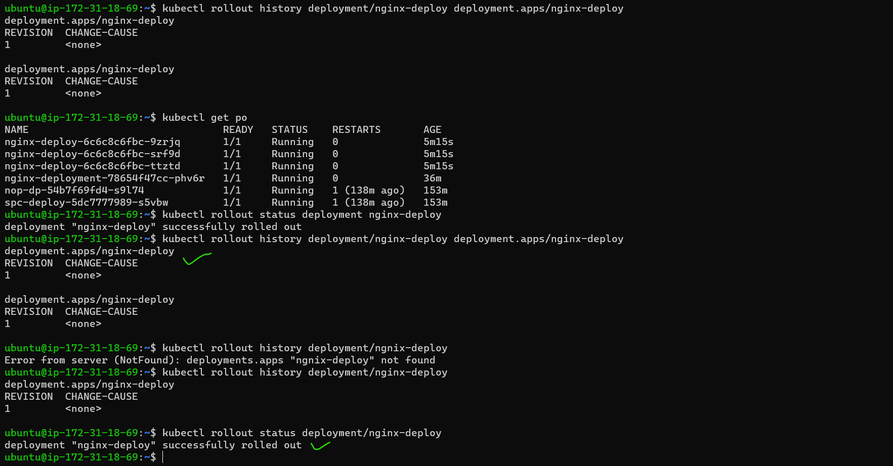

# 7.Ensure usage of secret in MySQL and configmaps
* configmaps yml file

```yml
---
apiVersion: v1
kind: ConfigMap
metadata:
  name: mysql-cm
data:
  MYSQL_USER: archana
  MYSQL_PASSWORD: "1234"
  MYSQL_ROOT_PASSWORD: "1234"
  MYSQL_DATABASE: employees
```
* First apply above file means after configmap then only set the env below file
* command ``kubectl apply -f mysql-config.yml``
* 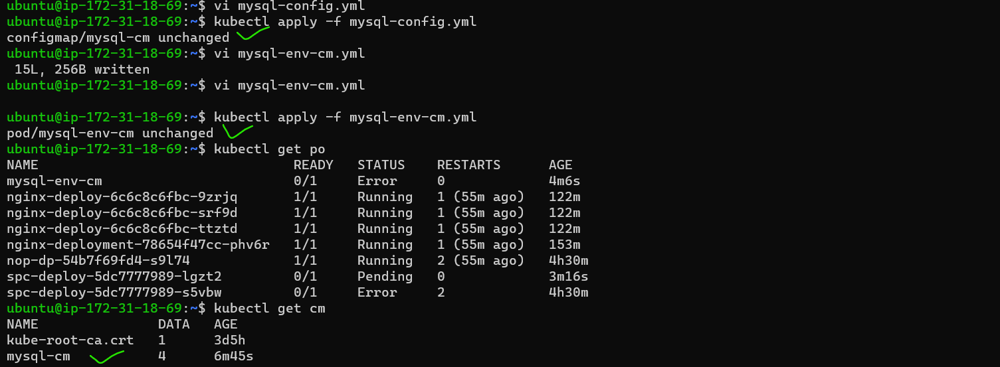
* If pods create error came then delete all resources 
* 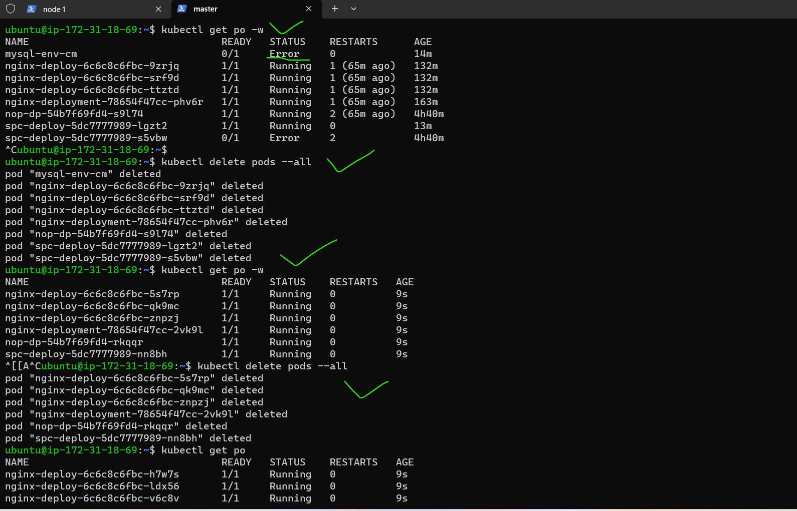then apply the files 
  
* pod creation with config file
```yml
---
apiVersion: v1
kind: Pod
metadata:
  name: mysql-env-cm
spec:
  containers:
    - name: mysql
      image: mysql:8
      envFrom:
        - configMapRef:
            name: mysql-cm
            optional: false
      ports:
        - containerPort: 3306
```

* for see the env variables ``kubectl exec mysql-env-cm -- printenv``
* 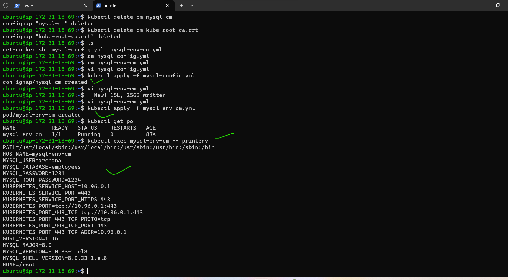
* 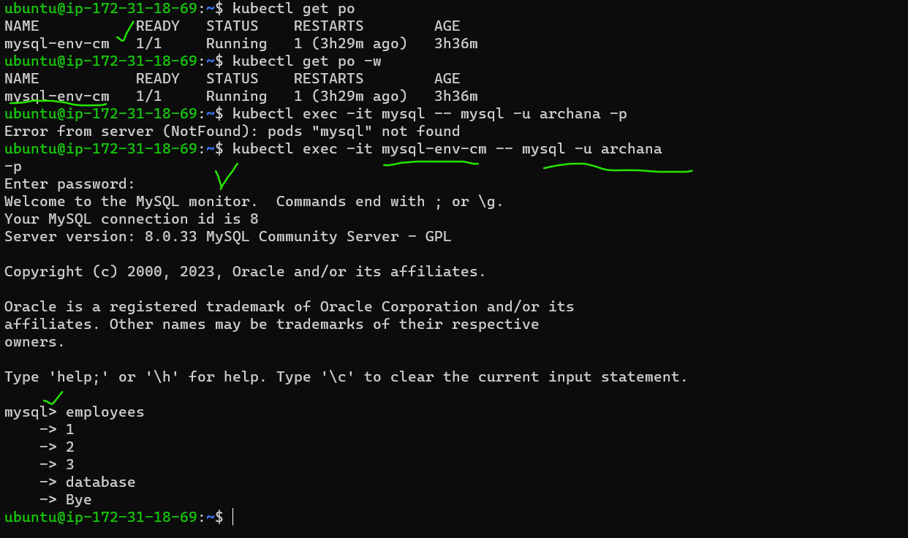

Secrets
-------

* To deal with confidential data k8s has secrets
* pod secret yaml file for mysql
* copy and paste the yml file``vi mysql-secret.yml``
* First we can execute the mysql-secret.yml file `` kubectl apply -f mysql-secret.yml``

```yml
---
apiVersion: v1
kind: Secret
metadata:
  name: mysql-secret
data:
  MYSQL_PASSWORD: MTIzNDUK #12345
  MYSQL_ROOT_PASSWORD: bXlwYXNzd29yZAo= #mypassword
  MYSQL_DATABASE: ZW1wbG95ZWVzCg== #employees
  MYSQL_USER: YXJjaGFuYQ== #archana

```
* For encode the secrets[referhere](https://www.base64encode.org/)
* copy and paste the yml file``vi mysql-pod-scrt.yml``
* First we can execute the mysql-secret.yml file `` kubectl apply -f mysql-pod-scrt.yml``

```yml
---
apiVersion: v1
kind: Pod
metadata:
  name: mysql
spec:
  containers:
    - name: mysql
      image: mysql:8
      envFrom:
        - secretRef:
            name: mysql-secret
            optional: false
      ports:
        - containerPort: 3306
```
* check the pods``kubectl get pods``
* describe the mysql secret data``kubectl describe secret mysql-secret`` 
* enter into the mysql container ``kubectl exec -it mysql -- mysql -u archana -p``

# 8.Create a nop commerce deployment with MySQL statefulset and nop deployment
nop commerce deployment yml file
---------------------------------

```yml
---
apiVersion: apps/v1 
kind: Deployment
metadata:
  name: nop-deploy
  labels:
    app: nop  
spec:
  minReadySeconds: 5
  replicas: 1
  selector:
    matchLabels:
      app: nop
  template:
    metadata:
      name: nop
    spec:
      containers: 
        - name: nop-cont  
          image: archanaraj/nop:latest
          ports :
            - ContainerPort: 5000    
```
* for pods creation command is `` kubectl apply -f nop.yml``
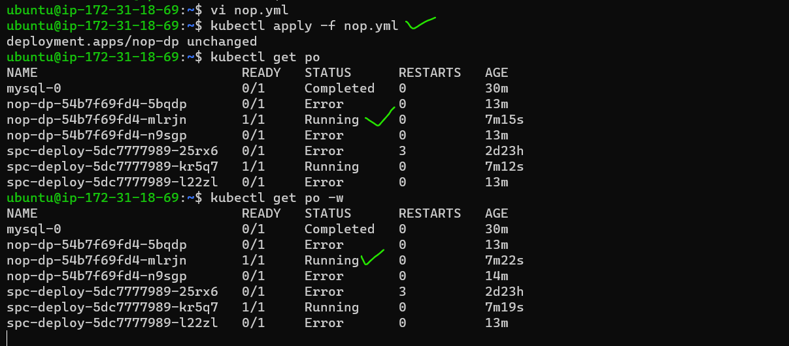
* for checking ``kubectl get deploy``

* my sql statefulset yml file

```yml
---
apiVersion: apps/v1
kind:	StatefulSet
metadata:
  name: mysql
  labels:
    app: mysql
spec:
  replicas: 1
  serviceName: mysql-svc 
  selector:
    matchLabels:
      app: mysql
  template:
    metadata:
      name: mysql
      labels:
        app: mysql
    spec:
      containers:
        - name: mysql
          image: mysql:5
          env: 
            - name: MYSQL_ROOT_PASSWORD
              value: password
            - name: MYSQL_USER
              value: Archana
            - name: MYSQL_USER
              value: password  
            - name: MYSQL_DATABASE
              value: students
          ports:
            - containerPort: 3306
          volumeMounts:
            - name: mysql
              mountPath: /var/lib/mysql
          volumes:
            name: mysql

---
apiVersion: v1
kind: Service
metadata:
  name: mysql-svc
spec:
  selector:
    app: mysql
  ports:
    - name: mysql
      port: 31000
      targetPort: 3306            
```
* above two files paste in ``vi mysql.yml``
* for pods creation command is `` kubectl apply -f mysql.yml``
* view servicefile(svc) `` kubectl get svc`` 
* Iam using kubeadm so external Ip is <none>
* for that Ip address we can use cluster AKS or EKS 
* 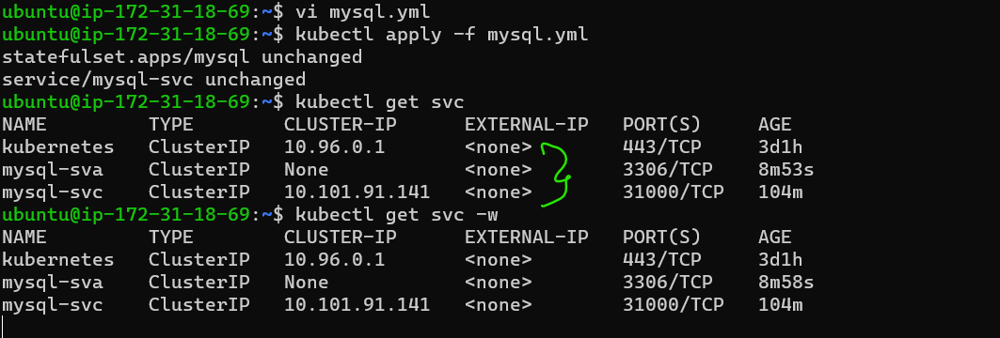 